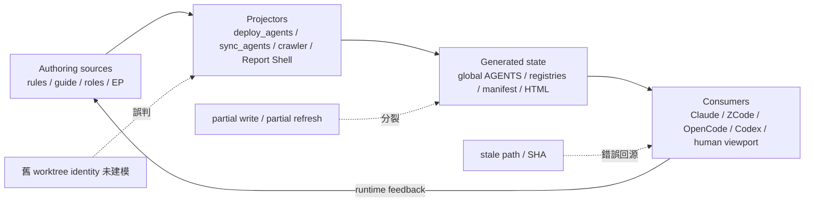

# ai-rules 全 repo 架構審查

## 結論摘要

本 repo 的主要治理骨架是清楚的：`rules/` 管 always-on policy、`skills/` 管 on-demand 方法論、`agents/roles/` 投影兩套 registry、`scripts/` 與 `hooks/` 構成 control plane、`ai-analysis/`／`backlog/` 保存任務狀態與人類 viewport、`ref-docs/harness/` 保存外部契約鏡像。現有機械閘門也不是裝飾：128 個測試與 ruff 全綠、10 個 agent roles 的雙 registry 投影一致、80 個 skill 全數進 discovery index、manifest 內的鏡像檔案沒有 missing 或 hash mismatch。

但「source → projection → runtime」這條主幹仍有 7 個 Important failure paths。最危險的共同模式不是一般 code style，而是控制面把錯誤狀態包裝成可信訊號：舊 worktree 會把健康部署誤報成 Critical 並建議降版覆寫、deploy 中斷可讓三個 harness 分裂、Stop hook 在 authority asset 缺席時反而執行 memory pool 內程式、crawler 的 partial/smoke refresh 會破壞 freshness 或 manifest coverage、canonical workflow 文件可讓 agent 跳過完整收尾鏈、歷史 Report Shell 可正常打開卻回到錯版本或不存在的 source。

嚴重度統計：**Critical 0、Important 7、Suggestion 4**。沒有 Critical 不代表可以直接忽略；這些 Important 多位於跨 harness control plane，blast radius 高於一般單一功能缺陷。

## 審查邊界與完整性合約

- 基準 worktree：`/Users/ctai/.codex/worktrees/8b3c/ai-rules`，detached `4c9085e76a9a97d2abf024d0886189a11896bb0d`。
- 對照 canonical checkout：`/Users/ctai/Github/ai-rules`，審查末端 HEAD `51b6e19779482349e69e1603bba99d21cf0ccee7`；用來反證全域部署 freshness，沒有修改該 checkout。
- 全量 inventory：1,406 個 tracked files，其中 1,332 個 Markdown、23 個 Python。逐檔全文審查 1,332 個 Markdown 既不節省 context，也無法提供一致深度，因此採 core/leaf/generated/mirror 分層：
  - **Core**：root instructions、19 個 rules、workflow owner skills、`scripts/`、`hooks/`、agent projection、crawler、測試；讀 source 與 failure branch。
  - **Leaf**：用檔案與 skill inventory、frontmatter/index、local link、狀態分類做全量機械掃描，再對異常深讀。
  - **Generated**：不把 generated artifact 當 source；以 producer、projection contract、hash／byte parity 驗證。
  - **Mirror/archive**：不逐頁吸入；以 manifest accounting、hash、orphan set、生命週期與回源連結驗證。
- `.code-reality/graph.db` 不在場，故無法提供 index 級 caller/impact evidence；本 repo 又以 Markdown control plane 為主，結論以 source、AST、`rg`、path/hash parity 與實跑命令為證。任何「沒有 caller」類結論均未僅靠此 degraded graph 狀態成立。
- 本次不執行真實 deploy、live hook、launchd service、crawler full refresh，也不修改 source。唯一新增物是本報告。

## 架構判讀

以 Clean Architecture／DDD 視角看，問題集中在 adapter/infra 層沒有忠實保存內層 authority 的 identity 與完整性：

- **依賴規則**：generated state 應單向依賴 authoring source；目前 checker 反而把「執行它的任意 checkout」當 authority，archive shell 也可硬連另一 checkout。
- **bounded context**：rules、skills、runtime deployment、historical artifacts、vendor mirrors 是不同 context；目前 global timestamp、root model pin、歷史 task path 讓邊界間語意重新 materialize，形成 drift surface。
- **use case**：此 repo 的主要消費者是長 session 中會退化、會跨 worktree、且沒有 CI 團隊兜底的 solo developer + agent。故「錯誤但看似可信的 gate」比單純缺 gate 更危險。

## Findings

### I-1 [Important · confirmed] Deploy freshness 把任意 worktree 當 authority，false-red 會導向全域降版

`skills/scan-project/scripts/check_single_source.py:283-322` 從執行該 checker 的 `REPO_ROOT` 載入 `scripts/deploy_agents.py`，以該 checkout 重建 bundle，再直接與三份 home-level `AGENTS.md` byte-compare。只要不同就宣告 `critical stale`，並在 `:318-320` 建議執行真實 deploy。它沒有辨識 canonical checkout、branch ancestry、source revision 或 target provenance。

本次可重現的反證如下：

| 比對物 | bytes | SHA-1 |
|---|---:|---|
| 本 audit worktree `4c9085e` 重建 bundle | 77,328 | `200d2f2a4d5875e0976f862d7d0c0cc46dc7ed0d` |
| canonical checkout `51b6e19` 重建 bundle | 77,822 | `047b5fe886e65e7e8c62d2e7dee0bf883b64f380` |
| `~/.zcode/AGENTS.md` | 77,822 | `047b5fe886e65e7e8c62d2e7dee0bf883b64f380` |
| `~/.config/opencode/AGENTS.md` | 77,822 | `047b5fe886e65e7e8c62d2e7dee0bf883b64f380` |
| `~/.codex/AGENTS.md` | 77,822 | `047b5fe886e65e7e8c62d2e7dee0bf883b64f380` |

所以三個 raw Critical 是 false positives：全域部署其實與 canonical working tree 完全一致。真正 reachable 的失敗路徑是：在舊／feature worktree 跑 checker → 收到 Critical → 照建議跑 deploy → `scripts/deploy_agents.py:374-392` 將該 worktree 規則覆寫三個 harness。這會把尚未合併甚至較舊的 policy 送入所有新 session。

`tests/test_check_single_source.py` 的 20 個測試涵蓋 hook parity 與 agent projection，但沒有 deploy freshness 或不同 HEAD/worktree identity case。建議把 deployment authority 顯式化；非 canonical worktree 的差異只能報「branch differs from deployed authority」，不可稱 stale，更不可給無條件 deploy remediation。

### I-2 [Important · confirmed] Bundle deploy 非原子，失敗可留下截斷檔與跨 harness policy split

`scripts/deploy_agents.py:261-271` 先 `unlink()` 既有 target，再 `write_text()` 新 bundle；這不是 atomic replace，process interrupt、disk full 或 write error 都可留下 missing／partial target。`scripts/deploy_agents.py:374-392` 又逐 target catch exception 後繼續，因此前一個 harness 可已升版、後一個仍舊版，最後只有 `N/3` failure summary，沒有 rollback 或完整 target receipt。

這不是抽象 transaction 潔癖：被寫入的是 always-on agent policy，三個 consumer 在 split state 下會採取不同 workflow／安全行為。`tests/test_deploy_agents.py:24-176` 的 19 個測試只涵蓋 scope parsing、Claude-only stripping、broken-ref/purity checks，沒有呼叫 `deploy()`、沒有 write-failure injection，也沒有 multi-target consistency test。

最低修復是每個 target 使用同目錄 temp file + fsync + `os.replace()`，確保單檔原子；較完整做法是先 stage 三份、驗 hash，再 commit replacements，失敗時保留舊 target。測試應在 `tmp_path` 注入第二 target failure，證明沒有 target 被截斷，且政策分裂會被明確收斂或回復。

### I-3 [Important · confirmed] Stop hook 的 generator trust boundary 在 authority asset 缺席時 fail-open

`hooks/memory-index-regen.py:24-34` 說 memory pool 內的 `_generate_index.py` 在自動執行前須與 repo asset byte-compare，避免 memory 目錄成為持久化執行鏈；但註解同時保留「資產缺場照舊執行」。實際 guard `:76` 只有在 `ASSET_SOURCE.exists()` 時才比對，asset 不存在就直接走 `:92-94` 的 `subprocess.run([sys.executable, str(gen)])`。

因此只要 repo/package/hook copy 不完整，原本的 authority absence 不會停止執行，反而取消唯一驗證。這是完整性邊界的方向反轉。`tests/test_memory_lifecycle.py:672-696,740-768` 測到 stale/tampered generator 與 failure marker，但沒有 asset missing case。

建議 fail closed：asset 缺席時不得執行 pool generator，留下可見 marker，並新增 monkeypatch `ASSET_SOURCE` 為不存在的負向測試。若產品刻意支援 legacy fail-open，應移除「信任邊界」保證並把該模式明確暴露成未驗證執行；目前兩種語意不可並存。

### I-4 [Important · confirmed] 單 source refresh 會刷新全域時間，讓未更新 mirrors 看起來同樣新

`ref-docs/harness/README.md:38-43` 允許 `--source X` 只更新一個 provider 並 merge 其他 entries；`ref-docs/harness/crawl.py:424-433` 卻在每次執行都重寫唯一頂層 `generated_at`。`ref-docs/harness/contracts.md:3` 再把這個頂層值稱為整份跨 harness 對照的 freshness 基準。

結果是只 refresh ZCode，也會讓 Claude Code、OpenCode、Codex、Meta 的舊 snapshot 共用新的 freshness timestamp。後續 agent 可能用 stale vendor contract 做跨 harness 設計，而 timestamp 提供錯誤信心。

manifest 應保存 per-source `generated_at`、discovery timestamp/count 與成功／失敗 accounting；`contracts.md` 應按實際引用的 provider 顯示其 freshness，而非用全域時間代表所有 source。

### I-5 [Important · confirmed] `--limit` smoke test 會用抽樣結果覆寫完整 manifest coverage

README 把 `uv run python ref-docs/harness/crawl.py --source zcode --limit 3` 列為 smoke test（`ref-docs/harness/README.md:36-40`）。`run_source()` 在 `crawl.py:342-345` 先截斷 discovery pages，接著 `:368-381` 回傳只含樣本的 `page_count/pages`；`main()` 在 `:425-433` 直接把它覆寫該 source entry。

所以一次看似低風險的 smoke test 會把完整 manifest 縮成 3 頁，磁碟上的其他 mirror files 仍存在但失去 URL/hash/status ledger。這破壞的不是內容 bytes，而是 completeness/provenance。

`--limit` 應是 no-manifest-write 模式，或只 merge sampled result 而不縮小既有 path set；測試需要固定一份完整 manifest，跑 limited source 後斷言 `page_count` 與 coverage 不縮小。目前 `tests/` 沒有 crawler/manifest tests。

### I-6 [Important · confirmed] Canonical review flow 與實際 post-build 收尾鏈互相矛盾

`skills/code-review/SKILL.md:219-225` 宣告自己是 canonical review flow 的單一源，但畫出的路徑是 `/implement → /code-review → /judge-review → /commit`。`skills/post-build/SKILL.md:105-118` 又稱自己是同一 flow 的執行載體，實際增加修正迴圈、`consistency`、`metadata-sync`、Report Shell refresh；root guide 也把 post-build 定義為 commit 前收尾。更直接地，`skills/ep-review/SKILL.md:221-230` 指示 consumer 在 judge 後直接 `/commit`。

在此 repo 的消費模型中，agent 會按 active skill 的「後續」繼續工作；因此這不是示意圖排版差異，而是可到達的 bypass。結果會跳過 follow-up 驗收、docs consistency、metadata finalization 與 hook 2，人類仍看到一條被標為 canonical 的合法路徑。

應只保留一個 owner：若 post-build 是標準路徑，canonical flow 應寫成 `/implement → /post-build → /commit`，細節由 post-build 編排；若 direct review path 是刻意例外，必須標成 standalone/bypass 並列出缺少的 guarantees，不能也叫 canonical。

### I-7 [Important · confirmed] Historical Report Shell 可正常開啟，但 provenance、回源路徑或 checkout identity 已失真

Report Shell 是人類 B 軸 viewport，不只是裝飾；`skills/_common/illustrate-html-mode.md:93-106` 要求 shell 隨 source 更新 projection SHA，任務移入 `done/` 時同步回源 URL，且 shell 是 source projection 而非平行作品。現有 tracked artifacts 有三種違約：

1. `ai-analysis/_tasks/done/09-06-diagram-selection-absorption/index.html:85` 的 projection `20c0600969721b07` 與當前 `ep.md` 相符，但 `:177` 又聲稱 `64e1b4449ff1a134`；同一 shell 同時宣告兩個互斥 source SHA。
2. 同檔 `:96,175` 與 `ai-analysis/_tasks/done/09-03-air13-unified-subagent-arch/index.html:79,182` 仍指向不含 `done/` 的 active task route；tracked source 只存在 done path。`kanban-board/SKILL.md:52-55` 明定結案後要替換為 done URL。
3. `ai-analysis/_tasks/done/09-05-external-runtime-push-collection/index.html:92,172` hard-code `file:///Users/ctai/Github/ai-rules/...`。在 worktree／clone 中點擊會跳到另一 checkout；當兩者版本不同時，連結仍可成功但內容錯版，這比 404 更難察覺。

建議建立 tracked shell lint：同一 shell 只能有一個 current projection identity；SHA 必須與同目錄 source 相符；tracked HTML 禁止 `file:///Users/...`；server route 必須反解成存在的 repo-relative path；task move 到 `done/` 時以整組 ref 驗證。歷史 artifact 可以 immutable，但不能同時被當作 current source projection；若刻意凍結，應標明 frozen revision 並連到可解析的 revision-specific source。

## Suggestions

### S-1 [Suggestion · confirmed] Active governance pointers 未隨 task 歸檔更新

`skills/kanban-board/SKILL.md:72` 指向 `ai-analysis/_tasks/09-03-backlog-governance-design/design.md`，`ai-analysis/schedule-registry.md:4` 也指同一 active path；實際檔案已在 `ai-analysis/_tasks/done/09-03-backlog-governance-design/design.md`。這會讓 current skill 與 registry 的「決策見」落到 phantom path。修正現存 link 即可；更長期應避免 core skill 依賴易搬移的 task-home path，或把必要 rationale 蒸餾回 owner skill。

### S-2 [Suggestion · evidence-based] Mirror producer 沒有收斂 manifest 外 orphan files，也缺 discovery-input 證據

`crawl.py:329-339,359-381` 只寫新頁，沒有處理 `old paths - newly discovered paths`。本地比對發現兩個 manifest 外檔案：

- `ref-docs/harness/claude-code/docs/en/agent-sdk/slash-commands.md`
- `ref-docs/harness/claude-code/docs/en/ultraplan.md`

無法只靠本地 snapshot 判斷它們是 upstream 下架還是 discovery 漏抓，因此不把「應刪除」當結論。但目前 `rg ref-docs/harness` 會混入沒有 current URL/hash/status 的頁面。Full refresh 應輸出 add/remove/orphan set；若要保留歷史頁，移入明示 archive/tombstone。manifest 也宜保存 discovery URL/input hash/discovered count，讓 coverage 可回放，而不只驗證已知頁面的 bytes。

### S-3 [Suggestion · evidence-based] Model routing 的具體 pin 在 root project instruction 再 materialize

`skills/model-routing/SKILL.md:79-81` 明定 model/effort/capacity 現值只由該段維護；但 `AGENTS.md:98` 又手寫 `muse-spark-1.3` 與 `xhigh`，和 `model-routing/SKILL.md:101` 重複。目前值相同，尚未形成 runtime drift，但 root file 沒有 generated marker 或 freshness contract。保留 repo 邊界與 family 用途即可，具體現值應指回 model-routing owner。

### S-4 [Suggestion · confirmed] `sync_agents --check` 在 parity authority 缺席時仍可 exit 0

`scripts/sync_agents.py:360-389` 宣告 `0=綠、2=fatal parity mismatch`；但 `skills/model-routing/SKILL.md` 缺席時只印 WARN，接著仍可因 generated projection 符合內嵌 constants 而回 0。這把「registry bytes 一致」與「policy parity 已驗證」合併成一個 green status。完整 checkout 現況沒有缺檔，所以不是 current drift；但 sparse/package failure 時會 false-green。建議用 distinct non-green exit，或輸出 machine-readable `projection-green / policy-unverified` 並由上游 gate 區分。

## 已驗證健康面與撤銷項目

- `PYTHONDONTWRITEBYTECODE=1 uv run --isolated pytest -q -p no:cacheprovider`：**128 passed**。
- `uv run --isolated ruff check .`：**All checks passed**。
- `uv run --isolated python scripts/sync_agents.py --check`：exit 0；`--map` 顯示 10 roles 在 `agents/zcode/`、`agents/claude/` 都有一致 projection。
- `uv run --isolated python scripts/deploy_agents.py --dry-run`：16 neutral rules，77,328 bytes，佔 90 KiB gate 的 83%；沒有執行 deploy。
- 80 個 `skills/*/SKILL.md` 全數出現在 `skills/CLAUDE.md`，沒有 folder/frontmatter name mismatch。
- `ref-docs/harness/manifest.json` 中所有成功頁面均存在且 SHA-256 相符：0 missing、0 hash mismatch。本報告批評的是 freshness/coverage semantics，不是否定本地 snapshot byte integrity。
- `backlog/tasks/` 的 19 張卡全為 Done 且仍留 board，是 `skills/kanban-board/SKILL.md:52-59` 明定的生命週期，不是 stale state；`backlog/archive/tasks/` 的 To Do 也代表廢棄語意，不是 active commitment。
- `arch-report/*visual-check.json` 的 `visualReview: pending` 沒有被誤升格為人類驗收；renderer outputs 依 `.gitignore` 可重建，缺檔不是 broken artifact。
- `hooks/block-python-file-write.py` 的窄 regex 可被其他 Python write idiom 繞過，但 source/test 已明示它不是 security sandbox；本次不把刻意窄化邊界誤報為新 defect。
- 原 checker 報出的三個 stale deployment Critical 已撤銷。它們促成 I-1，但不能當作「現在部署真的 stale」的證據。

## 修復順序

1. **先修 false authority 與 auto-execution**：I-1、I-3。兩者都會讓不可信 context 取得全域／自動執行權。
2. **再修寫入完整性**：I-2、I-5。先用 failure-injection tests 釘住，再改 atomic/limited-write semantics。
3. **修正 freshness/provenance**：I-4、I-7，並把 shell/manifest lint 納入現有機械 gate。
4. **統一 workflow owner**：I-6；同步所有引用 canonical flow 的 skills，再跑 `sync-sources` 類掃描。
5. **清理 drift surfaces**：S-1 至 S-4；這些不宜阻擋前四組 correctness 修復，但應在同一治理弧結算。

## 驗證限制與後續 acceptance

本次證據最高到 L3：source branch tracing、全量靜態 inventory、單元／整合測試、projection/hash parity 與 dry-run。沒有為了審查去破壞性重演 global deploy interruption、asset-missing autoexec、manifest clobber 或 live Report Server 404；因此 I-2 的 process-interrupt 結果與 I-7 的 HTTP 行為是由確定 control flow 推導，並非 live fault injection。

後續修復不可只補「跟實作同義」的 unit tests。最低 acceptance 應包含：不同 HEAD worktree 對同一 canonical deployment 的反證、第二 target failure 的 filesystem injection、authority asset missing 的 subprocess spy、full manifest 後 limited run 不縮 coverage、task archive move 後 shell/ref lint，以及從 `/implement` 的 consumer-facing workflow test 確認只有一條 canonical commit path。

## Judge Review：ZCode main working-tree 修正

裁決對象是 `/Users/ctai/Github/ai-rules` main checkout 的未提交 working tree；本節只記錄決策，沒有修改該 working tree 的 production code。ZCode 針對 7 個 Important、4 個 Suggestion 都有對應修改，但不能以「146 tests passed」直接視為 11/11 完成。

### 建議總覽

| Finding | ZCode 修改 | 決策／status | 機械證據與理由 |
|---|---|---|---|
| I-1 | main-worktree authority 判定＋非 main 降 Important | ✅ `adopted` | 用 audit worktree 實跑新 checker，3 個 target 均降為 Important 且明示不可 deploy；main 實跑為 `critical: 0 important: 0`。原 false-red → unsafe remediation 已被切斷。 |
| I-2 | stage 全 targets、單檔 `fsync`＋`os.replace` | ✅ `adopted`（minimum） | `scripts/deploy_agents.py:262-301` 與 failure-injection tests 證明 staging 失敗不動 target、replace 失敗保留完整舊檔；截斷風險已消除。跨 target rollback 與固定 `.tmp` 的 concurrent-deploy 風險仍開放，但不否定本次最低修復。 |
| I-3 | authority asset missing 時 fail-closed | ✅ `adopted` | `hooks/memory-index-regen.py:73-91` 在 subprocess 前中止並寫 marker；新負向測試與全套測試通過。 |
| I-4 | per-source `generated_at` | ✅ `adopted` | `crawl.py:368-381` 讓被刷新的 source 自帶時間；單 source test 證明其他 source timestamp 保持不變，`README/contracts` 同步語意。 |
| I-5 | `--limit` 不寫 manifest | ❌ `rejected` | `crawl.py:342-362` 仍先把 sampled bytes 寫入 mirror，`main():447-452` 才跳過 manifest。最小實測得到 `manifest_unchanged=True`、`integrity_split=True`：新 disk hash 與舊 ledger hash 分裂。`tests/test_crawl.py:37-43` 只斷言 manifest bytes 不變，剛好把新 corruption 漏掉。 |
| I-6 | canonical flow 納入 `/post-build` | ✅ `adopted` | `skills/code-review/SKILL.md:219-225` 與 `skills/ep-review/SKILL.md:221-230` 已指向同一 owner，與 post-build 的實際收尾鏈一致。 |
| I-7 | 修三份 shell＋新增 provenance lint | ❌ `rejected`（目前形態） | SHA 與 `done/` path 修正本身正確，但 AIR-26/AIR-30 仍使用 raw `http://.../ep.md`，違反 `illustrate-html-mode.md:98` 的 viewer-only 合約；`scripts/check_report_shells.py:28-58` 不檢查 raw route，且全 repo 只有 script 自身與 unit test 引用，未接 pre-commit/single-source/post-build。實跑仍回「全部通過」，是 false-green gate。 |
| S-1 | governance links 補 `done/` | ✅ `adopted` | `skills/kanban-board/SKILL.md:72` 與 `ai-analysis/schedule-registry.md:4` 現在解析到存在的 design；但 schedule-registry 新行保留 trailing whitespace，需在 commit 前清掉。 |
| S-2 | full refresh 列 orphan、不自動刪 | ✅ `adopted-partial` | `_report_orphans()` 將未知去留明示為人工裁定，符合原建議的安全邊界；discovery-input hash/count 仍未實作，該後半建議保持 open。 |
| S-3 | root 移除具體 Muse pin/effort | ✅ `adopted` | `AGENTS.md:98` 改為指向 model-routing authority，消除第二 authored value。 |
| S-4 | parity authority 缺席回 exit 3 | ✅ `adopted` | `scripts/sync_agents.py:364-394` 將 `policy-unverified` 與 green 分離，checker 對 rc 3 映成 Important；完整 main 實跑 `--check` exit 0。 |

裁決統計：**採納 9、不採納目前形態 2、需確認 0**。全採納警訊的否證重查落在 I-5：新增測試雖綠，但把上游 content 改為不同 bytes 後，smoke 立即重現 disk/ledger split，故不可採納。

### 新增阻擋事項

1. **[Important · runtime-confirmed] limited smoke 造成 mirror/manifest integrity split。** 修法應讓 `run_source()` 在 smoke 模式完全不呼叫 `write_if_changed()`，或寫入獨立 temp area；驗收同時 assert manifest 與既有 mirror bytes 均不變。
2. **[Important · confirmed] Report Shell lint 是未接線且規則不完整的 false-green。** 應新增 raw `.md` route detector、把兩份修改過的 shell 換成 viewer URL，並至少用一個 repo-level test 或既有 invariant runner 執行 `main()`，而非只測手造 fixtures。
3. **[Mechanical blocker] `git diff --check` 非零。** `ai-analysis/schedule-registry.md:4` 的新行有 trailing whitespace；pytest/ruff 不會攔此項。

### Judge 驗證證據

- `pytest -q -p no:cacheprovider`：146 passed。
- `ruff check .`：All checks passed。
- `scripts/scan-project/scripts/check_single_source.py`：Critical 0、Important 0。
- `scripts/check_report_shells.py`：exit 0，但依上方 I-7 是 coverage false-green，不可當 acceptance。
- `git diff --check`：非零，定位 `ai-analysis/schedule-registry.md:4`。
- 獨立 smoke probe：先 full 建 ledger，再改上游 bytes 跑 `--limit 1`；manifest 保持舊值但 mirror file 變更，`integrity_split=True`。

整體 verdict：**方向大多正確，但 main working tree 尚不可進 commit**。先修 I-5、I-7 與 diff-check，再重跑同一組驗證；其餘 9 項可保留，不需推倒重寫。
