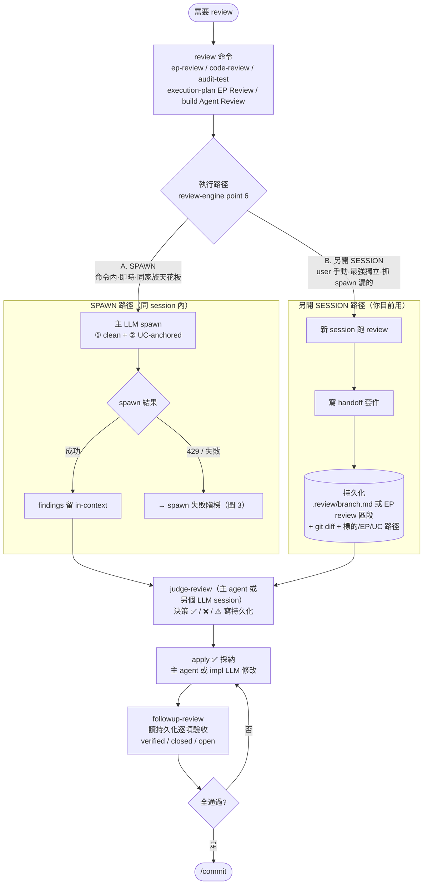
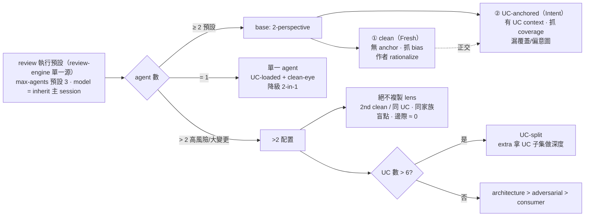
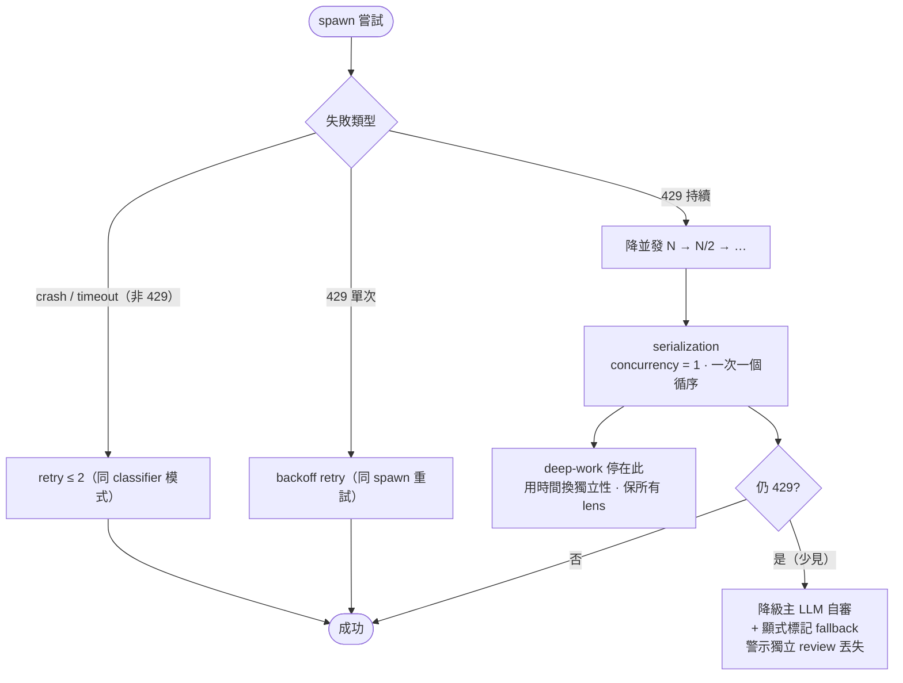

# Review 執行層 Orchestration 圖解說明

> 對象：想理解「review 命令的執行層（force 獨立 / 失敗處理 / 視角配置 / spawn-vs-session / mode 派發）集中後怎麼運作」的人。
> 落地來源：`ep-review-orchestration`（commit 8724c80）。單一源 = `skills/review-engine/SKILL.md`「review 執行預設」段。

## 一句話

review 的**執行層預設**集中到 review-engine 一處，各命令薄引用；review 鏈（review→judge→apply→followup）有**雙路徑**（spawn in-session / 另開 session），靠**持久化** handoff 套件跨 session；agent 預設 **2-perspective（clean 抓 bias + UC 抓 coverage）**；spawn 失敗有**階梯**（429→serialize→降級+標記）。

---

## 圖 1 — 雙路徑完整鏈（核心：spawn vs session 如何跑完 review→judge→apply→followup）



**讀圖要點（對照你的需求）：**

| 鏈上的位置 | SPAWN 路徑 | 另開 SESSION 路徑（你目前）|
|-----------|----------|------------------------|
| **review** | 主 LLM spawn clean+UC（in-context）| 新 session 跑，findings **寫持久化** |
| **findings 交接** | in-context 直接交主 LLM | **handoff 套件**（持久化 finding + git diff + 標的路徑）|
| **judge-review** | 主 agent 做 | 主 agent 或另個 LLM session 做（讀持久化）|
| **apply** | 主 agent 改 | 主 agent 或 impl LLM 改 |
| **followup-review** | 主 agent 讀持久化驗收 | **reviewing session 讀持久化驗收**（無參數→讀 `.review/` 或 EP review 區段）|

> **跨 session 的關鍵**：另開 session 沒有「之前對話」可看 → followup-review 改讀**持久化**（比對話記憶穩，跨 session 一定在）。這就是 handoff 套件的存在意義。review-engine point 6 定義雙路徑共存（非二選一），高風險建議兩個都跑。

---

## 圖 2 — Agent 策略（怎麼開 agent）



**你的需求對照**：你說「開新 session / spawn clean agent 避免主觀意識，可搭配有 use case 的另一個 agent，或許同時開 UC-context agent」—— **這正是 2-perspective 的設計**：① clean（無 anchor，抗主觀）+ ② UC-anchored（帶 use case context，抓覆蓋），**同時跑、正交互補**。「為何同時兩個」的理由就是 bias↔coverage 正交（單跑任一有盲點）。

- **model**：review command agent **inherit 主 session**（覆蓋通用 review→降級）—— 品質閘門需強度（不是 review-ish 的 verify/research/explore 那種降級）。
- **max-agents**：預設 3（與 build 一致，受 model-routing 並發上限 cap）。
- **>2**：opt-in，base 恆 ①+②，extra 依序（UC>6 split / architecture>adversarial>consumer），**不複製 lens**。

---

## 圖 3 — Spawn 失敗階梯（429 / 持續失敗怎麼辦）



**關鍵區分（最重要的一句）**：`serialization` 是**降並發的一步，不是降級**。降級（丟獨立性）只在 concurrency=1 還持續 429 才發生。deep-work（無人、無時間壓力）甚至可**預設低並發** —— 不急，何必冒 429 平行。

> 這覆蓋你問的「spawn 要有 429 fallback + 一直失敗怎麼辦」。定義在 `agent-workflow`「spawn 失敗階梯」（general，所有 spawn 共用），review-engine point 1 link 它。

---

## 你「另開 session」的實際流程對照

```
Session A（build / impl）          Session B（你另開，review）
─────────────────────              ─────────────────────────
/build 完成代碼
                                   /code-review 或 /ep-review
                                     → findings 寫持久化
                                     （.review/branch.md 或 EP review 區段）
                                   /judge-review
                                     → 決策 ✅❌⚠️ 寫持久化
根據 Session B 決策 apply ✅
（主 agent 或 impl LLM 改）
                                   /followup-review（無參數）
                                     → 讀持久化逐項驗收
                                     → verified / closed / open
                                   全通過 → 回 Session A /commit
```

**handoff 套件**讓 Session B 不靠記憶還原審查標的：持久化 finding（tracked）+ git diff + 標的/EP/UC 路徑。followup-review 無參數時優先讀持久化（`followup-review.md:33-42`），就是跨 session 的橋。

---

## 已處理 vs 殘留缺口

| 需求 | 狀態 | 證據 |
|------|------|------|
| spawn 429 fallback + 持續失敗 | ✅ | `agent-workflow` spawn 失敗階梯 |
| spawn vs 另開 session 區分 | ✅ | review-engine point 6 |
| handoff 跨 session | ✅ | point 6 handoff 套件 + followup 讀持久化 |
| agents 怎麼開 / max-agents | ✅ | review-engine point 2/4/5 + build --max-agents |
| clean 抗主觀 + UC-context 同時 | ✅ | agent-review-cycle 2-perspective |
| followup 無參數推斷 | ✅ | followup 讀持久化（比對話記憶穩）|
| **端到端跨 session 協議單點文件** | ⚠️ 機制在、未單點化 | 本圖補上（散落 point 6 / followup / judge / workflow-review-pattern）|
| **followup 也 spawn clean agent 做抗主觀驗收** | 💡 潛在增強 | 目前 followup 是主 agent / 另開 session 直接跑，不 spawn |
