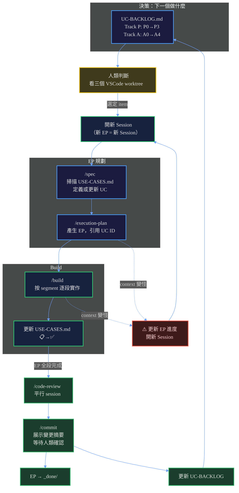
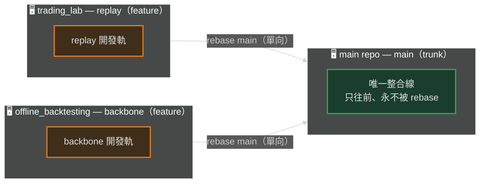
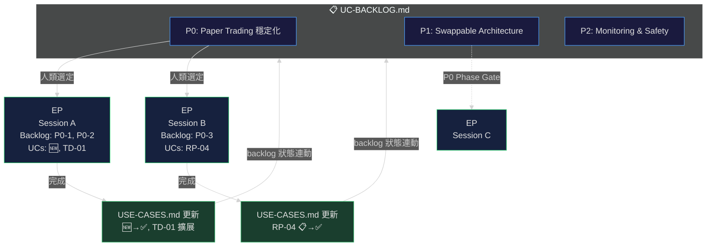
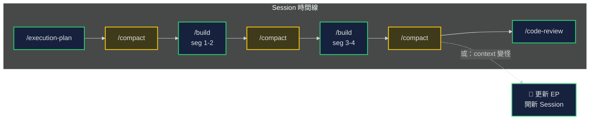
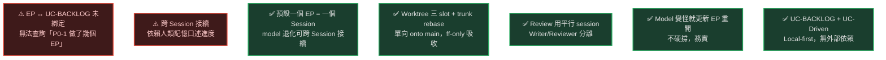

# Solo Developer + AI 開發流程圖

> 基於 2026-06-07 討論整理。描述 mosaic_alpha 專案的實際開發模式。

---

## 核心模式：預設一個 EP = 一個 Session

```mermaid
%%{init: {'theme': 'dark', 'themeVariables': {'primaryBorderColor': '#4a9eff', 'lineColor': '#6a9fff', 'fontFamily': 'system-ui'}}}%%
flowchart LR
    classDef good fill:#1a3e2e,stroke:#27ae60,color:#e0e0e0,stroke-width:2px
    classDef ok fill:#3e3a1a,stroke:#f1c40f,color:#e0e0e0,stroke-width:2px
    classDef bad fill:#3e1a1a,stroke:#e74c3c,color:#ffcccc,stroke-width:3px
    classDef decision fill:#1a1a3e,stroke:#4a9eff,color:#e0e0e0,stroke-width:2px

    SESSION["Session N<br/>新鮮 context"]:::good
    PLAN["/execution-plan<br/>產生 EP"]:::decision
    BUILD["/build<br/>逐段實作"]:::decision
    REVIEW["/code-review<br/>獨立 session"]:::decision
    COMMIT["/commit<br/>等待確認"]:::good
    DONE["✅ EP 完成<br/>Archive"]:::good

    SESSION -->|"新 EP"| PLAN --> BUILD -->|"EP 完成"| REVIEW --> COMMIT --> DONE

    %% Compact 發生在任何階段
    PLAN -.->|"/compact"| PLAN
    BUILD -.->|"/compact"| BUILD
    REVIEW -.->|"/compact"| REVIEW

    %% Model 退化 → 更新 EP → 新 session
    BUILD -.->|"Model 變怪"| SAVE["📝 更新 EP 進度"]:::ok
    SAVE -->|"開新 session"| SESSION2["Session N+1<br/>新鮮 context"]:::good
    SESSION2 -->|"繼續同一 EP<br/>或開新 EP"| PLAN

    style SAVE fill:#3e3a1a,stroke:#f1c40f,stroke-width:2px
```

---

## 全景流程

---

## 三個 Worktree + Trunk 模型

> **單向 rebase，不交互**：feature（replay / backbone）只 rebase onto trunk（`main`）；feature 之間不直接 rebase（要對方的東西走 trunk 中轉）。Trunk 只用 `git merge --ff-only` 吸收「已 rebase 過 main」的 feature —— 不是 fast-forward 就拒絕（安全欄杆，避免靜默改寫已 push 的 trunk）。`rerere` 開啟，相同衝突自動套用前次解析。詳見 [/rebase](../../commands/rebase.md)。

---

## UC-BACKLOG ↔ EP ↔ Session 關係

---

## Session 內的 Compact 分佈

---

## ⚠️ 問題點 & ✅ 運作良好的部分

