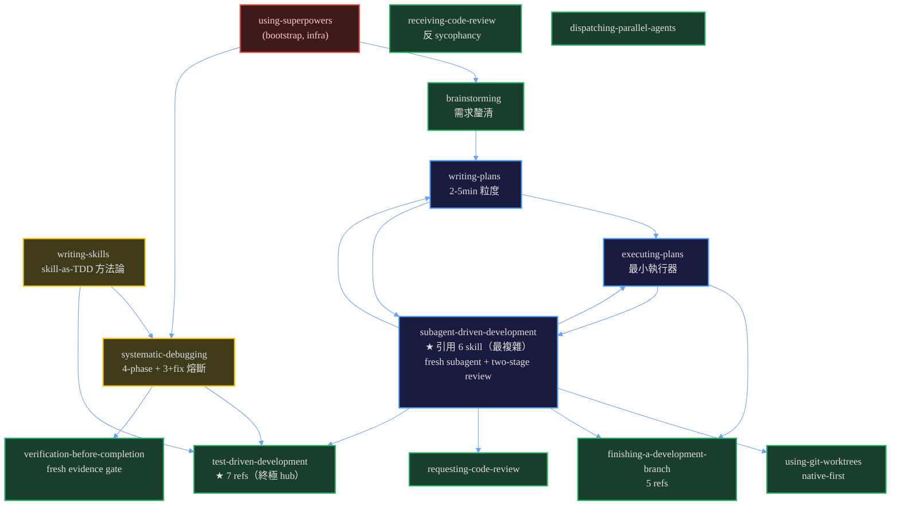

# 01 — Superpowers 結構理解與診斷

> 接續 [`README.md`](README.md)。本檔涵蓋：**Part 1 全面理解**（三層架構 + skill 拓樸 + 三種 integration shape + skill-as-TDD + behavior-shaping）+ **Part 2 結構診斷**（依賴規則 / bounded context / use case 驅動 + 結構債清單）。
> 改造方案見 [`02-改造方案.md`](02-改造方案.md)；雙向借鑒見 [`03-雙向借鑒.md`](03-雙向借鑒.md)。

---

## Part 1 — Whole Picture（全面理解）

### 1.1 三層 Clean Architecture（依賴嚴格向內）

這是 superpowers 最強的部分。`root CLAUDE.md:125-147` 定義三層，`docs/porting-to-a-new-harness.md` 是權威 spec（doc-code 不一致時 code wins）。

```
┌─────────────────────────────────────────────────────┐
│  Bootstrap（infra，per-harness）                     │  變化層
│    session-start 把 using-superpowers 注入 model     │  Shape A/B/C
│    context，wrap <EXTREMELY_IMPORTANT>               │
└─────────────────────▲───────────────────────────────┘
                      │ 翻譯（per-harness tool names）
┌─────────────────────┴───────────────────────────────┐
│  Tool mapping（adapter，per-harness）                │  變體層（每 harness 一份）
│    references/<harness>-tools.md 或 inline           │  「dispatch a subagent」→ Task(subagent_type)
└─────────────────────▲───────────────────────────────┘
                      │ 動作詞彙（不命名具體 tool）
┌─────────────────────┴───────────────────────────────┐
│  Skills（domain，harness-agnostic，唯一真相源）       │  不變層
│    14 個 skill，描述 actions                         │
└─────────────────────────────────────────────────────┘
```

**關鍵不變量**（`docs/porting-to-a-new-harness.md` Part 1 rule 1）：porting 到新 harness **只編輯 tool mapping，絕不 reach into `SKILL.md` 換 tool name**。這是讓一份 skill body 跨 9+ harness 不改一字的機制保證。`skills/using-superpowers/SKILL.md:54-58` 唯一允許的 SKILL.md 編輯是在 "Platform Adaptation" 加 pointer（因為是 pointer list 不是 behavior-shaping content）。

> **arch-thinking 視角**：這是教科書 DIP。domain（skill）定義動作詞彙（抽象 interface），adapter（mapping）實作翻譯，infra（bootstrap）注入。依賴向內，domain 不知道 adapter 存在。`ai-rules` 的「依賴向內（DIP）」原則（`rules/code-edit-constraints.md`）在這裡被完美示範。

### 1.2 Skill 拓樸（City Map — 跨檔 rg 掃描）

用 `rg -o "superpowers:[a-z-]+"` 跨所有 SKILL.md 畫出的依賴圖（被引用次數 = domain hub 程度）：



**分層（依賴向內，無反向耦合）** — *以下 infra/meta/use-case/domain 四層為本報告 arch-thinking 分析框架，非 superpowers 官方分類（官方用 README 的 Meta/Debugging/Testing/Collaboration）*：

| 層 | Skills | 特徵 |
|----|--------|------|
| **infra/bootstrap** | `using-superpowers` | session-start 注入；依賴 2 個 process skill |
| **meta** | `writing-skills`、`systematic-debugging` | 方法論 / 流程入口；依賴 domain |
| **use case（編排）** | `subagent-driven-development`、`executing-plans`、`writing-plans` | **執行核心三角**，互相引用；編排 domain skills |
| **domain（leaf-core）** | `test-driven-development`(7)、`finishing-a-development-branch`(5)、`using-git-worktrees`(3)、`verification-before-completion`、`brainstorming`、`receiving-code-review`、`requesting-code-review`、`dispatching-parallel-agents` | 被依賴、不依賴人（`-> [ ]`） |

> **機械查證**：所有 8 個 domain skill 的依賴清單都是 `[ ]`（`rg` 確認）—— **零反向耦合**。`test-driven-development` 是終極 primitive（7 refs，自己不引用任何人），這是健康分層的訊號：最被依賴的東西最純。

### 1.3 三種 integration shape（bootstrap 怎麼進 model context）

`root CLAUDE.md:135-147`、`docs/porting-to-a-new-harness.md` Part 4：

| Shape | 機制 | Reference 實作 | harness |
|-------|------|----------------|---------|
| **A — shell hook** | harness session-start 跑 shell command 讀 stdout JSON | `hooks/session-start`、`session-start-codex`、`run-hook.cmd`（polyglot）、`hooks.json`、`hooks-cursor.json` | Claude Code、Codex、Cursor、Copilot CLI |
| **B — in-process plugin** | JS/TS module lifecycle callback mutate message array | `.opencode/plugins/superpowers.js`、`.pi/extensions/superpowers.ts` | OpenCode、Pi |
| **C — instructions file** | extension-declared context file `@`-include | `GEMINI.md` + `gemini-extension.json` | Gemini（已 EOL） |

**Shape A 的精密設計**（`hooks/session-start:38-47`）：三路 env var 偵測，**恰好 emit 一個 JSON shape** —— Cursor `additional_context` / Claude `hookSpecificOutput.additionalContext` / Copilot `additionalContext`。原因：Claude Code 同時讀兩個 field 且**不 dedup**（`hooks/CLAUDE.md:26`），emit 錯 = 靜默失敗或 double-inject。

**Shape B 的 context 保護**：注入 **user message** 而非 system message（system 每 turn bloat token + 壞某些 model），附 dedup guard（OpenCode per-step content guard / Pi lifecycle flag + content guard 雙層）。

### 1.4 skill-as-TDD 方法論（superpowers 的真正護城河）

`skills/writing-skills/SKILL.md:10-16` 的核心命題：

> **Writing skills IS Test-Driven Development applied to process documentation.**
> 若你沒看過 agent 在沒有 skill 時失敗，你不知道這個 skill 教的對不對。

TDD 映射（`writing-skills/SKILL.md:32-43`）：

| TDD | Skill 創作 |
|-----|-----------|
| Test case | 壓力情境（subagent） |
| Production code | SKILL.md 文件 |
| RED | 沒 skill 時 agent 違規（baseline） |
| GREEN | 有 skill 時 agent 遵守 |
| REFACTOR | 堵新 rationalization 漏洞 |

**「Match the Form to the Failure」**（`writing-skills/SKILL.md:459-475`）是特別精緻的理論：不同失敗類型要不同 skill 形式 —— prohibition + rationalization table 治「知道規則卻違反」；positive recipe 治「output 形狀錯」；structural REQUIRED field 治「漏元素」。**prohibition 在 shaping 問題上會 backfire**（head-to-head wording test 證明 prohibition arm 比 no-guidance control 更糟）。

**實際落地落差**（Agent B 查證）：方法論是規範的，實作是**部分的**：
- 只有 `test-worktree-native-preference.sh` 有真正自動化 RED-GREEN（N 次統計，`tests/claude-code/test-worktree-native-preference.sh:19` 宣稱 50/50 驗證）
- 其他 13 個 skill 沒有 fork 內的自動化 RED baseline
- `test-subagent-driven-development.sh` 只測 agent 能不能**描述** SDD（string-match），不是**執行** SDD —— 標頭承認「Drill scenarios test behavior, not description-recall. Kept by design.」（`:4-9`）
- `evals/`（drill harness：LLM actor + LLM verifier 驗真 tmux session）**不在 fork 內**，需外部 clone `prime-radiant-inc/superpowers-evals`

### 1.5 carefully-tuned behavior-shaping（不該碰的內容）

每個 skill 都有精心調校的反 rationalization 機制（`skills/CLAUDE.md:25-28`、root `CLAUDE.md:101-108`）：

| 手法 | 範例 |
|------|------|
| **Red Flags table** | `using-superpowers/SKILL.md:34-51`（12 條「想法→現實」）；`test-driven-development`（12 條 stop-and-start-over 觸發） |
| **Rationalization table** | `test-driven-development`（11 條，亮點：「"TDD is dogmatic, I'm being pragmatic" → TDD IS pragmatic」直接反轉「務實」定義） |
| **"your human partner" 措辭** | root `CLAUDE.md:116` 明示「deliberate, not interchangeable with "the user"」 |
| **Iron Law** | TDD `NO PRODUCTION CODE WITHOUT A FAILING TEST FIRST`；verification `NO COMPLETION CLAIMS WITHOUT FRESH VERIFICATION EVIDENCE`；debugging `NO FIXES WITHOUT ROOT CAUSE INVESTIGATION FIRST` |
| **3+ fix 熔斷** | `systematic-debugging` Phase 4.5：≥3 次 fix 失敗禁止第 4 次，必須質疑 architecture 本身（repo 最獨特的 anti-thrashing 設計） |
| **anti-sycophancy** | `receiving-code-review`：禁 "You're absolutely right!"、禁 "Thanks for"、強制 verify-before-implement |

> 這些是 superpowers 的**護城河**，也是 root `CLAUDE.md:42-50` 設 94% rejection rate + 拒絕「compliance changes」的原因。**移植時絕不可重組/改寫這些內容**（除非附 eval 證據）。

---

## Part 2 — 結構診斷（arch-thinking 三視角 + 機械）

### 2.1 依賴規則（Clean Architecture 分層）— 🟢 乾淨，2 個小瑕疵

| 檢查 | 結果 | 證據 |
|------|------|------|
| 依賴向內（skill 不依賴 mapping/bootstrap） | ✅ | `rg` 確認所有 skill 用動作詞彙，不命名 tool |
| 無循環依賴 | ✅ | skill 拓樸無環（執行三角互相引用但無環） |
| 無反向耦合（domain 不依賴 use case） | ✅ | 8 個 domain skill 全 `-> [ ]` |
| single-source（每事實只定義一處） | ⚠️ | **Pi dual-maintenance**：`piToolMapping()` inline + `references/pi-tools.md` 兩處須手動同步（`.pi/CLAUDE.md:49-53`），無 CI check |

**瑕疵 1 — Pi dual-maintenance**：兩處 tool mapping 靠紀律同步，違反 single-source。對照 repo 已有 `.version-bump.json` 機械化追蹤版本一致性，tool mapping 缺對等防護。

**瑕疵 2 — executing-plans vs SDD 無自動路由**：兩者都執行 plan，界線靠「有無 subagent 支援」（`subagent-driven-development/SKILL.md:19-44` 決策樹），但用戶可能在有 subagent 平台誤選 executing-plans，無自動偵測。

### 2.2 bounded context（DDD 邊界）— 🟢 清楚，1 個定位問題

| context | 邊界 | 狀態 |
|---------|------|------|
| skills（domain） | harness-agnostic，不命名 tool | ✅ 嚴格 |
| tool mapping（adapter） | per-harness，只這層變 | ✅ 嚴格 |
| bootstrap（infra） | per-harness 注入 | ✅ 嚴格 |
| **fork-local 導航層**（你加的 7 個 CLAUDE.md） | 在 upstream 結構上加 AI 導航（後設文檔） | ✅ 正確獨立於「目錄導覽」段，與 product 三層性質不同 |

**設計正確**：root `CLAUDE.md:125-147` 的「Repository Architecture」只講 product 三層（skill→mapping→bootstrap 注入機制）；你加的 7 個 CLAUDE.md 是**後設導航文檔**（人/AI 怎麼理解 repo），正確獨立於 `:149-162`「目錄導覽」段。**兩者性質不同，不應混為「第四層 product 架構」** —— 導航文檔不在 skill 注入鏈上。

**職責重疊**：`requesting-code-review/code-reviewer.md`（172 行 subagent template）vs `subagent-driven-development/task-reviewer-prompt.md` 都檢查 plan alignment + code quality，但 task-reviewer 多了 spec compliance 雙 verdict + diff-file 傳遞規則。兩者分工與適用時機沒有 cross-reference 釐清（Agent C 發現）。

### 2.3 use case 驅動（消費者要什麼行為）— 與 ai-rules 的 scope 差異

消費者是 **coding agent**。skills 撐得起「agent 自動套用方法論」的 use case —— 這是 superpowers 的設計目標，它**做到了**。以下 4 點不是 superpowers 的缺陷，而是它**從未追求、且與 ai-rules 形成互補的差異點**：

| Use case | superpowers 現況 | ai-rules 對應 |
|----------|-----------------|---------------|
| **人類用大原則判讀方向**（方向 >> 品質） | 無（非 superpowers 設計目標，受眾是 agent） | `/deliverable-review` + `/illustrate`（B 軸人類 viewport） |
| **驗收證據強度分層** | 🟡 `verification` 只有「跑驗證確認輸出」，無 L1-L6 強度區分 | `acceptance-evidence.md` L1-L6 階層 |
| **審查優先序**（core vs leaf） | 無（全審，無依 dep weight 分配深度） | `arch-thinking` selective review matrix |
| **證據獨立性自覺** | 無（eval 的 LLM verifier 判 LLM actor = 同家族共享盲點；此為 LLM-as-judge 通用限制，非 superpowers 特有） | `acceptance-evidence.md`「AI 同寫 test+impl = 零獨立性」 |

### 2.4 結構債清單（6 個，全部 upstream 歸因）

| # | 問題 | 歸因 | 證據 |
|---|------|------|------|
| 1 | **Gemini 移除不完整** | upstream | commit `711d895`「Remove Gemini CLI support」刪了 `gemini-tools.md`（63 行），但 `GEMINI.md` + `gemini-extension.json` 殘留；`GEMINI.md:2` 還 `@`-include 已刪檔 → Shape C tool mapping 斷裂 |
| 2 | **幽靈引用 ×4** | upstream | `gemini-tools.md` / `claude-code-tools.md` / `copilot-tools.md`（references/ 只有 antigravity/codex/pi 三檔）+ `hooks/hooks-codex.json` 被 `docs/porting-to-a-new-harness.md`、`RELEASE-NOTES.md`、`tests/codex-plugin-sync` 引用但不存在 |
| 3 | **Pi dual-maintenance 無機械防護** | upstream | `.pi/CLAUDE.md:49-53` 警告但無 lint |
| 4 | **bootstrap failure 全靜默** | upstream | Shape A emit 錯 field / Shape B 找不到 user role / Shape C `@`-include 不展開 → 全靜默；只有 acceptance test（live tmux）能抓（Agent A 發現） |
| 5 | **evals/ 外部依賴** | upstream（by design） | `CLAUDE.md:112,179-189`；fork 內 skill-as-TDD 不可機械驗證 |
| 6 | **文件回憶 ≠ 行為塑造** | upstream | `test-subagent-driven-development.sh:4-9` 承認只測描述 |

> **歸因確認**：`git log` 確認 `711d895` 是 Jesse Vincent 的 upstream commit；`docs/superpowers/` 是 upstream tracked（25 檔，`git ls-files` 確認）。**你的 fork-local 導航 CLAUDE.md 沒製造這些問題**，反而是在 upstream 結構債上加導航層。
>
> **為何 `.agents/` 不列為結構債**：所有 harness manifest dotdir（`.claude-plugin` 2 檔、`.codex-plugin`/`.cursor-plugin`/`.kimi-plugin`/`.agents` 各 1 檔）都沒被目錄導覽覆蓋 —— 這是 by design（只覆蓋 Shape B in-process plugin 如 `.opencode`/`.pi` 因 lifecycle 複雜）。`.agents` 是這個一致模式的一員，不是特殊缺口。

---

> 接續：改造方案見 [`02-改造方案.md`](02-改造方案.md)；雙向借鑒見 [`03-雙向借鑒.md`](03-雙向借鑒.md)；決策摘要見 [`README.md`](README.md)。
