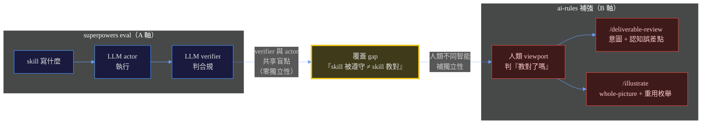

# 03 — 雙向借鑒（superpowers ⟷ ai-rules）

> 接續 [`01-結構理解與診斷.md`](01-結構理解與診斷.md)。本檔是 **Part 4 雙向借鑒移植**：哪些 superpowers 機制值得搬進 ai-rules、哪些 ai-rules 機制可貢獻回 superpowers、以及兩者互補的**黃金連接點**。
> superpowers 側改造見 [`02-改造方案.md`](02-改造方案.md)；決策摘要見 [`README.md`](README.md)。

---

## Part 4 — 雙向借鑒移植

### 4.1 概念一對一對照（Pattern Radar）

| superpowers | ai-rules 對應 | 重疊 | 差異關鍵 |
|-------------|--------------|------|---------|
| `brainstorming` | `/spec` | HIGH | superpowers 有 HARD-GATE + just-in-time visual companion；ai-rules 是 lightweight optional |
| `writing-plans` | `/execution-plan` | HIGH | superpowers 強制 2-5min 粒度 + 完整 code（No Placeholders）；ai-rules 是 Self-Contained Segments + UC 盤點 |
| `subagent-driven-development` | `/build` | HIGH | superpowers 是 fresh subagent per task + two-stage review；ai-rules 是段落實作 + Agent Review |
| `executing-plans` | `/build`（段落） | MEDIUM | 平行 session 版 |
| `test-driven-development` | `test-driven-development` skill | HIGH | 幾乎同名同理念 |
| `systematic-debugging` | `debugging-and-error-recovery` | HIGH | superpowers 多了 3+fix 熔斷 |
| `verification-before-completion` | `must-execute-before-complete` rule | HIGH | superpowers 是「fresh evidence gate」；ai-rules 是「必須 uv run」 |
| `requesting-code-review` | `/code-review` | HIGH | superpowers 用 subagent reviewer；ai-rules 用 review-engine force 獨立 |
| `receiving-code-review` | `/judge-review` | MEDIUM | 都反盲從，superpowers 反 sycophancy 更激進 |
| `using-git-worktrees` | `git-workflow-and-versioning` + EnterWorktree | MEDIUM | superpowers native-first 策略更明確 |
| `finishing-a-development-branch` | `/commit` | MEDIUM | — |
| `writing-skills` | （無明確對應） | **LOW** | **ai-rules 缺「skill-as-TDD」方法論** |
| `using-superpowers` | （無對應） | **LOW** | **ai-rules 缺「session-start 強制載入 + 1% rule」** |

### 4.2 superpowers → ai-rules（7 個借鑒機會）

| # | 機制 | 價值 | 移植考量（第二層後果） |
|---|------|------|----------------------|
| 1 | **session-start bootstrap 強制載入**（using-superpowers 1% rule + `<EXTREMELY-IMPORTANT>`） | 解決 ai-rules skills on-demand 但可能不被觸發的問題 | ⚠️ **與 ai-rules 哲學衝突**：ai-rules 刻意 on-demand 省 context（`CLAUDE.md`「載體選擇」）；強制載入會 bloat 每 session context。**需評估**：是否值得用 context 換確定性 |
| 2 | **skill-as-TDD 方法論**（RED baseline → GREEN compliance） | ai-rules 的 skill 品質靠 `/consistency` + `/doc-health`，缺「先看 agent 失敗再寫 skill」的迴圈 | ✅ 高價值，低衝突。可寫成 ai-rules 的 `writing-skills` 對等 skill |
| 3 | **SDD file-handoff**（task-brief / report / review-package 用檔案交接，不 paste） | ai-rules `/build` 可借鑒保護 controller context | ✅ 高價值，`ai-rules` 已有 `self-contained-prompt` skill 基礎 |
| 4 | **progress ledger 防 compaction** | ai-rules 長任務（deep-work）可借鑒 | ✅ 高價值，ai-rules 已有 compaction 意識（`rules/context-management.md`）但無 ledger 機制 |
| 5 | **carefully-tuned behavior-shaping**（Red Flags tables、rationalization lists） | ai-rules 的 rules 是原則導向，缺「逐條列舉 rationalization 反駁」 | ✅ 中價值。部分 ai-rules rules 已有 ❌/✅ 對照（`collaboration-constraints.md`），可強化 |
| 6 | **Match the Form to the Failure**（prohibition vs recipe 理論） | 精緻的 behavior-shaping 理論，ai-rules 寫 rule/skill 時可用 | ✅ 高價值，純理論無衝突 |
| 7 | **Model selection per-task 分層**（最弱能勝任模型 + turn count beats token price） | 比 ai-rules `model-routing.md` 更細緻（per-task vs per-role） | ✅ 中價值，ai-rules 已有 model-routing 基礎 |

### 4.3 ai-rules → superpowers（7 個貢獻機會）

| # | 機制 | 與 ai-rules 的差異點（互補機會） | 貢獻路徑 |
|---|------|----------------------|---------|
| 1 | **A/B 雙軸**（機器自驗 vs 人類驗收） | superpowers 全是 A 軸（LLM 鏈），無 B 軸概念 | 🔴 需 eval 證據（B4 門檻）；fork-local 實驗優先 |
| 2 | **L1-L6 證據階層** | `verification` 只有「跑驗證」，無強度分層 | 🔴 同上 |
| 3 | **人類 viewport**（/deliverable-review + /illustrate） | 無（非 superpowers 設計目標，受眾是 agent） | 🔴 同上 |
| 4 | **selective review matrix**（core vs leaf 依 dep weight） | review 全審，無優先序 | 🟡 可包裝成新 skill 提 PR（但「新 skill」upstream 不收，root `CLAUDE.md:243`） |
| 5 | **證據獨立性理論** | eval 的 LLM-verifier-judges-LLM-actor 盲點 | 🟡 可寫進 `writing-skills` 的 testing methodology 補強 |
| 6 | **載體選擇紀律**（Hook vs Rule vs Skill vs Agent） | superpowers 全用 skill，無「依執行確定性選載體」 | 🔴 違反 superpowers「一切都是 skill」哲學 |
| 7 | **受眾視角**（LLM 執行鏈 vs 人類 viewport） | 無區分 | 🔴 同 #1 |

### 4.4 黃金連接點：eval 獨立性缺口 ⟷ 證據獨立性

這是本次分析**最高價值的發現**。

**superpowers 的 eval 體系**（`docs/superpowers/specs/2026-05-06-lift-drill-into-evals-design.md`）：drill harness 用 LLM **actor** 模擬使用者 + 獨立 LLM **verifier** 判合規。

**ai-rules 的核心警告**（`rules/acceptance-evidence.md`）：

> 傳統 TDD 的權威性建立在「測試的意圖與實作的理解分屬不同認知主體」...AI 同時寫實作與測試時，這個獨立性塌縮...最危險的不是測試太弱，而是測試與實作共享同一個錯誤前提。

**連接**：drill eval 的 actor + verifier 都是同家族 LLM → **共享系統性偏誤**（acceptance-evidence 的「Agent Review 的獨立 context ≠ 獨立智能」）。superpowers 的 eval 能驗證「skill 有沒有被遵守」，但**驗證不了「skill 教的對不對」**（verifier 與 actor 可能共享對「對」的定義盲點）。

**啟示**：
- superpowers 的「skill-as-TDD」能保證 skill **被遵守**（GREEN），但只有 B 軸人類 viewport 能保證 skill **教對了**（方向對）。
- ai-rules 的 `acceptance-evidence.md`「A 是必要不充分，B 是充分性來源」正好解釋了**為什麼 superpowers 的 eval 即使完美也不夠**。
- 這是雙方互補的核心：superpowers 有 A 軸深度（skill-as-TDD + behavior-shaping），ai-rules 有 B 軸理論（證據獨立性 + 人類 viewport）。**結合 > 任一單獨**。

---

## 移植優先序

見 [`README.md` 優先序表](README.md#優先序建議)。借鑒側的核心判斷：

- **P2（高價值低衝突）**：借鑑 #2（skill-as-TDD）+ #4（progress ledger）—— 補 ai-rules skill 品質方法論 + compaction 防失憶。
- **P4（需深思）**：借鑒 #1（session-start bootstrap）—— 唯一與 ai-rules 省 context 哲學衝突的借鑒，可能結論是不引進。
- **P5（理論互補）**：借鑒 #5（證據獨立性 → 補 superpowers eval 獨立性缺口）—— 門檻高但這是黃金連接點的具體落地。

---

> 回到：[`README.md`](README.md) 決策摘要 ｜ [`01-結構理解與診斷.md`](01-結構理解與診斷.md) ｜ [`02-改造方案.md`](02-改造方案.md)
