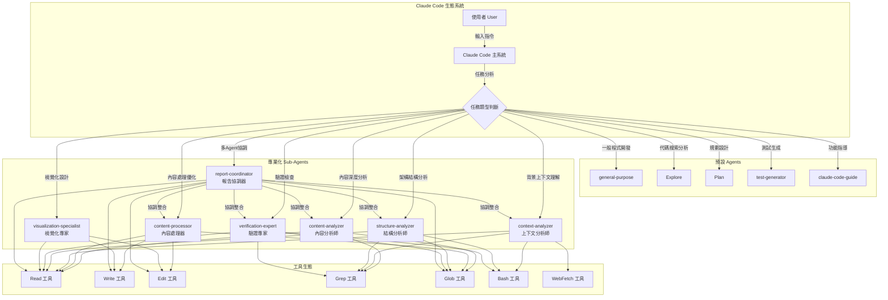
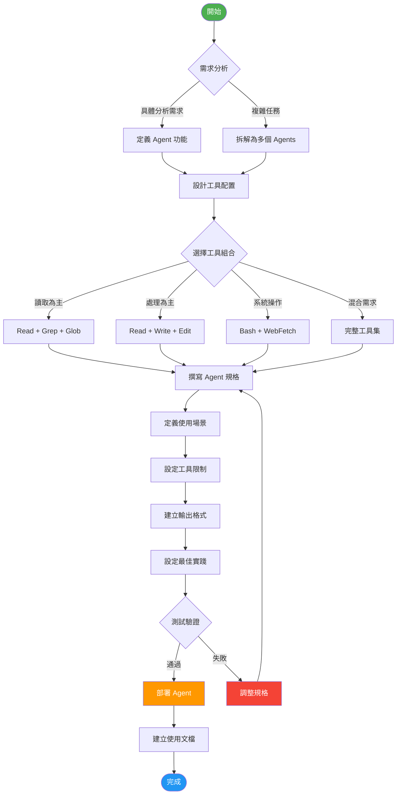
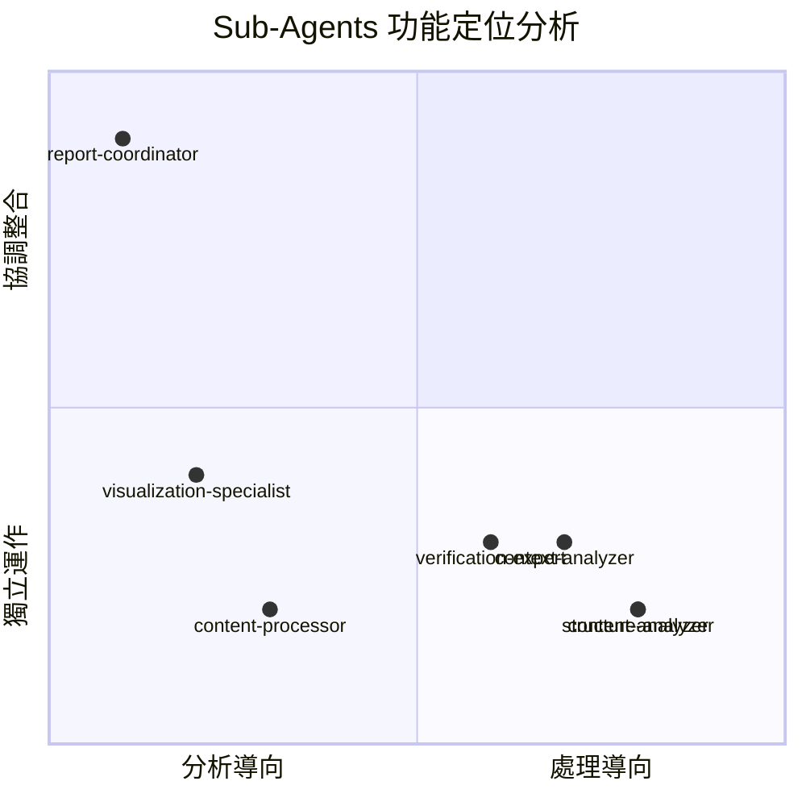
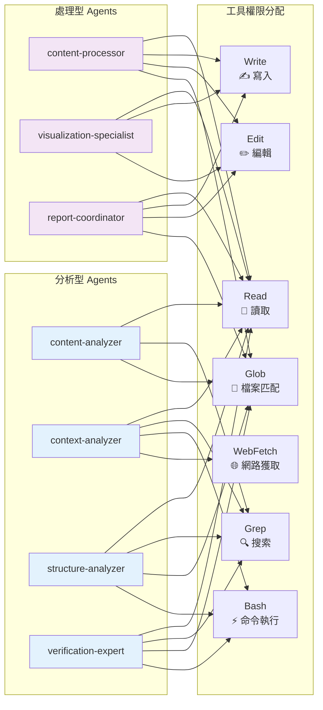
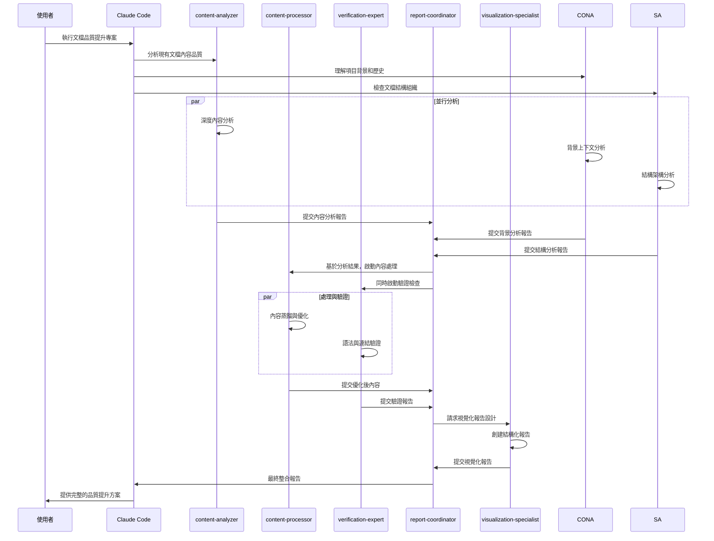
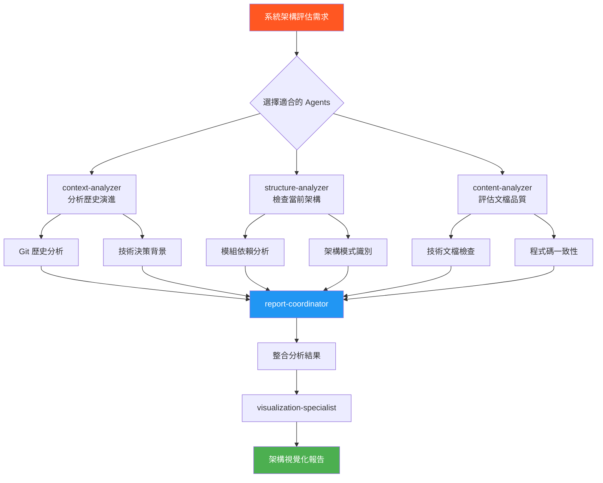
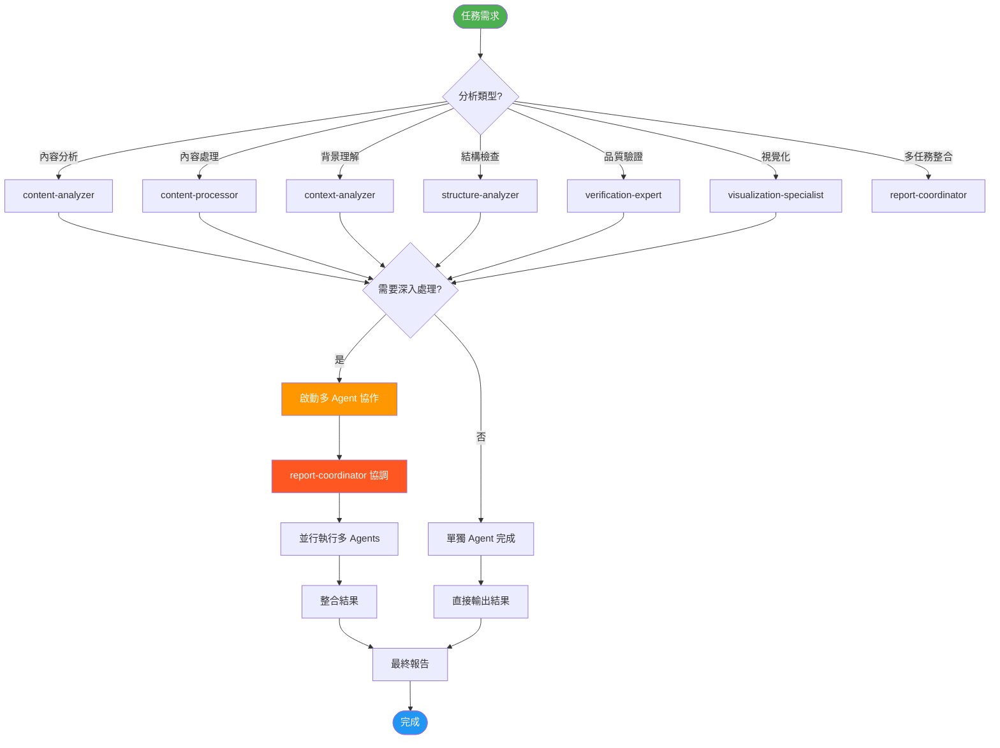
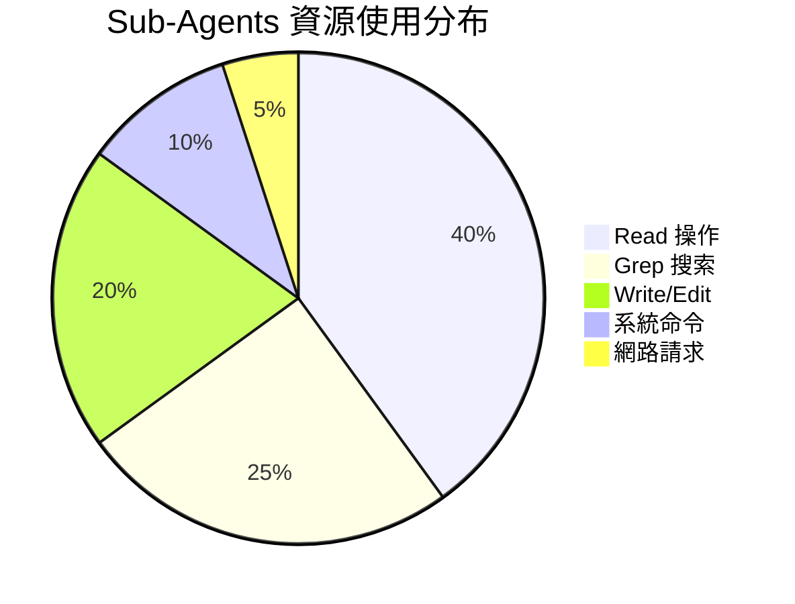
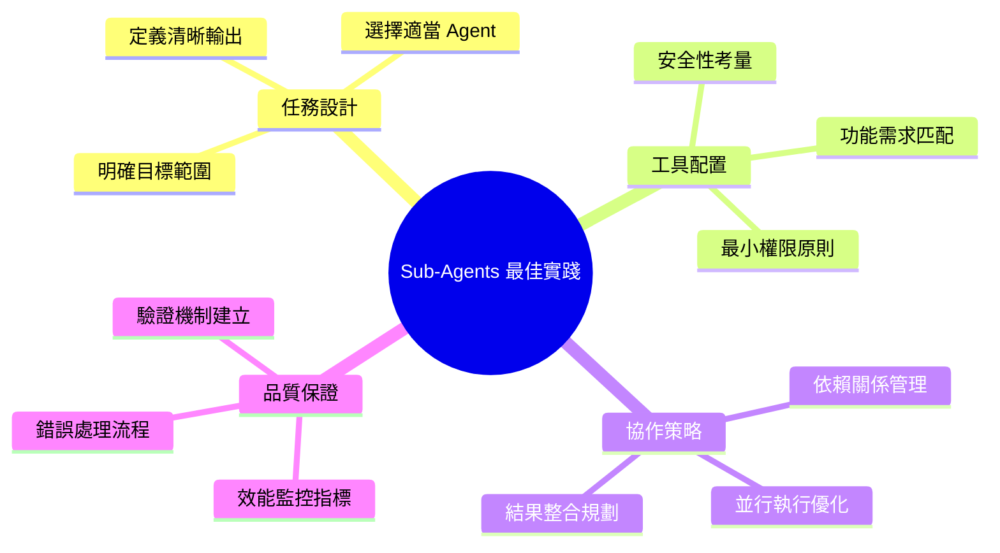

# Claude Code Sub-Agents 系統完整視覺化解釋

## 1. 系統架構圖

## 2. Sub-Agent 創建流程圖

## 3. 代理類型對照表

### 專業化 Sub-Agents 功能對比

### 工具權限矩陣

## 4. 使用場景實例

### 場景一：文檔品質提升專案

### 場景二：系統架構評估

## 5. 最佳實踐建議

### Sub-Agents 使用決策樹

### Agent 協作模式

```mermaid
graph TB
    subgraph "單獨執行模式"
        A1[單一任務] --> B1[選擇對應 Agent]
        B1 --> C1[獨立執行]
        C1 --> D1[直接輸出]
    end

    subgraph "序列協作模式"
        A2[複雜任務] --> B2[按順序啟動 Agents]
        B2 --> C2[Agent 1 輸出]
        C2 --> D2[Agent 2 處理]
        D2 --> E2[Agent 3 驗證]
        E2 --> F2[最終結果]
    end

    subgraph "並行協作模式"
        A3[大型專案] --> B3[同時啟動多 Agents]
        B3 --> C3[並行分析階段]
        C3 --> D3[report-coordinator 整合]
        D3 --> E3[綜合報告輸出]
    end
```

## 6. 效能優化建議

### 資源使用策略

### 最佳實踐清單

---

## 總結

Claude Code Sub-Agents 系統提供了一個專業化、模組化的 AI 協作框架。透過適當選擇和組合不同的專業化 agents，可以大幅提升複雜任務的執行效率和品質。關鍵在於理解每個 agent 的專長領域、工具限制，以及如何有效地協調它們的協作關係。