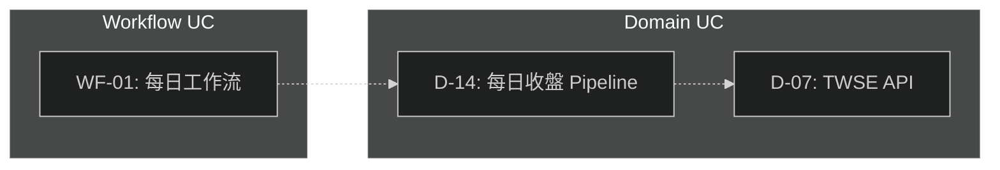

# /claude:daily-maintain — 每日維護四合一

統一的每日文檔健康檢查入口，編排四個維護階段。Phase 1 產出統一 snapshot，Phase 2/3 消費 snapshot 進行交叉驗證。

---

## 四階段流程

```
Phase 1: Unified Snapshot        Phase 2: CLAUDE.md Sync        Phase 3: USE-CASES Sync       Phase 4: Health Report
─────────────────────────        ──────────────────────         ────────────────────────      ──────────────────────
/scan-project → snapshot    →    /claude:sync              →    /uc-sync                 →   彙總報告
diff 新舊 snapshot                消費 claude_md_registry         消費 uc_registry              跨 phase 關聯
LLM 策展更新 dep-graph.md         + cross_validation             + uc_edges                    趨勢追蹤
commit snapshot
```

Phase 1 產出 `.project-snapshot.json`（統一知識快照），Phase 2/3 消費此快照實現資料驅動驗證。

---

## Phase 1: 統一知識快照

### 步驟 1.1：執行統一掃描（腳本）

透過 [/scan-project](../../skills/scan-project/SKILL.md) skill 執行統一掃描：

```bash
cd <project-root>
uv run python ${CLAUDE_SKILL_DIR}/scripts/scan_project.py --project-root . --output .project-snapshot.json
```

腳本產出 JSON v2（modules / edges / hotspots / uc_registry / claude_md_registry / uc_edges / cross_validation）。

**Graceful Degradation**：如果目標專案沒有 `scripts/scan_imports.py`，dep-graph 欄位為空，UC/CLAUDE.md 掃描仍正常運作。

### 步驟 1.2：偵測變化

**`--init` 模式**：跳過 diff，直接進入步驟 1.3。

**維護模式**：比較新舊 JSON 的 `modules`、`edges`、`uc_registry`。沒變 → 報告跳過。有變 → 列出具體變更：

- **dep-graph 變化**：新增/移除的 import edges、fan-out 變化
- **UC registry 變化**：新增/移除/狀態變更的 UC 條目
- **cross-validation 變化**：新增/解決的交叉驗證問題

### 步驟 1.3：更新 dependency-graph.md（LLM 策展）

根據掃描資料更新對應段落（Mermaid graph、Direct Dependencies、Hotspots、Ripple Impact Rules 等）。

- `--init`：從零產出所有段落
- 維護模式：只更新受影響的段落，保留既有語義描述

**Mermaid 暗色主題**：所有 ````mermaid` 區塊必須在第一行加入 `%%{init: {'theme': 'dark'}}%%`，禁止使用 `style ... fill:` 淺色系填色。

**UC Graph 章節**：在 dep-graph.md 中新增 UC graph section，用 `uc_edges` 資料繪製 UC→UC 依賴圖（虛線箭頭）：



### 步驟 1.4：Commit snapshot

`.project-snapshot.json` 隨程式碼一起 commit，作為下次 diff 基準。

---

## Phase 2: CLAUDE.md 同步（資料驅動）

執行 [/claude:sync](./sync.md) `--changed-since yesterday --recursive`。

**Snapshot 加成**（如果 `.project-snapshot.json` 存在）：

- 載入 `claude_md_registry` — 預計算的模組邊界、UC 引用
- 載入 `cross_validation` — 預計算的 X6（模組缺 CLAUDE.md）和 X-path 問題
- 載入 `edges` — 精確的 import 依賴鏈（取代 naive grep import chain）

**無 snapshot 時**：降級為獨立模式（目前的 sync 流程不變）。

**覆蓋範圍**（由 `--recursive` 保證）：
- **Root CLAUDE.md**（專案根目錄）— 頂層索引、模組觸發器、全局架構描述
- **Module CLAUDE.md**（各子模組目錄）— 模組內架構、導航、設計理由

檢查：
- 導航有效性（概念 → 程式碼路徑）
- 程式碼一致性（路徑、簽名、行為描述）
- Signal/Noise ratio
- **交叉驗證**：dep-graph 矛盾（X1）、模組覆蓋缺口（X6）、幽靈 UC 引用（X8）

低風險自動修正（路徑指向已更名檔案）直接修。其他問題先報告。

---

## Phase 3: USE-CASES 同步（資料驅動）

執行 [/uc-sync](../uc-sync.md)。

**Snapshot 加成**（如果 `.project-snapshot.json` 存在）：

- 載入 `uc_registry` — 預計算的 UC 條目、狀態、交叉引用
- 載入 `uc_edges` — 預計算的 UC→UC 依賴邊
- 載入 `cross_validation` — 預計算的 X7（斷裂引用）、X-unique（重複 ID）、X-path（路徑失效）

**無 snapshot 時**：降級為獨立模式（目前的 uc-sync 流程不變）。

檢查：
- 狀態-實作一致性（✅ 的 UC 路徑是否存在）
- 路徑有效性
- Domain-First 合規（UC 放在主要實作模組目錄）
- 跨引用完整性
- **UC-BACKLOG 一致性**（如果 UC-BACKLOG.md 存在）：
  - BACKLOG item 標 📋 但其引用的所有 UC 都已 ✅ → 報告「狀態不一致：P0-X 全部 UC 已完成，但 BACKLOG 仍標 📋」
  - BACKLOG item 標 ✅ 但其引用的 UC 有 📋/🔧 → 報告「狀態不一致：P0-X 有未完成 UC」
  - 報告每個 BACKLOG item 的完成進度（如「P0-1: 2/3 UCs ✅」）
- **SYSTEM-MAP 一致性**（如果 SYSTEM-MAP.md 存在）：
  - SYSTEM-MAP 功能中引用的 UC ID → 驗證這些 UC 存在且狀態正確
  - 功能生命週期狀態 vs 底層 UC 狀態聚合：所有 UC ✅ 但功能標 ⚠️ 或 📋 → 報告「狀態不一致」
  - SYSTEM-MAP 中存在功能但無對應 UC → 報告「缺口：功能 X 無 UC 追蹤」
  - **資料來源**：優先消費 Phase 1 產出的 `.project-snapshot.json`（uc_registry）；無 snapshot 時直接掃描 USE-CASES.md

---

## Phase 4: 統一健康報告

彙總三個 phase 的結果，產出跨 phase 關聯分析。

### 報告內容

1. **各 Phase 摘要**：每個 phase 的通過/警告/失敗統計
2. **跨 Phase 關聯**：
   - Phase 1 發現的 import 變化是否反映在 Phase 2/3 的報告中？
   - Phase 2 發現的 CLAUDE.md 問題是否與 Phase 3 的 UC 問題有共同根因？
   - cross_validation 中未解決的 critical 問題清單
3. **趨勢追蹤**（如果前次 snapshot 可比較）：
   - UC 狀態變化趨勢（📋→✅ 的數量）
   - cross_validation 問題增減
   - 新增/移除的模組數

---

## 參數

| 參數 | 說明 |
|------|------|
| **無參數** | 依序執行 Phase 1 → 2 → 3 → 4 |
| **--init** | Phase 1 用初始生成模式（從零產出 dep-graph） |
| **--only dep-graph** | 只跑 Phase 1 |
| **--only sync** | 只跑 Phase 2 |
| **--only uc-sync** | 只跑 Phase 3 |

---

## 輸出格式

### 無任何變化

```
## Daily Maintenance Report

### Phase 1: Unified Snapshot
✅ 無變化（掃描結果與上次一致）
   - modules: 21, UCs: 142, cross-validation issues: 21

### Phase 2: CLAUDE.md Sync
✅ 無問題（檢查 N 個檔案）

### Phase 3: USE-CASES Sync
✅ 無問題（檢查 N 個 USE-CASES.md）

### Phase 4: Health Report
✅ 整體健康，無跨 phase 關聯問題
```

### 有變化

```
## Daily Maintenance Report

### Phase 1: Unified Snapshot
⚠️ 偵測到變更
- 新增 deps: features → data
- 新增 hotspots: services (fan_out 2→4)
- UC 變化: 📋→✅ D-31, 新增 📋 D-35
- cross-validation: X-path 新增 2 筆（D-15, D-22），X7 解決 1 筆
- 已更新: Mermaid graph, Direct Dependencies 表, UC graph

### Phase 2: CLAUDE.md Sync
⚠️ 發現 3 個問題
- data/CLAUDE.md: 路徑 data/fetchers/twse.py 已更名 → 自動修正
- features/CLAUDE.md: 缺少 features/spec_base.py 導航 → 建議新增
- [X1] data/CLAUDE.md 宣告 "Does NOT depend on strategies" 但 dep-graph 有 import edge

### Phase 3: USE-CASES Sync
✅ 無問題

### Phase 4: Health Report
- Phase 1 的 features→data 新增依賴與 Phase 2 的 data/CLAUDE.md 問題有共同根因（D-31 狀態升級）
- 未解決 critical: X-path 2 筆（D-15, D-22 路徑失效）
- 趨勢: UC 📋→✅ 本月 +5（健康），cross-validation issues -3（改善中）

### 下一步
確認更新內容後，commit 變更
```

---

## 執行約束

- **腳本先行**：Phase 1 必須先跑 scan-project，禁止跳過
- **階段獨立**：前一階段失敗不阻塞後續（記錄錯誤，繼續）
- **資料驅動降級**：Phase 2/3 優先消費 snapshot；無 snapshot 時降級為獨立模式
- **增量更新**：維護模式只更新變化的部分，不重寫整個檔案
- **保留語義**：LLM 策展時保留既有的人工描述，只更新結構性資料
- **報告先行**：先完整報告四個階段的結果，再詢問是否執行修正

---

## 與 launchd 的配合

`run-claude-sync.sh` 已改用本命令：

```bash
claude -p "/claude:daily-maintain"
```

一次跑完四個維護階段。也可拆開執行（避免單次 session 過長）：

```bash
claude -p "/claude:daily-maintain --only dep-graph"
claude -p "/claude:daily-maintain --only sync"
claude -p "/claude:daily-maintain --only uc-sync"
```
