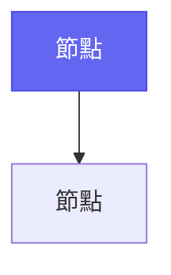

# Mermaid 圖表規範修正建議

## 🚨 需要修正的關鍵問題

### 1. 缺少代碼塊標記指導（致命錯誤）

**當前問題**: explain.md 完全沒有提到 Mermaid 圖表需要包裝在代碼塊中

**需要添加的指導**:
```markdown
### 📝 Mermaid 代碼塊標記（必須遵守）

**絕對要求**: 所有 Mermaid 圖表必須使用 ````mermaid` 代碼塊包裝

**正確格式**:


**❌ 錯誤格式**（缺少代碼塊標記）:
%%{init: {...}}%%
graph TD
    A[節點] --> B[節點]
```

### 2. CSS Class vs Style 語法修正

**當前錯誤**: 第 318 行推薦使用 CSS class，但這在標準 Mermaid 中無法工作

**需要修正的內容**:

**舊的錯誤指導**（第 318 行）:
```
✅ 推薦: 使用 CSS class 定義節點樣式（如 class A primaryNode）
```

**應該修正為**:
```
❌ 錯誤: CSS class 需要在 %%{init}%% 中預定義，不建議使用
✅ 正確: 使用 style 語法定義節點樣式
```

### 3. 風格建議更新

**當前矛盾**: 第 164 行禁止 `style fill:#color`，但這實際上是正確語法

**需要修正的指導**:

**舊的錯誤指導**（第 164 行）:
```
🚫 嚴格禁止: style fill:#color 自定義顏色
```

**應該修正為**:
```
✅ 允許: 使用標準 style 語法定義顏色
✅ 範例: style A fill:#6366f1,stroke:#4f46e5,color:#ffffff
🚫 禁止: 使用未定義的 CSS class
```

## 📋 建議的完整修正方案

### 替換第 163-169 行的內容：

**原文**:
```markdown
### 🚨 Mermaid 圖表色彩約束（重要提醒）
- **🚫 嚴格禁止**: `style fill:#color` 自定義顏色
- **🚫 嚴格禁止**: 不符合 Dark/Light 模式相容性的配置
- **✅ 必須使用**: 標準 init 配置（見下方範例）
- **✅ 推薦做法**: CSS class 或 Emoji 強調節點
- **📖 詳細約束**: 見「階段 2: 視覺化處理」章節
```

**修正後**:
```markdown
### 🚨 Mermaid 圖表語法約束（重要提醒）

**代碼塊標記要求**:
- **✅ 必須使用**: ````mermaid` 代碼塊包裝所有圖表
- **🚫 禁止**: 直接在文檔中寫 Mermaid 語法而不包裝

**樣式定義規範**:
- **✅ 推薦**: 使用標準 `style` 語法定義節點顏色
- **✅ 範例**: `style A fill:#6366f1,stroke:#4f46e5,color:#ffffff`
- **🚫 禁止**: 使用未定義的 CSS class（如 `class A primaryNode`）

**色彩約束**:
- **✅ 必須遵守**: CLAUDE.md 通用色彩設計約束
- **✅ 必須使用**: 符合 Dark/Light 模式相容性的顏色
- **🚫 嚴格禁止**: 極端深色和淺色配色
```

### 替換第 305-325 行的內容：

**原文**:
```markdown
**推薦做法**:
- **✅ 推薦**: 使用 CSS class 定義節點樣式（如 class A primaryNode）
- **✅ 推薦**: 使用 Emoji 強調節點（如 [✅ 改善] [❌ 問題] [🚀 新功能]）
- **✅ 推薦**: Dark/Light 模式下對比度都 ≥4.5:1 的色彩
```

**修正後**:
```markdown
**推薦做法**:
- **✅ 推薦**: 使用標準 `style` 語法定義節點樣式
- **✅ 範例**: `style A fill:#6366f1,stroke:#4f46e5,color:#ffffff`
- **✅ 推薦**: 使用 Emoji 強調節點（如 [✅ 改善] [❌ 問題] [🚀 新功能]）
- **✅ 推薦**: Dark/Light 模式下對比度都 ≥4.5:1 的色彩

**CSS Class 使用注意**:
- **⚠️ 注意**: CSS class 需要在 %%{init}%% 中預先定義
- **🚫 禁止**: 使用未定義的 class 名稱
- **✅ 安全**: 直接使用 style 語法更可靠
```

## 🎯 立即行動項

1. **高優先級**: 立即修正代碼塊標記指導遺漏
2. **中優先級**: 修正 CSS class vs style 的錯誤指導
3. **低優先級**: 更新範例代碼以符合正確語法

## 📚 參考資料

- [Mermaid 官方文檔 - 圖表語法](https://mermaid.js.org/syntax/)
- [Mermaid 官方文檔 - 樣式和 CSS](https://mermaid.js.org/syntax/theme.html)
- [GitHub Flavored Markdown - 代碼塊](https://docs.github.com/en/get-started/writing-on-github/working-with-advanced-formatting/creating-and-highlighting-code-blocks)