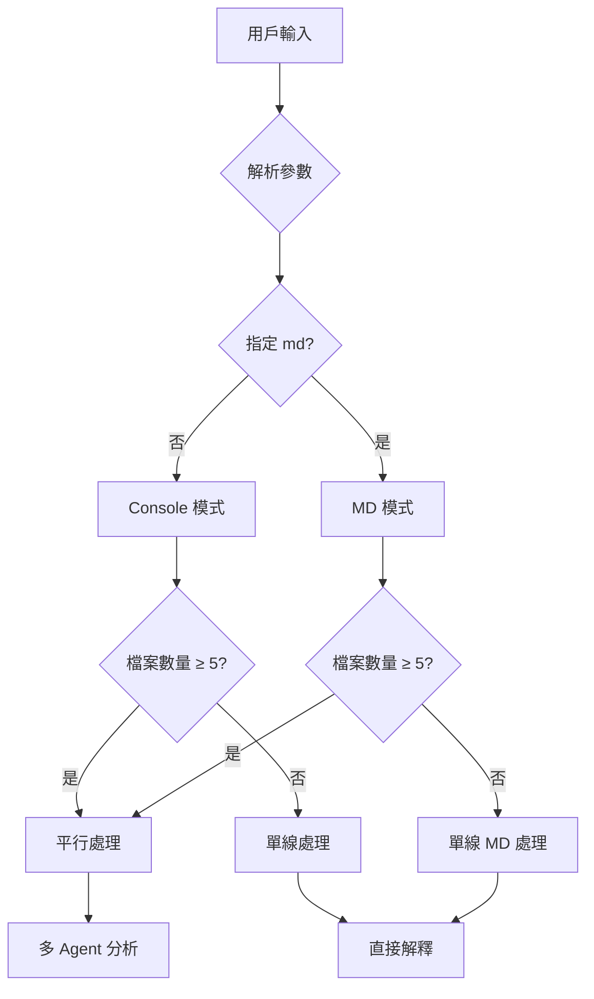
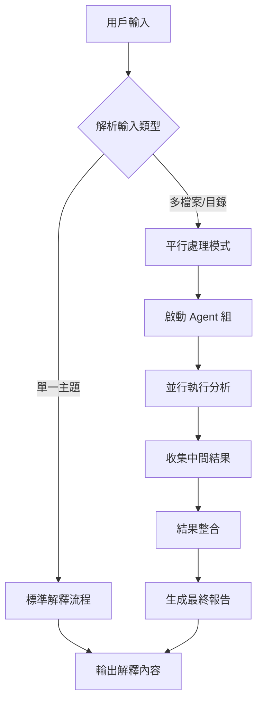
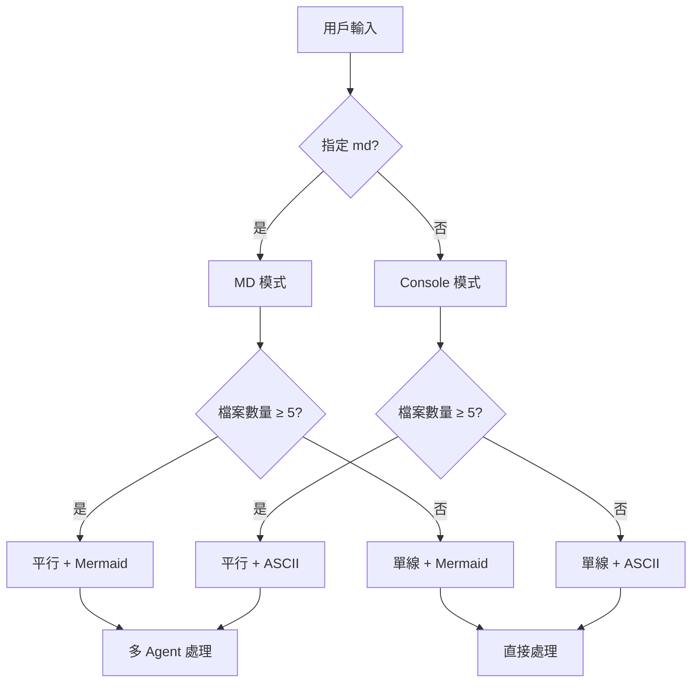
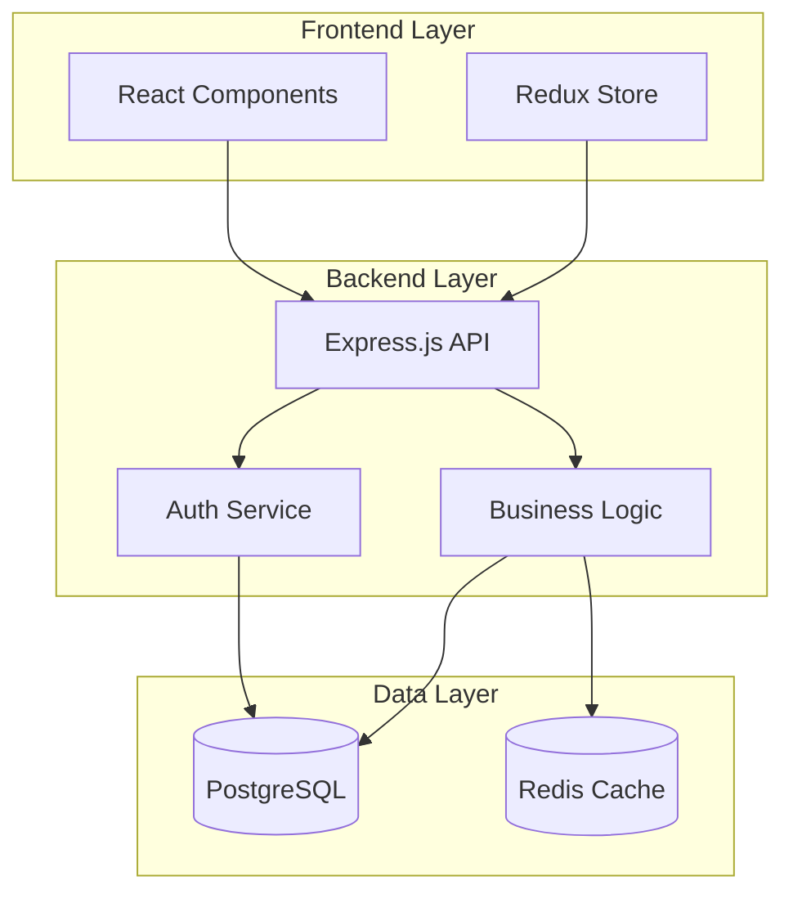

# 智能解釋系統

## 🎯 核心能力

### 📝 單一主題解釋
- **概念解析**: 技術概念、架構設計、流程說明
- **視覺化圖表**: ASCII 或 Mermaid 圖表輔助理解

### 📁 批次檔案分析
- **目錄掃描**: 自動分析整個目錄結構和內容
- **智能平行**: 根據檔案數量自動啟用平行處理
- **智能關聯**: 自動發現檔案間的關聯性和依賴關係

## 模式說明

### 🖥️ Console 模式（預設）
- **圖表類型**: ASCII 圖表
- **內容長度**: 精簡扼要
- **輸出格式**: 終端機友善
- **適用場景**: 快速理解、即時討論

### 📄 MD 檔案模式
- **圖表類型**: Mermaid 圖表
- **內容長度**: 詳盡完整
- **輸出格式**: Markdown 檔案
- **適用場景**: 文檔記錄、深度分析

## 使用方式

```bash
# 單一主題解釋（預設 Console 模式）
/explain 微服務架構
/explain md Kubernetes 叢集管理

# 目錄分析（自動檢測檔案數量）
/explain @src/components/          # 自動決定是否平行處理
/explain md @docs/                 # 生成 MD 報告

# 多檔案分析（自動觸發平行處理）
/explain @file1.js @file2.js @config.json
/explain md @src/ @tests/

# 進階分析
/explain md 深度分析整個專案架構 @src/
/explain 論文分析：@paper1.pdf @paper2.pdf
```

## ⚡ 自動平行處理邏輯

### 觸發條件（完全自動）
```bash
# 自動啟用平行處理的情況：
1. 檔案數量 ≥ 5 個
2. 目錄包含 ≥ 5 個檔案
3. 檔案總大小 > 50KB
4. 包含多種檔案類型（程式碼+配置+文檔）
```

### 處理模式決策流程


---

## 🖥️ Console 模式規範

### 輸出原則
- **精簡為上**: 重點突出，刪除冗餘
- **ASCII 圖表**: 使用文字符號繪製
- **快速掃讀**: 3-5 個章節，每節 3-5 點
- **即時可用**: 無需額外工具檢視

### ASCII 圖表工具集
```bash
# 基本元件
┌─┐ └─┘ │ │ ├─┤ ┬─┬
│ │ │ │ │ │ │ │ │ │
└─┘ └─┘ └─┘ └─┘ ┴─┴

# 流程箭頭
→ ↓ ↑ ← ↔ ⇄
─── ⇒ ⇐ ⟷

# 標註符號
【】『』※★◆
```

### Console 範例結構
```
【核心概念】
一行定義 + ASCII 簡圖

【架構流程】
┌─┐ → ┌─┐ → ┌─┐
│A│   │B│   │C│
└─┘   └─┘   └─┘

【關鍵要點】
• 要點一：簡要說明
• 要點二：簡要說明
• 要點三：簡要說明

【實作建議】
1. 步驟一
2. 步驟二
3. 步驟三
```

---

## 📄 MD 檔案模式規範

### 輸出原則
- **詳盡完整**: 深度分析，背景脈絡
- **Mermaid 圖表**: 專業圖表，可互動檢視
- **層次結構**: 多級標題，詳細展開
- **文檔導向**: 適合長期保存和分享

### Mermaid 圖表類型
```mermaid
# 流程圖
graph TD
    A[開始] --> B[處理]
    B --> C[結束]

# 序列圖
sequenceDiagram
    participant A
    participant B
    A->>B: 請求
    B-->>A: 回應

# 類圖
classDiagram
    class ClassA {
        +method()
    }
    ClassA --|> ClassB

# 甘特圖
gantt
    title 專案時程
    section 階段一
    任務一：2024-01-01, 7d
```

### MD 範例結構
```markdown
# 主題：[主題名稱]

## 一、概念背景
### 問題定義
### 發展歷程
### 核心價值

## 二、技術架構
### 整體架構圖


### 核心組件分析
#### 組件一：功能與職責
#### 組件二：介面設計
#### 組件三：資料流程

## 三、實作流程
### 階段一：規劃設計
### 階段二：開發實作
### 階段三：測試部署

## 四、最佳實踐
### 設計原則
### 常見陷阱
### 優化策略

## 五、案例分析
### 成功案例
### 失敗教訓
### 經驗總結
```

---

## 智能內容調整

### 內容深度差異

| 層次 | Console 模式 | MD 模式 |
|------|-------------|---------|
| **概念介紹** | 1-2 句話定義 | 完整背景脈絡 |
| **技術細節** | 重點特色 | 完整技術規格 |
| **流程說明** | 主要步驟 | 詳細執行流程 |
| **案例分析** | 1 個典型例子 | 多個對比案例 |
| **實作建議** | 3 個要點 | 完整實作指南 |

### 圖表複雜度

| 圖表類型 | Console | MD |
|----------|---------|----|
| **流程圖** | 線性流程，5-7 個節點 | 分支邏輯，完整決策樹 |
| **架構圖** | 核心組件關係 | 多層次系統架構 |
| **時序圖** | 主要交互流程 | 完整消息傳遞 |
| **對比表** | 3x3 重點對比 | 詳細功能對照 |

---

## ⚡ 自動平行處理架構

### 觸發機制（智能化）
系統會自動檢測並決定是否啟用平行處理：

```bash
# 自動判斷條件
- 檔案數量 >= 5 個 ✓
- 目錄包含 >= 5 個檔案 ✓
- 檔案總大小 > 50KB ✓
- 多種檔案類型混合 ✓
```

**注意**: 使用者無需手動指定，系統會自動選擇最優處理方式。

### 🚀 多 Agent 工作流程

#### 階段 1: 檔案分析（3 個並行 Agents）
```
Agent #1: 結構分析師
- 任務: 分析檔案結構、依賴關係、模組劃分
- 工具: Glob, Grep, Read
- 輸出: 檔案關聯圖、依賴樹

Agent #2: 內容分析師
- 任務: 深度解析程式碼邏輯、設計模式
- 工具: Read, Task(Explore)
- 輸出: 核心邏輯說明、設決策分析

Agent #3: 上下文分析師
- 任務: 分析 Git 歷史、文件註解、配置
- 工具: Bash, Read, WebFetch
- 輸出: 開發背景、演進過程
```

#### 階段 2: 視覺化處理（2 個並行 Agents）
```
Agent #4: ASCII 圖表設計師 (Console 模式)
- 任務: 生成 ASCII 流程圖、架構圖
- 工具: 文字處理、符號庫
- 輸出: 終端機友善圖表

Agent #5: Mermaid 圖表設計師 (MD 模式)
- 任務: 生成 Mermaid 流程圖、類圖、時序圖
- 工具: Mermaid 語法、圖表最佳化
- 輸出: 可互動的專業圖表
```

#### 階段 3: 結果整合（1 個協調 Agent）
```
Agent #6: 總結報告師
- 任務: 整合所有分析結果，生成最終報告
- 工具: 文件生成、格式化、摘要
- 輸出: 完整的分析報告
```

### 平行處理執行流程



### 智能檔案分組策略

```python
def group_files_for_analysis(file_paths):
    """智能分組檔案以進行最適化平行處理"""
    groups = {
        'config': [],      # 配置檔案
        'code': [],        # 程式碼檔案
        'docs': [],        # 文檔檔案
        'tests': [],       # 測試檔案
        'data': []         # 資料檔案
    }

    for path in file_paths:
        if any(config in path for config in ['package.json', 'tsconfig', 'yaml']):
            groups['config'].append(path)
        elif any(code in path for code in ['.py', '.js', '.ts', '.java']):
            groups['code'].append(path)
        elif any(doc in path for doc in ['.md', '.txt', '.pdf']):
            groups['docs'].append(path)
        elif 'test' in path:
            groups['tests'].append(path)
        else:
            groups['data'].append(path)

    return [g for g in groups.values() if g]  # 過濾空群組
```

---

## 執行邏輯

### 簡化決策流程


### 自動化執行策略
```bash
# 系統自動執行步驟：
1. 解析用戶輸入 → 主題 or 檔案/目錄
2. 檢測 md 參數 → 圖表類型決策
3. 計算檔案數量 → 處理模式決策
4. 自動啟動對應的處理流程
5. 生成格式化輸出
```

**使用者只需**: 選擇 `console` 或 `md`，其餘全自動！

---

## 深度分析模式

根據不同類型內容，在視覺化解釋基礎上增加對應的深度分析：

### 📄 論文分析模式

#### 學術結構分析
- **研究問題**：問題定義、動機、假設
- **方法論**：實驗設計、數據來源、評估指標
- **核心貢獻**：創新點、理論突破、實用價值

#### 技術深度探討
- **算法原理**：數學公式、推導過程、複雜度分析
- **實驗設計**：對照組設定、參數調整、統計方法
- **結果驗證**：數據解讀、統計顯著性、局限性

#### 影響力評估
- **學術脈絡**：前人研究、理論基礎、發展脈絡
- **實際應用**：產業應用、實作可行性、商業價值
- **未來方向**：研究缺口、擴展可能、後續工作

### 📝 文章分析模式

#### 論述結構分析
- **核心論點**：主要觀點、支撐論據、邏輯脈絡
- **資訊架構**：章節安排、資訊層次、重點分布
- **說服策略**：修辭技巧、證據類型、目標受眾

#### 內容深度探討
- **事實查證**：數據來源、統計方法、可信度評估
- **觀點比較**：不同立場、爭議點、平衡性分析
- **背景脈絡**：時代背景、相關事件、影響因素

#### 價值判斷
- **實用性**：可操作性、適用範圍、實施難度
- **創新性**：新穎觀點、獨特見解、突破性思考
- **影響力**：社會影響、政策意涵、長期效應

### 💻 程式碼分析模式

#### 技術實作層面
- **代碼架構分析**：關鍵類別、方法、設計模式
- **性能考量**：時間/空間複雜度、瓶頸分析
- **技術選型依據**：框架選擇理由、技術棧權衡

#### 實作細節探討
- **關鍵算法**：核心邏輯的偽代碼或實際代碼
- **數據結構設計**：儲存格式、索引策略
- **錯誤處理策略**：異常情況、容錯機制

#### 系統整合分析
- **模組間依賴**：介面定義、數據傳遞
- **擴展性設計**：未來需求、架構彈性
- **測試策略**：單元測試、整合測試重點

**使用場景**：
- 📄 **論文**: 學術研究分析、技術文獻理解
- 📝 **文章**: 商業報告分析、政策文件解讀
- 💻 **程式碼**: 代碼審查、架構重構、技術選型

---

## 🎯 實際使用範例

### 範例 1: 單一概念解釋
```bash
# Console 模式 - 快速理解
/explain Docker 容器化

【核心概念】
Docker 將應用程式打包成輕量級、可移植的容器
┌─────────┐    ┌──────────┐    ┌─────────┐
│ 應用程式 │ →  │ Docker   │ →  │ 容器運行│
│ + 依賴   │    │ 打包     │    │ 任何環境│
└─────────┘    └──────────┘    └─────────┘

【關鍵優勢】
• 環境一致性：開發、測試、生產環境完全相同
• 快速部署：秒級啟動，資源占用少
• 版本管理：映像檔版本控制，易於回滾
```

### 範例 2: 目錄智能分析
```bash
# 分析整個專案結構（檔案數量 >= 5 時自動平行處理）
/explain @src/ @config/ @docs/

# 系統檢測到 15+ 檔案 → 自動啟動 6 個 Agents 平行處理：

#### 🔍 Agent #1: 結構分析師
發現 3 層架構：
```
┌─────────────┐
│  Presentation│ ← @src/components/
└─────────────┘
       ↓
┌─────────────┐
│   Business  │ ← @src/services/
└─────────────┘
       ↓
┌─────────────┐
│    Data     │ ← @src/models/
└─────────────┘
```

#### 🔍 Agent #2: 內容分析師
核心服務：
- AuthService：JWT 認證機制
- PaymentService：第三方支付整合
- NotificationService：郵件/簡訊通知

#### 🔍 Agent #3: 上下文分析師
Git 歷史顯示：
- 2 個月前從 monolithic 重構為 microservices
- 最近活躍開發：PaymentService 功能擴充
```

### 範例 3: MD 檔案深度分析
```bash
# 生成完整技術文檔
/explain md @architecture/ @database-schema.sql

# 輸出完整 Markdown 報告：

# 系統架構分析報告

## 一、整體架構概覽


## 二、資料庫設計分析
### 2.1 核心表結構
...

[完整報告約 2000 字，包含詳細的圖表和建議]
```

---

## 🚀 進階使用技巧

### 智能檔案引用
```bash
# 使用萬用字元（檔案數量 >= 5 時自動平行處理）
/explain @src/**/*.py @tests/**/*.py

# 排除特定檔案
/explain @src/ @tests/ --exclude @src/temp/ @src/old/

# 組合不同類型檔案
/explain @code/ @docs/ @config/ "微服務架構分析"
```

### 自動化整合
```bash
# Git Hook 整合
#!/bin/sh
# pre-commit hook（staged 檔案 >= 5 個時自動平行處理）
/explain md @staged/ > PR-summary.md

# CI/CD Pipeline
claude -p "/explain @build-errors/" > analysis.json
```

### 結果儲存與分享
```bash
# 儲存分析結果（大專案自動平行處理）
/explain md @project/ > project-analysis.md

# 生成可分享的報告
/explain @architecture/ > report.html
```

---

## ⚠️ 最佳實踐與限制

### ✅ 最佳實踐
1. **明確範圍**: 指定具體檔案或目錄，避免過廣
2. **批次處理**: 一次處理相關檔案，提高效率
3. **定期分析**: 建立定期程式碼審查流程
4. **結果記錄**: 保存重要分析結果供未來參考

### ⚠️ 注意事項
- **檔案大小**: 單次建議不超過 50 個檔案
- **處理時間**: 大型專案可能需要 1-3 分鐘
- **記憶體使用**: 複雜分析會消耗較多資源
- **網路依賴**: 某些分析可能需要外部查詢

### 🔄 故障排除
```bash
# 檢查檔案數量和平行處理狀態
/explain --status @project/

# 強制重新分析
/explain --refresh @project/

# 除錯模式
/explain --debug @problematic-file.py

# 查看檔案統計
/explain --stats @src/
```

---

## 📊 效能指標

### 平行處理效能
- **小型專案** (< 10 檔案): 5-10 秒
- **中型專案** (10-50 檔案): 10-30 秒
- **大型專案** (50+ 檔案): 30-120 秒

### 資源使用
- **記憶體峰值**: ~200MB (大型專案)
- **CPU 使用**: 短暫高峰，多核心並行
- **網路頻寬**: 最小化，僅必要時使用

