# Agentic Design Patterns — 全書章節重點

> Antonio Gulli《Agentic Design Patterns — A Hands-On Guide》(482 頁,21 patterns)章節重點。繁中 + 英文術語,基於第一手逐章精讀。
> 配套:[Agentic-Design-Patterns-應用分析.md](./Agentic-Design-Patterns-應用分析.md)(書 → ai-rules → mosaic 應用分析)。
> 三框架:LangChain/LangGraph(顯式控制流)、Crew AI(角色/任務宣告式)、Google ADK(Agent+Tool+Session/State/Memory 原生抽象)。全書隱喻:agent 開發 = 在 canvas(底層 infrastructure)上創作。
> 📄 **PDF 跳轉**:每章標題下的「跳轉 PDF 第 N 頁」連結 = `file://...#page=N`(**實體 PDF 頁**,非書本印刷頁碼)。**瀏覽器(Chrome/Firefox/Safari)/ Adobe Reader 點擊即跳該頁**;macOS Preview 不支援 `#page` fragment(會開 PDF 但不跳頁,需手動輸頁碼)。

---

## 目錄

- [前言:Agent 定義與全景](#前言agent-定義與全景)
- [Part One — Core Execution & Decomposition](#part-one--core-execution--decomposition)
  - Ch1 Prompt Chaining · Ch2 Routing · Ch3 Parallelization · Ch4 Reflection · Ch5 Tool Use · Ch6 Planning · Ch7 Multi-Agent
- [Part Two — State, Knowledge & Goals](#part-two--state-knowledge--goals)
  - Ch8 Memory · Ch9 Learning · Ch10 MCP · Ch11 Goal/Monitoring
- [Part Three — Reliability & Oversight](#part-three--reliability--oversight)
  - Ch12 Exception Handling · Ch13 HITL · Ch14 RAG
- [Part Four — Production Hardening](#part-four--production-hardening)
  - Ch15 A2A · Ch16 Resource-Aware · Ch17 Reasoning · Ch18 Guardrails · Ch19 Evaluation · Ch20 Prioritization · Ch21 Exploration
- [附錄 + Conclusion](#附錄--conclusion)

---

## 前言:Agent 定義與全景

> 📄 [跳轉 PDF 第 14 頁（What makes an AI system an Agent）](file:///Users/ctai/Github/ai-rules/ref-docs/Agentic-Design-Patterns.pdf#page=14)

**Agent** = 一個能 **感知環境(perceive)→ 基於目標決策(decide)→ 自主行動(act)** 的計算實體。必要特徵:autonomy(自主)、proactiveness(主動)、reactiveness(反應)、goal-oriented(目標導向)、tool use、memory、communication。從標準 LLM 演化而來(加上 plan / use tools / interact)。

**5-step agent loop**:Get Mission → Scan Scene → Think It Through → Take Action → Learn & Get Better。

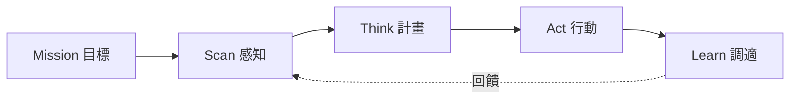

**Agent 複雜度 Level 0-3**:

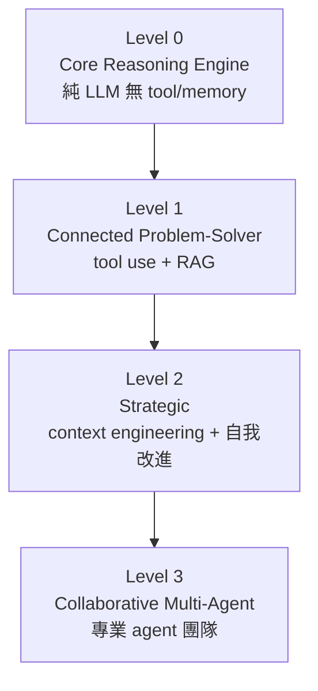

**Context Engineering(獨立紀律,位於 prompt engineering 之上)**:output 品質取決於 context 豐富度,非模型架構。context 分層 = system prompt + 外部資料(retrieved docs + tool outputs)+ implicit data(user identity/history/env)。**這是全書最重要的橫切概念**。

**5 個未來假設**:Generalist Agent(通用型)、Deep Personalization(個人化主動)、Embodiment(實體機器人)、Agent-Driven Economy(代理經濟)、Goal-Driven Metamorphic Multi-Agent(目標驅動、自我重組)。

**Marco Argenti(Goldman CIO)觀點**:rules-based automaton = static subway map(遇障礙即壞);reasoning agent = dynamic GPS(observe/adapt/reroute)。「messy systems + agents = disaster」,須先整頓 clean data / consistent metadata / well-defined APIs(enterprise-as-software)。

---

## Part One — Core Execution & Decomposition

### Ch1 Prompt Chaining(Pipeline Pattern)

> 📄 [跳轉 PDF 第 23 頁](file:///Users/ctai/Github/ai-rules/ref-docs/Agentic-Design-Patterns.pdf#page=23)

**核心**:Divide-and-conquer —— 複雜任務拆成 sub-problem 序列,每步一個 focused prompt,前步 output 餵入下步。又稱 Pipeline。

**何時用 / 不用**:單一 prompt 會 instruction neglect / contextual drift / error propagation / hallucination 時用;任務簡單無明顯階段不用。structured output(JSON/XML)是步間可靠性的關鍵;每步可賦不同 role(Analyst → Writer)。

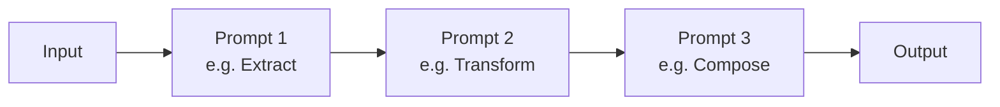

**Pitfalls**:步間 output 格式不明確污染下游;單一 monolithic prompt 的五大失敗模式。**真系統常組合**:parallel(獨立收集)+ chaining(相依合成)。

---

### Ch2 Routing

> 📄 [跳轉 PDF 第 36 頁](file:///Users/ctai/Github/ai-rules/ref-docs/Agentic-Design-Patterns.pdf#page=36)

**核心**:在 chain 之上加 conditional logic,依 input intent 或 state 動態選下一個 specialized function/tool/sub-agent。

**4 種 router**:LLM-based(prompt 吐分類)、Embedding-based(語意相似)、Rule-based(if-else,快但僵)、ML classifier(supervised fine-tune,real-time)。需有 fallback(unclear → clarification sub-agent)。

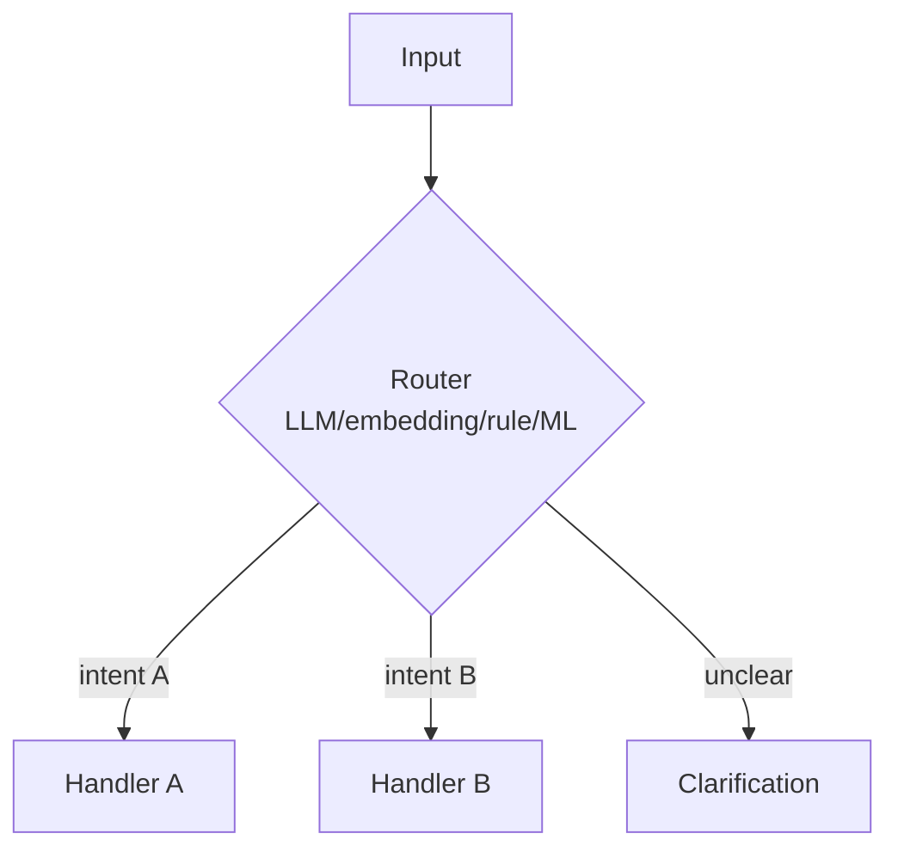

**Pitfalls**:rule-based 對 novel input 不靈活;LLM router 較慢且非確定性。ADK 的 Auto-Flow(parent 有 sub_agents 即自動 LLM delegation)是 routing 的一種。

---

### Ch3 Parallelization

> 📄 [跳轉 PDF 第 50 頁](file:///Users/ctai/Github/ai-rules/ref-docs/Agentic-Design-Patterns.pdf#page=50)

**核心**:識別彼此不依賴的 sub-task 並行執行,收斂點 synthesize。大幅降 latency(尤其外部 I/O)。

**關鍵澄清**:**asyncio 提供 concurrency 非 parallelism** —— 單執行緒 event loop + GIL,靠 I/O idle 切換。Map(並行)→ Synthesize(序列,等全部)。

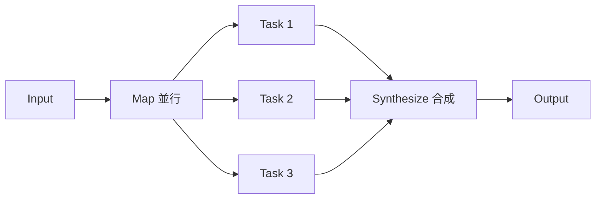

**Pitfalls**:並行**顯著增加 design/debug/logging 複雜度與成本**(key takeaway,非免費)。對外部服務(API/DB)有 latency 時最有價值。

---

### Ch4 Reflection

> 📄 [跳轉 PDF 第 65 頁](file:///Users/ctai/Github/ai-rules/ref-docs/Agentic-Design-Patterns.pdf#page=65)

**核心**:Agent 評估自己產出並用該評估 refine(self-correction)。引入 feedback loop(有別於 chain 直線、routing 分支)。品質/準確度 >> 速度/成本時用。

**最有效實作 = Producer-Critic 分離**(Generator-Critic):Producer 生成,Critic 用不同 persona/system prompt 評,避免「self-review 認知偏差」。

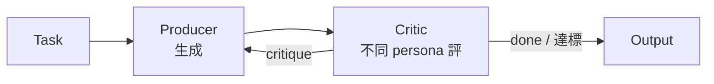

**Pitfalls**:**更高成本與 latency**(每 refinement loop 多一次 LLM call);memory-intensive(history 膨脹:initial + critique + refinements),易超 context window 或被 throttle。與 Goal Setting(Ch11,benchmark)+ Memory(Ch8,使 reflection cumulative)協同。

---

### Ch5 Tool Use(Function Calling)

> 📄 [跳轉 PDF 第 79 頁](file:///Users/ctai/Github/ai-rules/ref-docs/Agentic-Design-Patterns.pdf#page=79)

**核心**:讓 LLM 決定何時、如何呼叫外部 function —— bridge 推理能力與外部 API/DB/code/agent 的執行能力。是「text generator → 能感知/推理/行動 agent」的基石。

**6 步**:Tool Definition → LLM Decision → Function Call Generation(structured JSON)→ Tool Execution → Observation(result 回灌)→ LLM Processing。**function calling**(預定義 code function) vs **tool calling**(更廣:API endpoint、DB query、甚至委派另一 agent)。

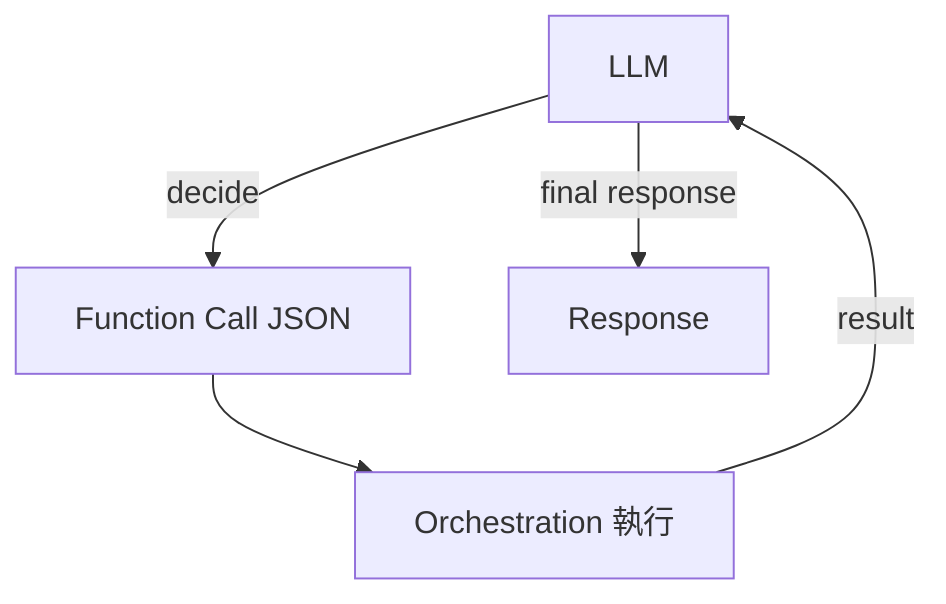

**Pitfalls**:LLM 知識靜態、與外界斷裂;tool description 寫不好 LLM 不會選對。ADK 有 pre-built tools(Google Search、Code Execution、Vertex AI Search);Vertex Extensions 自動執行,function call 需手動。

---

### Ch6 Planning

> 📄 [跳轉 PDF 第 100 頁](file:///Users/ctai/Github/ai-rules/ref-docs/Agentic-Design-Patterns.pdf#page=100)

**核心**:Agent 從 initial state 制定 action 序列達 goal state,且**計畫是動態的**(吸收新資訊、繞障礙、replan)。Plan 回應請求而生,非事先已知。

**關鍵判準**:「**does the how need to be discovered, or is it already known?**」—— 已 well-understood 且 repeatable → 限制自主、用固定 workflow(flexibility vs predictability trade-off)。


**Pitfalls**:動態 planning 非萬靈丹;predictable 場景硬用反增不確定性。Google DeepResearch = plan → 用戶 review/modify → async iterative search-analyze → 引用來源報告(plan-before-execute 範例)。

---

### Ch7 Multi-Agent Collaboration

> 📄 [跳轉 PDF 第 113 頁](file:///Users/ctai/Github/ai-rules/ref-docs/Agentic-Design-Patterns.pdf#page=113)

**核心**:多個專業 agent 協作的 ensemble,靠 task decomposition + standardized communication protocol + shared ontology,集體表現 > 單一 agent。

**6 種 collaboration 形式**:Sequential Handoffs / Parallel Processing / Debate & Consensus / Hierarchical(manager 動態委派)/ Expert Teams / Critic-Reviewer。

**6 種 interrelationship 模型**:Single / Network(peer-to-peer,去中心但 overhead)/ Supervisor(中央,但 single point of failure)/ Supervisor-as-Tool(提供資源非命令)/ Hierarchical(多層 supervisor)/ Custom。

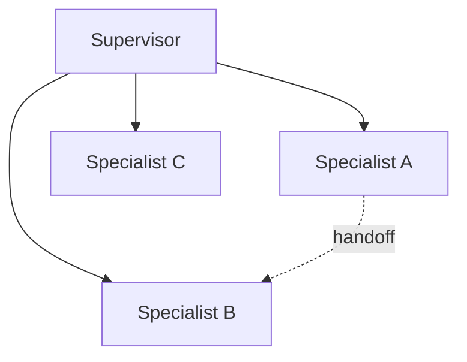

**Pitfalls**:Network 溝通 overhead 大;Supervisor 是 bottleneck + single point of failure;設計成本高。

---

## Part Two — State, Knowledge & Goals

### Ch8 Memory Management

> 📄 [跳轉 PDF 第 132 頁](file:///Users/ctai/Github/ai-rules/ref-docs/Agentic-Design-Patterns.pdf#page=132)

**核心**:Agent 需雙層記憶 —— **short-term(contextual,在 context window)** vs **long-term(persistent,跨 session)**。沒記憶 = stateless。

**關鍵澄清**:**long-context model 只是放大 short-term,仍 ephemeral、session 結束即失、處理昂貴** —— long context ≠ long-term memory。long-term 存外部(DB / knowledge graph / vector DB,語意搜尋)。

**long-term 3 型**:semantic(facts)、episodic(experiences,常用 few-shot)、procedural(rules/system prompt,可 reflection 改)。

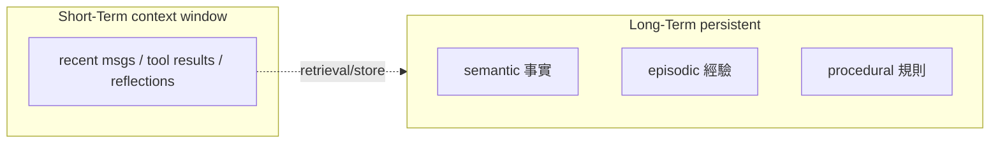

**ADK 三元件**:Session(對話 thread + Events)、session.state(臨時資料,user:/app:/temp: prefix)、MemoryService(可搜尋跨 session)。**紀律:state 須透過 EventActions.state_delta 或 output_key 更新,不可直接改 dict**(否則不記錄/不持久/concurrency 問題)。Pitfalls:context window 有限且昂貴;long-term 品質取決於 embedding + retrieval 設計。

---

### Ch9 Learning and Adaptation

> 📄 [跳轉 PDF 第 154 頁](file:///Users/ctai/Github/ai-rules/ref-docs/Agentic-Design-Patterns.pdf#page=154)

**核心**:Agent 透過新經驗/資料改變 thinking/actions/knowledge,從靜態指令跟隨者 → 自我進化系統。6 範式:RL / Supervised / Unsupervised / Few-Shot(LLM 快速適應)/ Online / Memory-Based。

**PPO**(clip 機制防 policy 劇變,trust region)+ **DPO**(跳過 reward model,直接用 preference data,避 reward hacking)。

**Case Study: SICA(Self-Improving Coding Agent)** —— agent **修改自己 source code**:review 過去版本 archive → 選最佳 → analyze → 改 codebase → 跑 benchmark → 記錄。演化出 Smart Editor → Diff-Enhanced → AST Symbol Locator。**關鍵:asynchronous overseer LLM** 監控行為、偵測 loops/stagnation、必要時 halt。

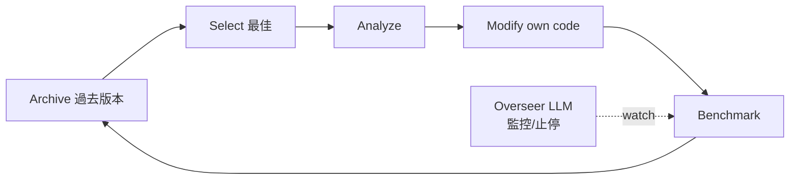

**AlphaEvolve**(Google):LLM + 演化框架自主發現/優化演算法(matrix multiplication、TPU Verilog、data center scheduling)。**Pitfalls**:自我修改有風險(overseer 防);context window 結構對效率至關重要。

---

### Ch10 Model Context Protocol(MCP)

> 📄 [跳轉 PDF 第 167 頁](file:///Users/ctai/Github/ai-rules/ref-docs/Agentic-Design-Patterns.pdf#page=167)

**核心**:**開放標準**,LLM 與外部系統間的 universal adapter —— 標準化「LLM 如何發現並使用外部 capabilities」。client-server 架構;server 暴露 Resource(靜態資料)/ Tool(可執行 function)/ Prompt(template);client 動態 discover 並消費。

**MCP vs function calling**:MCP = 高抽象開放標準(跨 provider、動態發現、可重用 server);function calling = 單 agent 內綁定、手動執行。MCP 可包住 function call。

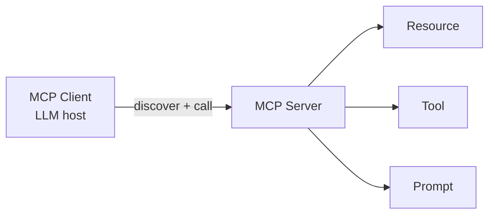

**🔴 最強警告(反模式)**:
1. **MCP 只是「agentic interface 的契約」,療效取決於底層 API 設計**。直接包 legacy API 不改良 → 對 agent 次優(ticketing API 只能逐筆取 → agent 彙整慢又不準)。**底層 API 應加 deterministic filter/sort 支援 non-deterministic agent** —— 「agents do NOT magically replace deterministic workflows; they require STRONGER deterministic support」。
2. **MCP 不保證資料 agent-friendly**:document store 回 PDF 對不會 parse PDF 的 agent 無用 → 應先做回 Markdown 的 API。

其他:Tool/Resource/Prompt 區分、Discoverability(just-in-time)、Security(authn/authz)、Error Handling(協定須定義錯誤回報讓 LLM 換路)、Transport(local JSON-RPC STDIO / remote Streamable HTTP + SSE)。FastMCP 簡化 server 開發。

---

### Ch11 Goal Setting and Monitoring

> 📄 [跳轉 PDF 第 183 頁](file:///Users/ctai/Github/ai-rules/ref-docs/Agentic-Design-Patterns.pdf#page=183)

**核心**:Agent 需明確目標 + 監控機制 —— 把 reactive 系統轉成 proactive、goal-driven、能自我評估進度並修正方向。兩支柱:Goal Setting(**SMART**:Specific/Measurable/Achievable/Relevant/Time-bound)+ Monitoring(持續觀察行動/state/tool output 對照 goal)。形成 feedback loop:偏離 → 評估 → 修正 plan / escalate。

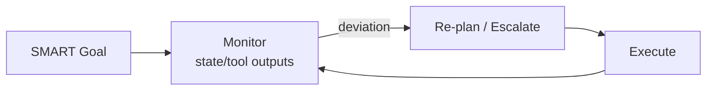

**與 Reflection(Ch4)協同**:goal = self-evaluation 的 ultimate benchmark;monitoring = reflection 輸入。

**🔴 LLM-as-Judge caveat(本書對 acceptance-evidence 論題的獨立確認)**:「**same LLM 寫 code 又 judging quality → harder time discovering wrong direction**」「LLM may incorrectly assess as successful / hallucinate」。解法 = 分離角色多 agent(Peer Programmer / Code Reviewer / Test Writer)。監控太基本會「risk running forever」(須 max_iterations guard)。ADK:goal 透過 instructions,monitoring 透過 state management + tool interactions。

---

## Part Three — Reliability & Oversight

### Ch12 Exception Handling and Recovery

> 📄 [跳轉 PDF 第 196 頁](file:///Users/ctai/Github/ai-rules/ref-docs/Agentic-Design-Patterns.pdf#page=196)

**核心**:agent 在不可預測真實環境必須能「偵測錯誤 → 優雅處理 → 恢復穩定」。常與 reflection 結合(失敗後反思再試)。

**3 層**:
1. **Error Detection**:malformed tool output、HTTP 4xx/5xx、超時、格式異常、monitoring agent 主動偵測。
2. **Error Handling**:logging / retries(可調參)/ fallbacks(替代)/ graceful degradation(部分功能)/ notification。
3. **Recovery**:state rollback、diagnosis、self-correction/replanning、escalation(交人或上層)。

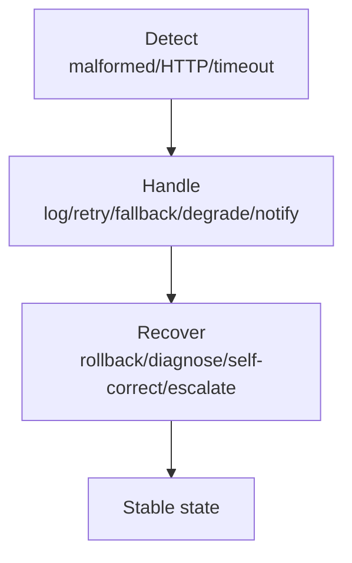

**Trading bot 例子(直擊 M1)**:「insufficient funds / market closed → log,**不重試同 invalid trade**,notify user 或 adjust strategy」。**書明說 state rollback 對有 side-effect 的 tool(下單)極危險** —— 不能 undo 已成交,只能清本地 view。Pitfalls:retry 風暴(無 backoff);fallback 品質默默下降無人知。

---

### Ch13 Human-in-the-Loop(HITL)

> 📄 [跳轉 PDF 第 204 頁](file:///Users/ctai/Github/ai-rules/ref-docs/Agentic-Design-Patterns.pdf#page=204)

**核心**:刻意把人類判斷/創造力/倫理織入 AI 流程,AI 是 augment 非 replace。errors 後果嚴重(醫療/金融/自駕)、含模糊/倫理/nuance、需高品質人工標註時用。

**6 面向**:Human Oversight / Intervention & Correction / Human Feedback for Learning(RLHF)/ Decision Augmentation(AI 建議人定案)/ Human-Agent Collaboration / Escalation Policies。

**關鍵變體 — Human-on-the-loop**:人定 overarching policy,AI 執行即時動作以合規。**書直接以自動化金融交易為例**:人設「70% 科技股 30% 公債、單一股票 <5%、跌破買價 10% 自動賣」,AI 即時盤中執行。

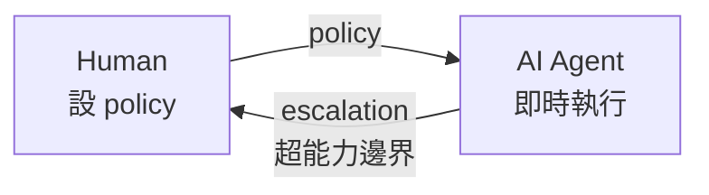

**Pitfalls(書明列)**:**缺乏 scalability**(人無法處理百萬任務,須自動化+HITL 混合);**高度依賴操作員專業**(只有 skilled developer 抓細微碼錯);**隱私**(敏感資訊暴露給人前須 anonymize)。「escalation 是一個 tool」+「context 透過 callback 動態注入」。

---

### Ch14 Knowledge Retrieval(RAG)

> 📄 [跳轉 PDF 第 213 頁](file:///Users/ctai/Github/ai-rules/ref-docs/Agentic-Design-Patterns.pdf#page=213)

**核心**:LLM 知識限於訓練資料;RAG 在生成前先從外部知識庫「查」,把檢索 chunk 注入 prompt,讓回答 ground 在可驗證/即時/專屬資料。降幻覺、可引用。

**核心概念**:Embeddings(文字→向量,語意近則向量近)、Semantic Similarity/Distance、Chunking(大文件切小段保語境)、Vector DB(Pinecone/Weaviate/Chroma/Milvus/pgvector,HNSW 近鄰搜尋)、Hybrid Search(BM25 關鍵字 + 語意)。全庫須預處理 + 定期 reconciliation。

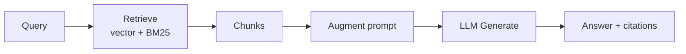

**GraphRAG**:用知識圖非向量庫,擅長跨文件合成(金融分析、基因-疾病);代價:建圖複雜/昂貴/高延遲。

**Agentic RAG**:在檢索上加 reasoning layer 當 gatekeeper —— 4 能力:(1) reflection + source validation(辨識 2025 官方政策 vs 2020 部落格、丟棄過時)、(2) reconciling conflicts(初始 €50k vs 最終 €65k,選可信源)、(3) multi-step decomposition(比較題拆子查詢再合成)、(4) 識別 knowledge gap 並呼叫外部 tool(web search)。**挑戰:agent 本身可能成為新錯誤源,陷入無用迴圈**。

**Pitfalls**:資訊分散多 chunk 抓不全 → 不完整;chunking 品質決定上限;矛盾來源合成困難;latency/token 成本上升;periodic reconciliation。

---

## Part Four — Production Hardening

### Ch15 Inter-Agent Communication(A2A)

> 📄 [跳轉 PDF 第 231 頁](file:///Users/ctai/Github/ai-rules/ref-docs/Agentic-Design-Patterns.pdf#page=231)

**核心**:**Google A2A 開放協定**,讓不同框架(ADK/LangGraph/CrewAI)的 agent 互通、任務委派、資訊交換。與 MCP 互補(MCP 管 agent↔工具/資料,A2A 管 agent↔agent)。

**Core Actors**:User、A2A Client(client agent)、A2A Server(remote agent,opaque)。**Agent Card**:JSON 數位身分(name/url/version/capabilities/skills/auth),host 於 `/.well-known/agent.json` 或 registry。**Communications**:圍繞 async task(submitted/working/completed),Message(attributes + parts),Artifacts;走 HTTP(S)+ JSON-RPC 2.0;`contextId` 跨互動保語境。

**4 種 Interaction**:Sync Request/Response、Async Polling、SSE Streaming、Push Notifications(Webhook)。modality-agnostic(文字/音/視)。Security:mTLS、audit logs、Agent Card 宣告 auth、OAuth2/API key 走 HTTP header(不在 URL/body)。

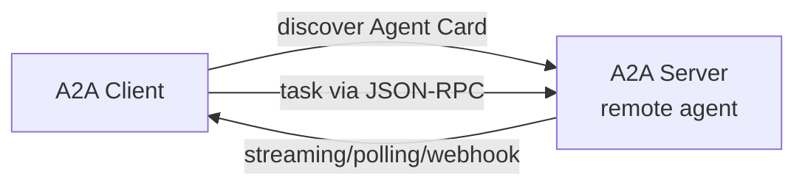

**Pitfalls**:Agent Card 端點須存取控制;跨框架 schema 不一致;長任務 context 保存/清理。Agent Card「自描述能力」概念 ↔ skill `description`(供 routing)。

---

### Ch16 Resource-Aware Optimization

> 📄 [跳轉 PDF 第 246 頁](file:///Users/ctai/Github/ai-rules/ref-docs/Agentic-Design-Patterns.pdf#page=246)

**核心**:agent 動態管理運算/時間/金錢預算 —— 「更準但貴」vs「更快但便宜」間選;**關鍵策略 = fallback mechanism**(首選模型被節流 → 自動降級便宜模型,保服務不中斷,graceful degradation)。

**Router Agent**(依 query 長度/複雜度路由)+ **LLM router**(分析 query 決定下游模型)+ **Critique Agent**(評估回應品質,回饋校準 router)+ prompt tuning / fine-tuning router。例:gemini-2.5-pro 當 planner、flash 做 web query;OpenAI 三分類(simple→gpt-4o-mini / reasoning→o4-mini / internet_search→GPT-4o+Google CSE);OpenRouter 統一介面 + 自動 failover + sequential model fallback。

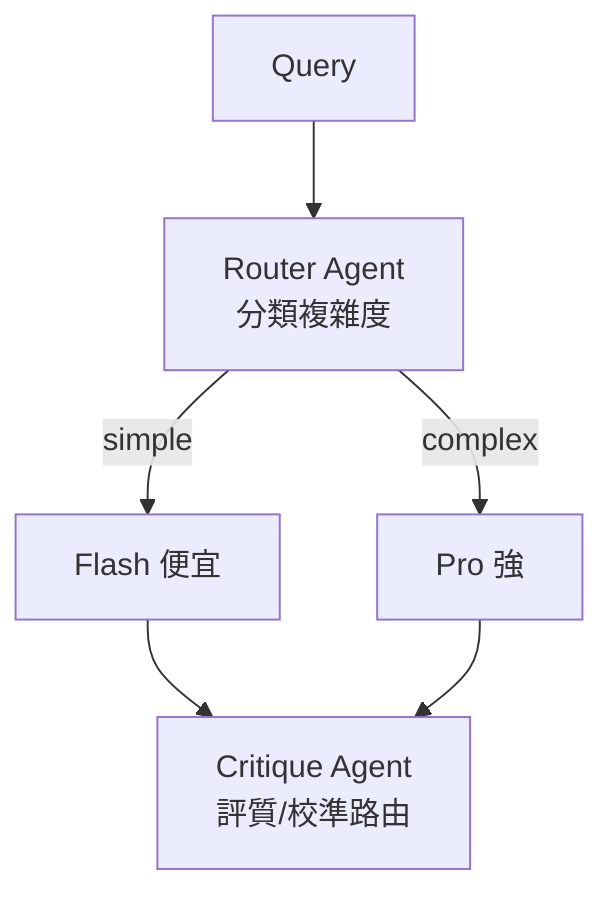

**其他優化**:Adaptive Tool Use、Contextual Pruning & Summarization、Proactive Resource Prediction、Cost-Sensitive Exploration、Energy-Efficient Deployment、Learned Resource Allocation、Graceful Degradation。**Pitfalls**:簡單 metric(字數)誤判複雜度;Critique 本身花 token;flash 答太差需「升級」路徑。

---

### Ch17 Reasoning Techniques

> 📄 [跳轉 PDF 第 262 頁](file:///Users/ctai/Github/ai-rules/ref-docs/Agentic-Design-Patterns.pdf#page=262)

**核心**:讓 agent 內部推理外顯,分配更多 inference-time 運算。**關鍵啟示:「給模型更多 thinking time/steps 往往顯著提升複雜問題準確性」**(Scaling Inference Law:小模型 + 更多 thinking time 可勝大模型)。

**技術清單**:
- **Chain-of-Thought (CoT)**:逐步推理;Zero-Shot CoT(加「Let's think step by step」)、Few-Shot CoT。提升透明度與可除錯性。
- **Tree-of-Thought (ToT)**:CoT 上分支成樹,支援 backtracking 與多路徑探索。
- **Self-Correction / Self-Refinement**:內部批判草稿與中間思考,迭代精煉。
- **PALMs(Program-Aided)**:LLM 生成並執行 Python,計算交確定性環境(ADK `BuiltInCodeExecutor`)。
- **RLVR(Reinforcement Learning from Verifiable Rewards)**:訓練 reasoning model 用可驗證答案(數學/碼),產生數千 token 長 reasoning trajectory,具 planning/monitoring/evaluation。
- **ReAct(Reasoning + Acting)**:Thought → Action → Observation 交錯循環,行動是 tool call;比線性 CoT 更能回應即時回饋。

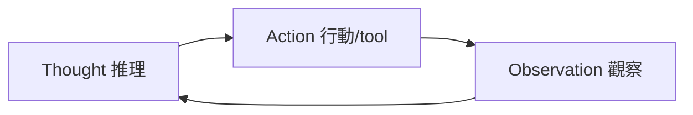

- **CoD(Chain of Debates, Microsoft)**:多多樣模型像 AI 委員會辯論互批,降偏見提品質。
- **GoD(Graph of Debates)**:辯論為非線性圖,論點節點、support/refute 邊,結論取最被支持聚類(well-supported = ground truth + search grounding + 多模型共識)。
- **MASS(Multi-Agent System Search)**:自動化 MAS 設計三階段 —— Block-level prompt opt → Workflow topology opt(影響力加權)→ Workflow-level prompt opt。**關鍵發現:編碼任務最佳 topology = predictor agent 反思 + executor agent 跑測試驗證**(迭代自校 + 外部驗證 > 簡單 MAS)。

**Pitfalls**:CoT 單一路徑不適應複雜度;ToT/GoD 成本高;PALMs 執行外部碼安全風險;reasoning model 長 trajectory 增延遲/成本。DeepResearch = Planning + Tool Use + Reflection + Memory + Parallelization 五 pattern 織成。

---

### Ch18 Guardrails / Safety Patterns

> 📄 [跳轉 PDF 第 286 頁](file:///Users/ctai/Github/ai-rules/ref-docs/Agentic-Design-Patterns.pdf#page=286)

**核心**:guardrails = 保護層,引導 agent 行為/輸出避免有害/偏頗/離題。**目標不是限制能力而是確保 robust/trustworthy**。可用輕量模型當快速預篩。

**多層**:Input Validation/Sanitization、Output Filtering/Post-processing、Behavioral Constraints(prompt 層)、Tool Use Restrictions、External Moderation API、HITL。監控可觀測性(logging、latency/error metrics)、try-except + exponential backoff、context window 管理、rate limits、API key 安全、對抗訓練。

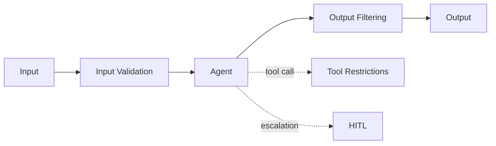

**CrewAI 範例**:`SAFETY_GUARDRAIL_PROMPT`(LLM 當 Content Policy Enforcer,4 政策:Instruction Subversion/Jailbreaking、Prohibited Content、Irrelevant/Off-Domain、Proprietary/Competitive)+ `PolicyEvaluation`(Pydantic 結構化 compliance_status/summary/triggered_policies)+ `validate_policy_evaluation`(technical guardrail 驗格式)+ 便宜 Gemini Flash 當 policy 模型。**精髓:policy = prompt + 結構化輸出 + Pydantic 驗證,三層**。ambiguity 預設 compliant。

**「Engineering Reliable Agents」(古典 SE 套到 agent)**:checkpoint/rollback(transactional commit/rollback)、modularity/separation of concerns、observability via structured logging(捕 chain-of-thought/tool/confidence)、principle of least privilege(最小權限、blast radius)。**Pitfalls**:單層防護不足須縱深;guardrail LLM 本身可能誤判;policy 太嚴傷體驗。

---

### Ch19 Evaluation and Monitoring

> 📄 [跳轉 PDF 第 306 頁](file:///Users/ctai/Github/ai-rules/ref-docs/Agentic-Design-Patterns.pdf#page=306)

**核心**:系統性、持續、常外部地量測 agent effectiveness/efficiency/compliance —— 不同於 Ch11 內部 goal monitoring。定義 metrics、feedback loops、報告系統。

**Agent Response Assessment**:exact match 不夠(語義同但字串異),需 Levenshtein/Jaccard/keyword/semantic cosine/LLM-as-Judge/RAG faithfulness & relevance。**Latency Monitoring**(structured log → InfluxDB/Prometheus/Datadog)。**Token Usage Tracking**(成本管理)。**LLM-as-a-Judge**(用 rubric 評主觀品質如 helpfulness)。

**🔴 trajectory evaluation(本書對 acceptance-evidence L6 的確認)**:「traditional software tests 不足;agent 機率性運作,須評 final output **and** trajectory(步驟序列)」。比較法:exact/in-order/any-order match、precision/recall、single-tool use。multi-agent 評估:cooperation 是否有效、計畫是否守住、對 agent 是否選對、加 agent 是否改善。

```mermaid
flowchart LR
    A[Agent run] --> T[Trajectory<br/>steps 序列]
    T --> C[Compare vs ground-truth path]
    F[Final output] --> C
    C --> E[Evaluation]
```

**比較表**:Human Evaluation(抓細微但難規模)/ LLM-as-Judge(一致高效可規模但漏中間步)/ Automated Metrics(客觀高效但漏完整能力)/ Agent Trajectories(評完整軌跡,本書重點)。

**AI "Contract" / contractor 演化(4 pillar)**:from agent → advanced contractor(formalized 契約):
1. **Formalized Contract**:可驗證 deliverable + scope + 單一真相源(非簡單 prompt)。
2. **Dynamic Negotiation**:agent 分析條款並 negotiate(flag 歧義/風險/缺存取,執行前解決誤解)。
3. **Quality-Focused Iterative Execution**:對 contract criteria 自我驗證(gen 多方案 → test → score → 只 submit 通過的)。
4. **Hierarchical Subcontracts**:大任務拆子 contract(各完整獨立契約)。

**Drift Detection**:input 分布變化(concept drift)/ 環境變化 → 效能退化。**Anomaly Detection**:異常/非預期行動(錯誤/攻擊/湧現)。**AI "Contract"**:企業治理 Agentic AI 的新控制工具,動態協定 codify 目標/規則/控制。ADK evaluation:web UI(adk web)/ pytest / CLI(adk eval)。

---

### Ch20 Prioritization

> 📄 [跳轉 PDF 第 325 頁](file:///Users/ctai/Github/ai-rules/ref-docs/Agentic-Design-Patterns.pdf#page=325)

**核心**:複雜動態環境中,agent 面對過多可能動作、衝突目標、有限資源 —— prioritization 讓 agent 評估並排序任務,確保力氣用在最關鍵處。

**流程**:Criteria definition(urgency/importance/dependencies/resource availability/cost-benefit/user preference)→ Task Evaluation → Scheduling/Selection Logic → **Dynamic Re-prioritization**(環境變化即重排)。三層:高階目標 / sub-task / action selection。

**Pitfalls**:criteria 不當致排序錯;動態重排抖動(任務永遠被插隊);依賴 LLM 推論可能不一致。LangChain 範例:`SuperSimpleTaskManager`(dict O(1))+ `Task`(Pydantic: id/description/priority/assigned_to)+ tools(create/priority/assign/list)+ ReAct agent;prompt 內建「缺資訊時合理預設(P1 + Worker A)」。精髓:**優先序是 agent 自主推論而非硬編碼**。

---

### Ch21 Exploration and Discovery

> 📄 [跳轉 PDF 第 335 頁](file:///Users/ctai/Github/ai-rules/ref-docs/Agentic-Design-Patterns.pdf#page=335)

**核心**:不同於在預設解空間優化,exploration 讓 agent 主動探尋未知、發現 unknown unknowns、生成新知識。對開放/複雜/快速演進領域至關重要。

**應用**:科學研究自動化(AlphaEvolve、Google AI Co-Scientist 幫假說生成/實驗設計)、遊戲策略(AlphaGo)、市場趨勢嗅探、資安漏洞發現、創意內容、個人化教育。

**Google AI Co-Scientist**:Gemini-based 多 agent 計算科學協作者。架構:supervisor agent + Generation(產假說)/ Reflection(peer review)/ Ranking(Elo tournament)/ Evolution(精煉)/ Proximity(聚類)/ Meta-review(綜合回饋)。test-time compute scaling。「generate, debate, evolve」迭代(鏡像科學方法)。**濕實驗室驗證**:AML 藥物重定位(KIRA6)、肝纖維化新靶點、抗藥性機制(兩天重現他人十年成果)。**augmentation 非 automation** —— scientist-in-the-loop。Safety:研究目標 + 假說皆安全審查。

```mermaid
flowchart TD
    P[Problem] --> G[Generation<br/>產假說]
    G --> R[Reflection<br/>peer review]
    R --> K[Ranking<br/>Elo tournament]
    K --> E[Evolution<br/>精煉]
    E -.迭代.-> G
    K --> V[Validation<br/>濕實驗室]
```

**Agent Laboratory**(Schmidgall):Professor/PostDoc/Reviewer/ML-eng/SW-eng agent 階層(鏡像研究團隊),tripartite ReviewersAgent(三視角 harsh-but-fair 評分)。**Pitfalls**:探索成本高/可能無收斂;須平衡 explore vs exploit;開放探索的安全/倫理邊界。

---

## 附錄 + Conclusion

### Appendix A: Advanced Prompting Techniques(28p,核心參考)

> 📄 [跳轉 PDF 第 349 頁](file:///Users/ctai/Github/ai-rules/ref-docs/Agentic-Design-Patterns.pdf#page=349)
- **Core Principles**:clarity / conciseness / 動詞(act/analyze/...)/ instructions-over-constraints(正向>負向)/ iteration。
- **Zero/One/Few-Shot**(+ many-shot for 長 context 模型);**System/Role/Contextual Prompting**;**Delimiters**(三反引號/XML/---)。
- **Context Engineering**(詳見前言;system prompt + retrieved docs + tool outputs + implicit data;Vertex AI Prompt Optimizer 自動改進)。
- **Structured Output**(JSON/XML/CSV/Markdown)+ **Pydantic**(`model_validate_json`,parse-don't-validate at boundaries,Object-Oriented Facade)。
- **Reasoning 技術**:CoT(Zero/Few-Shot)、Self-Consistency(多路徑投票)、ToT、Step-Back、ReAct、Meta-Prompting、APE(Automatic Prompt Engineering)、**DSPy**(programming not prompting)、Multimodal、Code prompting。

### Appendix B: AI Agentic Interactions — From GUI to Real World(6p)

> 📄 [跳轉 PDF 第 378 頁](file:///Users/ctai/Github/ai-rules/ref-docs/Agentic-Design-Patterns.pdf#page=378)
Agent-Computer Interfaces(ChatGPT Operator、Project Mariner、Anthropic Computer Use、Browser Use)+ 環境互動(Project Astra、Gemini Live、GPT-4o omni、ChatGPT Agent 附 System Card 認列新濫用向量 + user authorization)。Vibe Coding 收尾。**Pitfalls**:GUI 自動化非確定性;安全向量放大。

### Appendix C: Agentic Frameworks Quick Overview(8p)

> 📄 [跳轉 PDF 第 385 頁](file:///Users/ctai/Github/ai-rules/ref-docs/Agentic-Design-Patterns.pdf#page=385)
框架光譜導覽(低階→高階),LangChain 起頭,各框架定位與工具。

### Appendix D: Building an Agent with AgentSpace(6p,線上)

> 📄 [跳轉 PDF 第 393 頁](file:///Users/ctai/Github/ai-rules/ref-docs/Agentic-Design-Patterns.pdf#page=393)
Google AgentSpace(no-code Agent Designer)+ 企業知識圖 + A2A 多 agent + 角色權限。企業級 agent 部署平台生態。

### Appendix E: AI Agents on the CLI(5p,線上)— 與 ai-rules 高度相關

> 📄 [跳轉 PDF 第 399 頁](file:///Users/ctai/Github/ai-rules/ref-docs/Agentic-Design-Patterns.pdf#page=399)
四大 CLI agent:**Claude Code**(深度理解 repo、pair programming、MCP 擴展、Git 整合)、**Gemini CLI**(開源、Gemini 2.5 Pro、長 context、多模態、sandbox)、**Aider**(開源、model-agnostic、**直接改檔+跑測試+自動 commit**、TDD 友善)、**GitHub Copilot CLI**(GitHub 生態、接 issue 開 PR)。**Aider「改+測+commit」對應 /build TDD 流程**。

### Appendix F: Under the Hood — Reasoning Engines(14p)
**本 PDF 未收錄**(E 之後跳 G)。內容應為推理引擎內部剖析。

### Appendix G: Coding Agents(7p)

> 📄 [跳轉 PDF 第 404 頁](file:///Users/ctai/Github/ai-rules/ref-docs/Agentic-Design-Patterns.pdf#page=404)
Vibe coding 起手式 + **「Context Staging Area」**(任何成功 agent 互動的基礎)+ Coding Specialist invocation prompt 範例(「You are a principal engineer conducting a code review...」)+ 「Principles for Leading the Augmented Team」(master the brief、context staging、human judgment)。**Context Staging Area ↔ ai-rules context-engineering;principal-engineer prompt ↔ /code-review 深層思考**。

### Conclusion(5p)
21 patterns 歸 4 大類:(1) Core Execution & Decomposition(Chaining/Routing/Parallelization/Planning)、(2) Interaction with External Environment(Tool Use/RAG)、(3) State, Learning & Self-Improvement(Memory/Reflection/Self-Correction/Learning)、(4) Collaboration & Communication(Multi-Agent/A2A/MCP)。**模式組合範例**:autonomous research assistant = Planning + Tool Use + Multi-Agent(Researcher→Writer→Critic)+ Reflection/Self-Correction + Memory,五 pattern 織成。**未來趨勢**:更大自主性(human-in-the-loop → **human-on-the-loop**)、抽象/因果推理、neuro-symbolic、agentic 生態標準化(MCP/A2A)、agents-as-a-service;**核心挑戰:安全、對齊、robustness**。

### Glossary(4p)+ Index(11p)
Glossary:Fundamental Concepts(Prompt/Multimodality/Transformers/Mamba/Planning/Critique Model...)精簡定義。**Index 由 Gemini Pro 2.5 自動生成**(書中明言,附 reasoning steps 當 agentic 範例)—— 本身是 agentic 應用案例展示。Online FAQ:common multi-agent architecture = Orchestrator + specialists 等。
