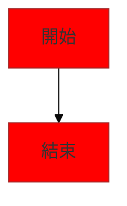
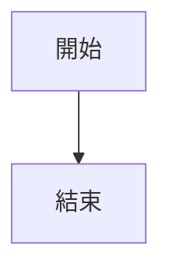
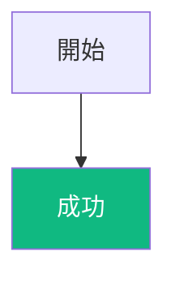
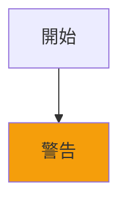
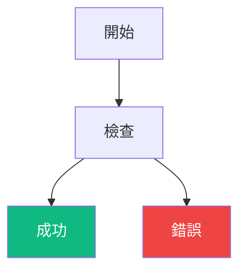
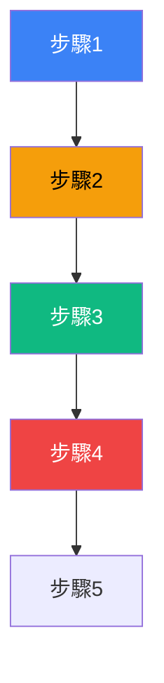
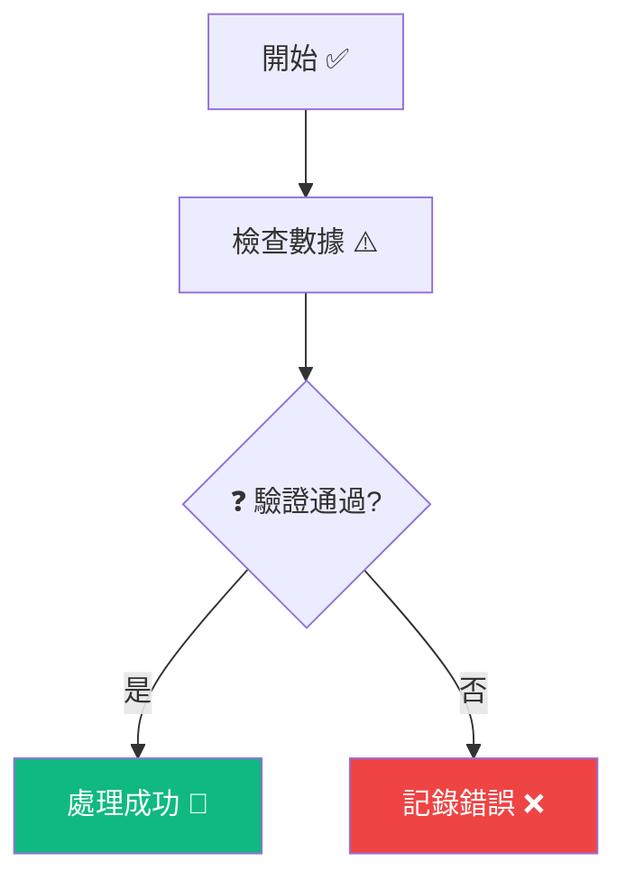

# 視覺化規範

> **自動載入**: 此檔案位於 `~/.claude/rules/`，會自動載入到所有會話

> **重要**: 圖表生成使用 `skill: "mermaid"` 工具，確保 Dark/Light 模式相容性

---

## 核心原則

**簡單就是美** - 直接使用 Mermaid 預設配置，確保在所有環境下的最大相容性。

**基於實際經驗的核心理念**：
- 預設主題已經非常成熟且通用，無需自定義配置
- 移除所有 `%%{init: {...}}%%` 配置，避免 Dark/Light Theme 相容性問題
- 專注於圖表內容而非樣式調整
- 實用主義優於完美主義
- 通用性比客製化更重要

---

## 圖表輸出格式規範

- **終端機輸出**：使用 ASCII 圖表，確保在任何終端環境下的可讀性
- **Markdown 文檔**：使用 Mermaid 圖表，提供專業的視覺化效果和互動性
- **設計原則**：遵循最小干預的視覺設計原則

---

## Mermaid 配置約束

### 黃金法則

**🔥 黃金法則：直接使用預設配置，不加任何 %%{init: {...}}%%**

根據實戰經驗，移除所有自定義配置可以：
- ✅ 避免 Dark/Light Theme 相容性問題
- ✅ 確保在所有環境下的通用性
- ✅ 減少維護成本和複雜度
- ✅ 專注於圖表內容本身

### 禁止的配置



### 正確的使用方式



---

## Style 語法規範

### Dark/Light Theme 相容性約束

**❌ 絕對禁止的配色**（會在特定主題下消失）：

| 顏色        | 問題         | 原因                     |
|-------------|--------------|--------------------------|
| `#000000`   | 純黑         | 在 Dark Theme 完全看不到  |
| `#ffffff`   | 純白         | 在 Light Theme 看不清楚   |
| `#808080`   | 中灰         | 對比度不足               |
| `#333333`   | 深灰         | 在 Dark Theme 難以辨識    |

**✅ 安全的配色方案**（通過雙主題測試）：

| 狀態   | 背景色    | 文字色    | 用途               | 相容性     |
|--------|-----------|-----------|--------------------|------------|
| 成功   | `#10b981` | `#ffffff` | 成功狀態、完成節點  | ✅ Dark/Light |
| 失敗   | `#ef4444` | `#ffffff` | 錯誤狀態、失敗節點  | ✅ Dark/Light |
| 警告   | `#f59e0b` | `#000000` | 警告狀態、注意節點  | ✅ Dark/Light |
| 資訊   | `#3b82f6` | `#ffffff` | 資訊節點、處理中   | ✅ Dark/Light |

### Style 使用絕對規範

#### 🔥 黃金法則：底色+文字色必須同時指定

**✅ 正確用法**：必須同時指定 `fill` (底色) 和 `color` (文字色)



**❌ 錯誤用法**：只指定單一顏色



#### 📏 數量限制：絕對不超過 3 個組件

**✅ 正確**：最多 3 個組件使用 style



**❌ 錯誤**：超過 3 個組件



#### 🎯 優先使用 Emoji 替代顏色

**推薦做法**：使用 Emoji 強調，減少顏色使用



### 註解符號規範

**⚠️ 常見錯誤**：AI 經常混淆註解符號

**✅ 正確的 Mermaid 註解符號**：


**❌ 錯誤的註解符號**：

```mermaid
flowchart TD
    A[開始] --> B[結束]

    // 這是 JavaScript/Python 的註解，不是 Mermaid 的
    # 這是 Python/Bash 的註解，不是 Mermaid 的
    /* 這是 CSS/C 語言的註解，不是 Mermaid 的 */
```

**🔥 註解規則**：
- ✅ **只使用 `%%`**：Mermaid 語法中唯一的註解符號
- ✅ **獨立註解**：必須獨占一行，完全不能與程式碼同行
- ❌ **絕對禁止行末註解**：`style A %% 註解` 會造成 Lexical Error
- ❌ **絕對禁止混合註解**：`%% style A %% 註解` 會造成 Lexical Error
- ❌ **絕對禁止其他符號**：`//`、`#`、`/* */` 在 Mermaid 中不是註解

---

## Emoji 系統性替代方案

**常用 Emoji 對照表**：

| 狀態 | 推薦 Emoji | 顏色搭配 | 使用場景 |
|------|-----------|----------|----------|
| 開始 | ✅, 🚀 | 無需顏色 | 流程起點 |
| 成功 | ✅, 🎉, 🟢 | `#10b981` + `#ffffff` | 成功完成 |
| 失敗 | ❌, 🚫, 🔴 | `#ef4444` + `#ffffff` | 錯誤失敗 |
| 警告 | ⚠️, ⏳, 🟠 | `#f59e0b` + `#000000` | 注意警告 |
| 處理中 | 🔄, ⚙️, 🔵 | `#3b82f6` + `#ffffff` | 進行中 |
| 決策 | ❓, 🤔, 📝 | 無需顏色 | 條件判斷 |

**⚠️ 重要**：Mermaid 中使用 Emoji 需要用引號包圍節點名稱

---

## 自檢清單

生成 Mermaid 圖表前確認：
- [ ] 不使用 `%%{init: {...}}%%` 配置
- [ ] 使用安全配色方案（避免純黑、純白、灰色）
- [ ] style 語句同時指定 fill 和 color
- [ ] style 使用的組件不超過 3 個
- [ ] 只使用 `%%` 作為註解符號
- [ ] 註解獨占一行，不與程式碼同行
- [ ] 含 Emoji 的節點用引號包圍

---

## 最佳實踐

- ✅ **零配置原則** - 直接使用預設主題，無需自定義
- ✅ **專注內容** - 圖表資訊傳達比樣式重要
- ✅ **嚴格 Style 約束** - 底色+文字色同時設定，最多 3 個組件
- ✅ **優先 Emoji** - 使用 emoji 減少顏色依賴
- ✅ **安全配色** - 只使用經過驗證的安全顏色組合
- ✅ **正確註解** - 只使用獨立行的 `%%` 註解

---

## 常見錯誤

- ❌ **使用 %%{init: {...}}%% 配置** - 已證實會造成相容性問題
- ❌ **錯誤註解符號** - 使用 `//`、`#`、`/* */` 而非 `%%`
- ❌ **只設定單一顏色** - 底色或文字色只設其一，對比度無保證
- ❌ **超過 3 個組件限制** - 過度使用 style 語法
- ❌ **使用禁忌顏色** - 純黑、純白、灰色等相容性差的顏色
- ❌ **忽略 Emoji 語法** - 未用引號包圍含 emoji 的節點名稱