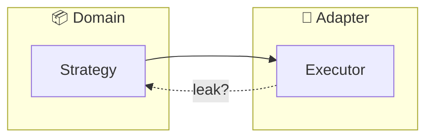
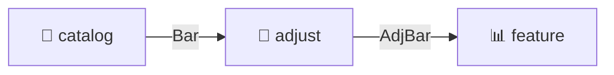
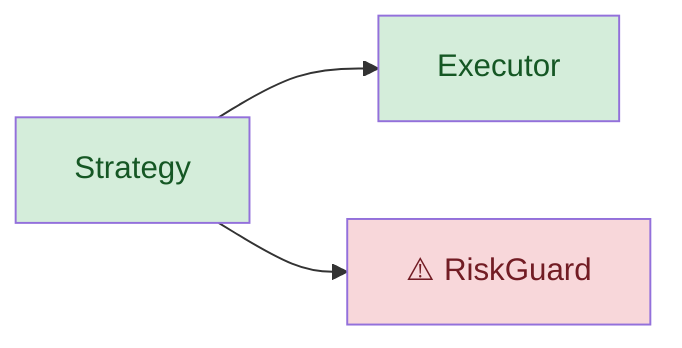

# Illustrate Artifact Menu — SA/SD code 解釋 artifact

> **載體**：[illustrate.md](../illustrate/SKILL.md) mode B（理解既有）的 artifact menu 支撐檔。**on-demand**（mode B / drift checkpoint 時讀，非每 session auto-load）。
> **受眾**：layer-3 人類 viewport（B 軸）——渲染結構 artifact 給人判讀方向。**不產 file:line finding**（那是 `/code-review` axis 3）。
> **資料來源**：靜態結構資料由 [arch-thinking](../arch-thinking/SKILL.md) skill §二 生成（City Map 模組級 + call graph 函數級 + type structure contract slice + data-flow 靜態骨架）；本檔定義**渲染產物**（Mermaid 模板 / 方向問題 / anti-pattern）——illustrate 特有，不沉 skill（capability-sink rule）。
>
> **docs mode 消費端**（無 `.py` 的 repo）：dep_graph/LSP 不適用 → artifact 降級為 rg 跨檔畫命令/skill 拓樸（arch-thinking §二 product-type 雙軌 docs 軌）；data-flow/call graph/class-slice artifact 在純 docs 場景降級為「文件引用拓樸」，標「docs mode：結構靠 rg 跨檔，非 AST/LSP」。

## 為什麼是 artifact menu（非鬆散標籤）

mode B 舊標籤（運作流程/資料流/概念圖）讓 LLM 無法把「方向問題」綁到能回答的 artifact → freehand 風險。menu 讓綁定明確：人依**方向問題**選 artifact，每 artifact 綁 Mermaid 模板 + fuel spec + when-to-use + anti-pattern。

**mode = 意圖，artifact = 手段**。同一 artifact 可服務多 use point（mode B 理解 / EP 結構檢查 / post-build drift）。

## 詞彙單一源（與 drill 統一）

artifact 詞彙 = drill `artifact <type>` 的 type，全程一致（無同義變體）：

| artifact | drill type | 方向問題軸 |
|----------|-----------|-----------|
| System / Module Boundary | `boundary` | 靜態結構（分層/bounded context）|
| Data-Flow Lineage（DFD）| `data-flow` | 模組資料流 |
| Change-scoped Call Graph | `call-graph` | 靜態結構（函數級 call）|
| Scenario Sequence | `sequence` | 動態行為 |
| Contract Class Slice | `class-slice` | 靜態結構（型別）|

**HTML 圖型映射**（html 模式）：artifact 選型後可走 archify 渲染——類型映射見 [illustrate-html-mode.md](illustrate-html-mode.md)（class slice 無對應，維持 md）。

## default + menu 邏輯

- mode B **無 crisp 方向問題**（`/illustrate @模組` 無進一步指定）→ default **Boundary diagram**（whole-picture 骨架，human-viewport fit 最高）
- **有方向問題** → 從 menu 選對應 artifact
- **post-build/post-EP drift** → Call Graph 為主幹 substrate + drift overlay（見下）

---

## 5 Artifact

### 1. System / Module Boundary（default）

- **方向問題**：新東西落在對的 context/layer 嗎？AI 在重造既有模組嗎？邊界被跨越嗎？
- **Mermaid**：`flowchart` + `subgraph` per bounded context / Clean Architecture layer；directed edges = 允許依賴方向；`-.->` dashed = leak/forbidden（跨層/跨域）
- **Fuel**：code-reality-first（`list_communities` + `architecture_overview` + `hub_nodes`/`bridge_nodes`）/ fallback（scan-project `dep_graph.modules.imported_by[]` + AGENTS.md Capabilities）。**code-reality 缺場 → emit `[WARN]`（cr-query GATE）+ scan-project/AGENTS.md fallback**。⚠️ caveat：**community ≠ module boundary**（目錄 + AGENTS.md 是模組真相，community 只 coupling hint）
- **When-to-use**：mode B 理解整體骨架 / EP（新節點落對 context 嗎）/ post-build drift（boundary-crossing signal）
- **Anti-pattern**：raw 全系統拓樸 dump（耗盡人類注意力）

### 2. Data-Flow Lineage / DFD（最高優先級 — silent-corruption 對齊）

- **方向問題**：我在意的 data 從哪來、誰 transform、誰消費？新 code 插在 pipeline 對的點嗎？
- **Mermaid**：`flowchart LR`（nodes = producers/transforms/consumers；edge labels = data type 或 contract）
- **Fuel**：hybrid（code-reality `affected_flows`/`list_flows` + LSP `outgoingCalls` type-bearing edges + scan-project dep_graph 模組方向 + 吸收「欄位 ← 發布 client」authority edge）。**code-reality 缺場 → emit `[WARN]`（cr-query GATE）+ LSP/scan-project fallback**。**runtime data VALUES：三者皆無——須 read/run code（acceptance-evidence L4-L5），標 static-skeleton-only**
- **When-to-use**：mode B 追蹤 field 來源 / EP（讀對 source、插對 pipeline 點）/ post-build drift（producer shifted 或 consumer 期望 field 被停發 = silent-corruption 前兆）
- **Anti-pattern**：宣稱 runtime 值（只產靜態骨架）

### 3. Change-scoped Call Graph（drift 主幹 substrate）

- **方向問題**：我改這個，誰受影響？
- **Mermaid**：`graph`（**pruned impact-radius subgraph，禁全系統**）；code-reality-sourced edges 附 anti-over-reliance label
- **Fuel**：code-reality-first（`callers` direct sites＋`closure`/`impact_radius` transitive blast）/ fallback（LSP `incomingCalls`/`outgoingCalls` AGGREGATION walk——arch-thinking §二 能力，無 transitive，`[WARN]` degraded）/ scan-project dep_graph 模組級脈絡
- **When-to-use**：post-build drift（主用——change blast radius）/ mode B 理解 call 結構 / EP（call 方向 vs DIP：domain←use case←adapter）
- **Anti-pattern**：全系統 call graph（重造 `/code-review` 結構軸 + 耗盡人類注意力）

### 4. Scenario Sequence（OOAD 動態）

- **方向問題**：這個 use case，對的 component 以對的順序跨對的邊界協作嗎？
- **Mermaid**：`sequenceDiagram`（lifelines = components/boundaries；messages = calls；layer 分 group + notes）。**單一 scenario**（whole-system sequence 是噪音）
- **Fuel**：code-reality-first（`affected_flows`/`list_flows`——real call chains，唯一高效 source）/ fallback（LSP `outgoingCalls` 從 entrypoint recursive walk，manual single-path，`[WARN]` single-path-only）。consume arch-thinking call-graph 資料 scoped to one scenario。anti-over-reliance：parse-time edges 漏 dynamic dispatch/config/reflection
- **When-to-use**：mode B（use case 怎麼跑）/ EP（component 協作順序、跨禁制 layer 嗎）/ post-build drift（scenario 路徑上的新邊）
- **Anti-pattern**：全系統 sequence；宣稱 runtime tracing（靜態概念流程 viewport-only）

### 5. Contract Class Slice（OOAD/UML，conditional）

- **方向問題**：這個模組由什麼 abstraction 錨定，新 code 是遵循/擴展它還是 fork 它？
- **Mermaid**：`classDiagram`（**僅 abstracts/Protocols + inheritance/realization edges；hide concrete members**）
- **Fuel**：**LSP-primary ALWAYS**（code-reality graph 面此處弱——持 call/refs edges 非 inheritance edges）：`hover` base + `documentSymbol` members + `goToImplementation` overrides（Claude 有 / ZCode 無）+ `findReferences` on base 組裝繼承鏈。**誠實標記**：pyright 無 typeHierarchy op 故 chaining（best-effort，complex hierarchy 產 partial edges）。fallback：rg for class defs
- **When-to-use**：**conditional**——僅變更觸及 abstract/Protocol/繼承 shape 時 render；純 dataclass 新增靜默跳過（YAGNI）。mode B（模組由什麼 abstraction 錨定）/ EP（新 code 榮譽或 fork 既有 Protocol 嗎）/ post-build drift（+type = parallel-abstraction candidate——是否重造既有）
- **Anti-pattern**：full class diagram（每 concrete class + attrs + methods——derivable + 人審結構上限）

---

## 完整 Mermaid 範例（build agent 可抄模板）

遵守 [mermaid](../mermaid/SKILL.md) 約束：禁 `%%{init}%%`、fill+color 成對、最多 3 styled group、安全 4 色、禁純黑/白/灰、emoji 優先、emoji 節點名引號。

### Boundary artifact（default）範例



> 約束自檢：無 `%%{init}%%`；emoji 節點名引號；subgraph=2（≤3）；dashed edge 標 leak；無 style 行即免 fill+color。

### Data-Flow（DFD）範例



---

## Drift Overlay Spec（drift detection 共用 — post-EP / post-build / mode B）

> drift detection 是 mode B + post-EP/post-build checkpoint 的脊柱，直接回應「程式碼失控」恐懼。主幹用**機械 git-diff**（恆可用），EP-claimed structure 僅 optional gold。

### 流程

1. **SEED**：`git diff` + `git diff --cached` 取變更 symbol（機械、恆可用；無 uncommitted → `HEAD~1`）。engine 在場可加 `detect_changes`。
2. **GENERATE**：arch-thinking §二 能力對 changed symbols 產 change-scoped graph facts（call graph blast radius / type structure slice / data-flow lineage）。
3. **BASELINE degradation ladder**（決定 diff 另一側）：
   - ① **EP-claimed**（gold，**OPTIONAL**——LLM-heuristic parse EP，每 bucket 附 confidence label，低信心可 dismiss；**非 load-bearing**）
   - ② **last commit**（機械**主幹**：`git show HEAD:<code>` 取 HEAD code → 重產 graph facts → diff current 產出的 facts）
   - ③ **HEAD~1**
   - ④ **current-only**（無 diff，僅渲染 change-scoped artifact，仍 grounded 非 freehand）
4. **DIFF & SIGNAL**：actual vs baseline，rule-based 分 5 signal class（下）。
5. **RENDER**：見 drift rendering 範例。

### 5 signal class（視覺 marker，**非 finding**）

| signal | 意義 | candidate |
|--------|------|-----------|
| `+edge` | 新 call 不在 baseline | scope-creep |
| `-edge` | baseline 宣稱 call 不在 build | under-build |
| `+type` | 新 class/Protocol 不在 baseline | parallel-abstraction |
| `broken-caller` | caller 簽名/contract 不符 | contract-drift |
| `boundary-crossing` | 邊違反 baseline layer/context | layer-violation |

### 死碼 false-positive 防護（查證 step — drift 訊號須消費設計意圖）

`-edge` / `+type` 死碼 candidate 訊號 surface 時，**強制查證 step**：讀目標 symbol 所在 AGENTS.md 的設計意圖標註（禁誤判 marker / YAGNI 階段 / facade 激活計畫）。

**理由**：drift 只比對結構（call edges / 消費者數），**不消費語意意圖**。AGENTS.md 的「禁誤判死碼」標註常是前人踩過的陷阱（曾誤撤零消費者 facade）。no-severity 硬規（不自動刪）是第一道防線，但 false-positive 訊號仍浪費人類注意力——讀設計意圖是第二道。

**範例（mosaic_alpha dogfood 實證）**：`watchlist/ranking.py` 改走 `IntelService` 後，drift surface「`MarketIntelService` 14 方法零外層消費者 → 死碼 candidate」。查證 `services/AGENTS.md` 明文「14 方法非死碼、`IntelService` 是 YAGNI facade 起點、禁誤判」→ **by design，非死碼**。drift overlay 正確 surface 訊號讓人查（no-severity），查證 step 消費 AGENTS.md 避免誤判。

### 5 → 3 bucket 映射（mermaid max-3-styled-group 硬限制）

marker 重用 style 不倍增：

| bucket | marker | 含信號 |
|--------|--------|--------|
| **added** | ➕ | `{+edge, +type}` |
| **removed/broken** | ➖ | `{-edge, broken-caller}` |
| **violated** | ⚠️ | `{boundary-crossing}` |

共 3 styled group（合規）；Console ASCII 用 `+`/`-`/`!` 三 marker 對應。

### no-severity 硬規（layer-3 viewport 線）

- NO severity、NO file:line fix recommendation、NO「this is wrong」verdict
- 僅「**this moved; you judge direction**」
- 每個 `+edge` 旁附 EP/baseline 原話（若 baseline 是 EP）讓人看「授權了什麼」（防「drift=bad」偏見——+edge 可能是合法演化）

### skill / command 分工

drift-signal 分類由 illustrate 套用。arch-thinking §五 counter-rule：**skill 只產 graph facts**（{caller, callee, transitive set, type edges, data edges}），消費命令套用受眾 framing（illustrate overlay marker vs `/code-review` severity-tagged finding）。

---

## Drift Rendering 範例

### Console ASCII（call graph with drift markers + legend）

```
  Strategy.on_bar() ──+──▶ Executor.submit()      [+edge: 新 call]
                   ──!──▶ RiskGuard.check()       [!: broken-caller]
  Executor.submit() ─────────▶ (nothing)          [-edge: baseline 宣稱未實作]
  legend: + added(➕)  - removed(➖)  ! violated/broken(⚠️)
```

### MD Mermaid overlay（3 styled bucket，fill+color 成對）



> 約束自檢：2 styled group（≤3）；fill+color 成對；安全色（green d4edda/155724, red f8d7da/721c24）；無 init；emoji 引號。

---

## 三 use point 對照

| use point | baseline | 主產出 |
|-----------|----------|--------|
| mode B code-explain | last commit / 無 EP → current-only | change-scoped 結構 artifact（仍 grounded）|
| post-EP（prospective，pre-build）| EP-claimed（gold）| EP 假設 vs current-actual diff（catch call 不存在 symbol、wrong-layer）|
| post-build（核心恐懼）| EP-claimed 或 last commit | 5 signal class drift overlay（程式碼失控的機械化呈現）|
