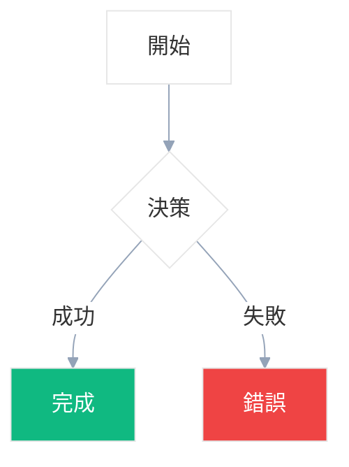
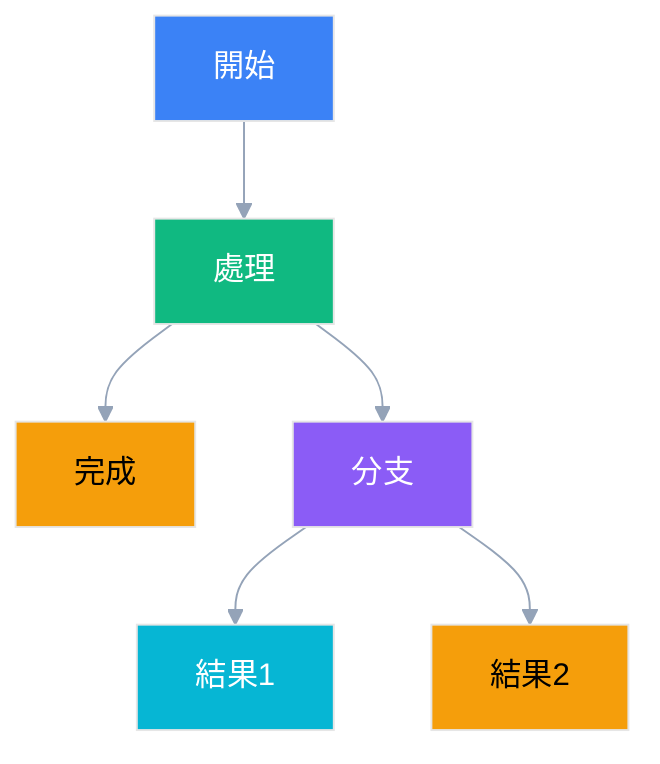

# Mermaid 專業圖表生成 Skill

## 🎯 功能概述

專業的 Mermaid 圖表生成和色彩管理工具，確保 Dark/Light 模式下的完美相容性。特別設計用於技術文檔、系統架構圖、業務流程圖等專業視覺化場景。

## ✨ 核心特色

### 🎨 Dark/Light 模式智能相容
- **透明背景策略**: 適應任何主題環境
- **對比度保證**: 所有色彩搭配確保 ≥4.5:1 對比度
- **最小干預設計**: 僅在關鍵節點使用色彩強調

### 🔧 標準化配置模板
- **統一的初始化配置**: 確保所有圖表風格一致
- **最佳實踐範例**: 提供可直接使用的圖表模板
- **色彩驗證機制**: 自動檢查色彩搭配的可讀性

## 🚀 使用時機

當你需要：
- 生成技術文檔中的架構圖
- 創建業務流程視覺化圖表
- 設計系統組件關係圖
- 製作專案時序圖或甘特圖
- 確保圖表在 Dark/Light 模式下都清晰可見

## 📋 使用方法

### 基本語法
```bash
skill: "mermaid"
```

### 需求描述
明確告訴 AI 你需要什麼類型的圖表：
- "生成一個用戶註冊流程圖"
- "創建微服務架構圖"
- "製作資料庫設計關係圖"

## 🎨 色彩設計原則

### 推薦通用配色
```yaml
# 最小干預配色方案（基於實驗驗證）
universal_colors:
  background: "transparent"  # 關鍵：透明背景，適應所有主題
  lineColor: "#94a3b8"       # 中性灰 - 連接線
  textColor: "#374151"       # 適應性文字色

# 僅用於關鍵節點強調（最多3個節點）
emphasis_colors:
  success: "#10b981"         # 綠色 - 成功/完成狀態
  error: "#ef4444"           # 紅色 - 錯誤/失敗狀態
  warning: "#f59e0b"         # 橙色 - 警告/注意狀態
  info: "#3b82f6"            # 藍色 - 一般強調
```

### 核心約束
- **普通節點禁止使用底色**
- **最多3個節點使用 `style` 語法**
- **只在關鍵狀態（成功/錯誤/警告）時使用底色**

## 📐 標準配置模板

所有 Mermaid 圖表都使用以下標準配置：

```mermaid
%%{init: {
  'theme': 'base',
  'themeVariables': {
    'background': 'transparent',
    'lineColor': '#94a3b8',
    'textColor': '#374151',
    'primaryColor': '#ffffff',
    'secondaryColor': '#ffffff',
    'tertiaryColor': '#ffffff'
  }
}}%%
```

## 📊 範例對比

### ✅ 最小干預範例（推薦）


### ❌ 過度使用底色（禁止）


## 🔍 色彩驗證標準

### 基於實際測試驗證的顏色
- **✅ 強烈推薦**: #3b82f6, #10b981, #f59e0b, #64748b
- **✅ 可用**: #6366f1, #8b5cf6, #06b6d4
- **🚫 絕對禁止**: #ffffff, #f0f0f0, #f8fafc, #fbbf24（淺色災難）
- **🚫 避免**: #000000, #1a1a1a（極端深色）

## ✅ 品質檢查清單

生成圖表前請確保：
- [ ] 使用 `theme: 'base'` + 3變數簡化配置
- [ ] 背景設置為 `transparent`
- [ ] 最多3個節點使用底色（僅強調節點）
- [ ] 在實際 Dark/Light 模式都測試過
- [ ] 文字與背景對比度 ≥4.5:1（雙模式）

## 🚨 重要約束

### 代碼塊標記要求
- **✅ 必須使用**: ````mermaid` 代碼塊包裝所有圖表
- **🚫 禁止**: 直接在文檔中寫 Mermaid 語法而不包裝

### 樣式定義規範
- **✅ 推薦**: 使用標準 `style` 語法定義節點顏色
- **✅ 範例**: `style A fill:#6366f1,stroke:#4f46e5,color:#ffffff`
- **🚫 禁止**: 使用未定義的 CSS class（如 `class A primaryNode`）

---

*這個 Skill 確保所有生成的 Mermaid 圖表都符合專業標準，在任何環境下都能提供最佳的視覺體驗。*