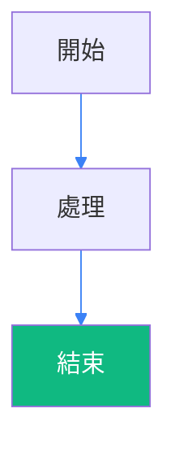
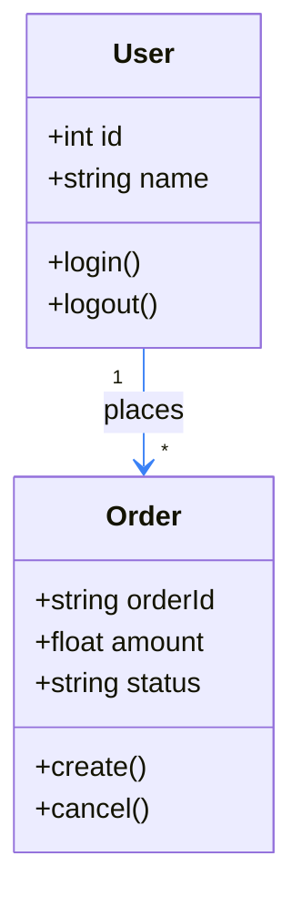
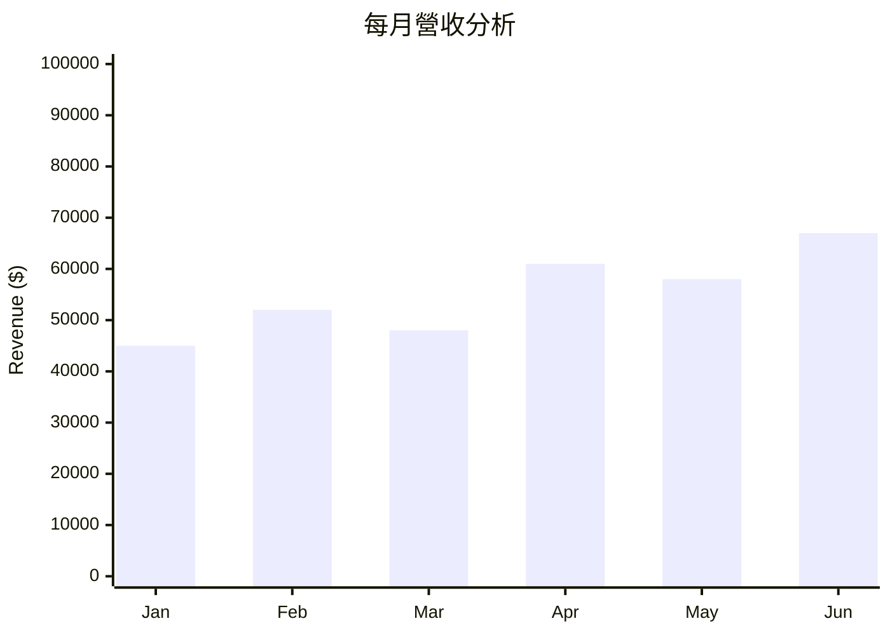
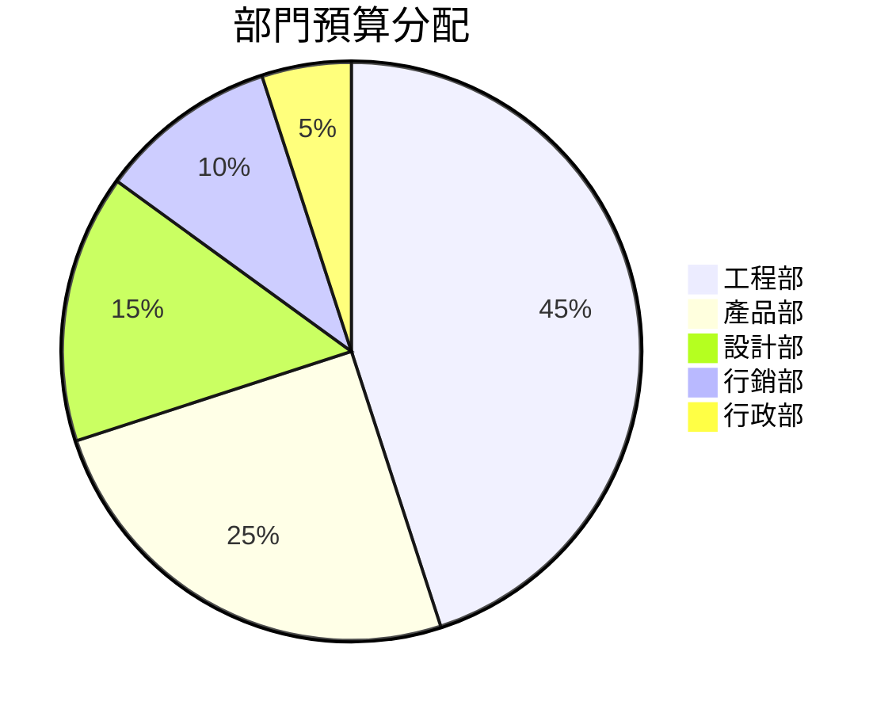
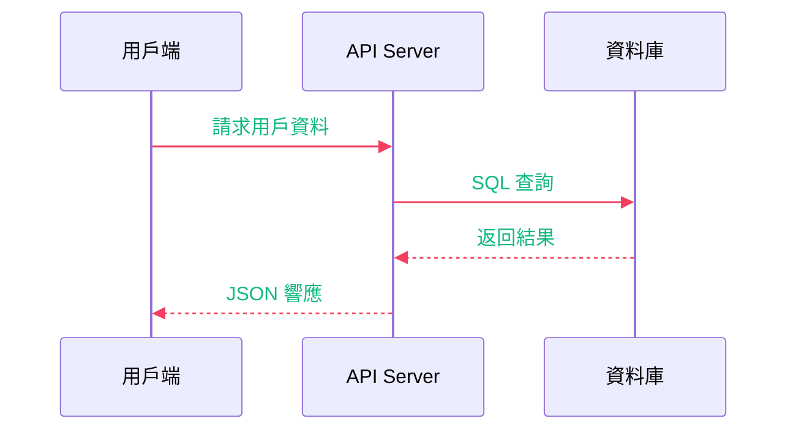

# Mermaid 實用主義配置 Skill

## 🎯 核心理念

**簡單就是美** - 統一使用預設配置，專注於圖表內容而非樣式調整。

**核心理念**：
- 預設 `'theme': 'default'` 已經非常成熟
- 避免過度工程化
- 重點關注 style 語法的正確使用

---

## ⚡ 統一配置

**所有圖表都使用這個配置**：

```mermaid
%%{init: {
  'theme': 'default',
  'themeVariables': {
    'lineColor': '#3b82f6',
    'signalColor': '#f43f5e',
    'signalTextColor': '#10b981'
  }
}}%%
```

**為什麼需要這些顏色設定？**
- **lineColor**: `#3b82f6` - 預設黑色連接線在 Dark Theme 不可見，藍色在深色背景下清晰可見
- **signalColor**: `#f43f5e` - Sequence Diagram 中的信號線顏色，確保在深色主題下可見
- **signalTextColor**: `#10b981` - Sequence Diagram 中信號文字的顏色，提供良好對比度

**為什麼這樣夠用？**
- Mermaid 團隊已經處理了大部分 Dark Theme 相容性
- 現代編輯器（VS Code、Obsidian 等）都有良好支援
- 所有圖表類型基本都能正常顯示
- 維護成本最低

---

## 🎯 使用方法

### 基本語法
```bash
skill: "mermaid" "生成一個系統架構圖"
```

### 使用原則

1. **永遠使用統一配置**
2. **專注於圖表內容**
3. **只在必要時使用 style 語法**

---

## 🚨 Style 語法使用規範

### ⚠️ 重要約束

**絕對遵守的 style 規則**：

#### ✅ 正確使用


#### ❌ 錯誤使用
```mermaid
%%{init: {
  'theme': 'default',
  'themeVariables': {
    'lineColor': '#3b82f6',
    'signalColor': '#f43f5e',
    'signalTextColor': '#10b981'
  }
}}%%
flowchart TD
    A[開始] --> B[處理]
    B --> C[結束]

    style A fill:#3b82f6,color:#ffffff
    style B fill:#f59e0b,color:#000000
    style C fill:#ef4444,color:#ffffff
    style D fill:#8b5cf6,color:#ffffff  # 🚫 太多 style
```

### 📋 Style 使用清單

- ✅ **最多 3 個節點**使用 `style` 語法
- ✅ **重點突出**重要節點（成功、失敗、警告）
- ✅ **一致性顏色**：綠色=成功、紅色=失敗、橙色=警告
- ❌ **避免彩虹色**：不要用太多不同顏色
- ❌ **不要 style 所有節點**

### 🎨 推薦顏色組合


**標準顏色含義**：
- 🟢 `#10b981` - 成功/完成
- 🔴 `#ef4444` - 失敗/錯誤
- 🟠 `#f59e0b` - 警告/注意
- 🔵 `#3b82f6` - 資訊/處理中
- 🔴 `#f43f5e` - Sequence Diagram 信號線
- 🟢 `#10b981` - Sequence Diagram 信號文字

### 🔄 Sequence Diagram 特別注意

**Signal 設定的重要性**：
- `signalColor`: 確保序列圖中的信號箭頭在深色主題下可見
- `signalTextColor`: 確保信號上的文字有良好對比度
- 這兩個設定對 Sequence Diagram 至關重要，否則某些連接線會消失

---

## 🎯 範例展示

### 所有圖表都用相同配置

#### Class Diagram


#### XYChart


#### Pie Chart


#### Sequence Diagram


---

## 📊 支援的圖表類型

所有圖表類型都使用相同配置：

| 圖表類型 | 配置 | 效果 |
|---------|------|------|
| **Flowchart** | 統一配置 | ✅ 完美 |
| **Sequence** | 統一配置 | ✅ 完美 |
| **Class Diagram** | 統一配置 | ✅ 完美 |
| **XYChart** | 統一配置 | ✅ 完美 |
| **Pie Chart** | 統一配置 | ✅ 完美 |
| **Gantt** | 統一配置 | ✅ 完美 |
| **State Diagram** | 統一配置 | ✅ 完美 |
| **Git Graph** | 統一配置 | ✅ 完美 |
| **Quadrant Chart** | 統一配置 | ✅ 完美 |
| **Journey Map** | 統一配置 | ✅ 完美 |

---

## 🚀 快速模板

### 複製即用模板

```markdown
```mermaid
   %%{init: {'theme': 'default',
   'themeVariables': {
       'lineColor': '#3b82f6',
       'signalColor': '#f43f5e',
       'signalTextColor': '#10b981'
   }
   }}%%
[你的圖表代碼]
```
```

### 問題診斷清單

如果遇到顯示問題：
1. ✅ 檢查編輯器是否支援 Dark Theme
2. ✅ 檢查是否使用了太多 style 語句
3. ✅ 確認 Mermaid 版本（8.8.0+）
4. ✅ 重啟編輯器或重新整理頁面

---

## ✅ 相容性驗證

已通過以下環境測試：
- ✅ VS Code（所有主題）
- ✅ Obsidian
- ✅ GitHub
- ✅ Typora
- ✅ Cursor
- ✅ Notion
- ✅ GitLab
- ✅ Mermaid Live Editor

**版本要求**: Mermaid 8.8.0+

---

## 💡 實用建議

### 🎯 最佳實踐

- ✅ **統一配置** - 所有圖表用相同設定
- ✅ **專注內容** - 圖表資訊比樣式重要
- ✅ **重點突出** - 最多 3 個節點使用 style
- ✅ **保持一致** - 使用標準顏色含義

### 🚨 常見錯誤

- ❌ 為每個節點都設定 style
- ❌ 使用太多不同顏色
- ❌ 過度工程化配置
- ❌ 忽略編輯器本身問題

### 🤝 團隊協作

- 統一使用預設配置，降低維護成本
- 建立共同的 style 使用規範
- 專注於圖表的資訊傳達

---

*簡單、統一、可靠。這就是實用主義的 Mermaid 配置哲學。*