# Mermaid 實用主義配置 Skill

## 🎯 核心理念

**簡單就是美** - 直接使用 Mermaid 預設配置，確保在所有環境下的最大相容性。

**基於實際經驗的核心理念**：
- 預設主題已經非常成熟且通用，無需自定義配置
- 移除所有 `%%{init: {...}}%%` 配置，避免 Dark/Light Theme 相容性問題
- 專注於圖表內容而非樣式調整
- 實用主義優於完美主義
- 通用性比客製化更重要

---

## ⚡ 核心配置原則

**🔥 黃金法則：直接使用預設配置，不加任何 %%{init: {...}}%%**

根據實戰經驗，移除所有自定義配置可以：
- ✅ 避免 Dark/Light Theme 相容性問題
- ✅ 確保在所有環境下的通用性
- ✅ 減少維護成本和複雜度
- ✅ 專注於圖表內容本身

---

## 🎨 Style 語法規範（核心重點）

### 🔴 絕對約束 - Dark/Light Theme 相容性

**❌ 絕對禁止的配色**（會在特定主題下消失）：

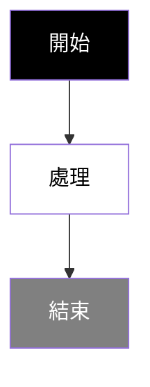


**✅ 安全的配色方案**：

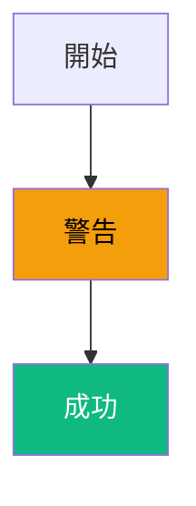

### 🔤 安全配色清單

#### ✅ 推薦配色（通過雙主題測試）

| 狀態   | 背景色    | 文字色    | 用途               | 相容性     |
|--------|-----------|-----------|--------------------|------------|
| 成功   | `#10b981` | `#ffffff` | 成功狀態、完成節點  | ✅ Dark/Light |
| 失敗   | `#ef4444` | `#ffffff` | 錯誤狀態、失敗節點  | ✅ Dark/Light |
| 警告   | `#f59e0b` | `#000000` | 警告狀態、注意節點  | ✅ Dark/Light |
| 資訊   | `#3b82f6` | `#ffffff` | 資訊節點、處理中   | ✅ Dark/Light |

#### ❌ 禁止配色（相容性問題）

| 顏色        | 問題         | 原因                     |
|-------------|--------------|--------------------------|
| `#000000`   | 純黑         | 在 Dark Theme 完全看不到  |
| `#ffffff`   | 純白         | 在 Light Theme 看不清楚   |
| `#808080`   | 中灰         | 對比度不足               |
| `#333333`   | 深灰         | 在 Dark Theme 難以辨識    |

### 📋 Style 使用絕對規範

#### 🔴 註解符號規範（重要）

**⚠️ 常見錯誤**：AI 經常混淆註解符號

**✅ 正確的 Mermaid 註解符號**：


**❌ 錯誤的註解符號**：
```mermaid
flowchart TD
    A[開始] --> B[結束]

    // 這是 JavaScript/Python 的註解，不是 Mermaid 的
    # 這是 Python/Bash 的註解，不是 Mermaid 的
    /* 這是 CSS/C 語言的註解，不是 Mermaid 的 */
```

**🔥 註解規則**：
- ✅ **只使用 `%%`**：Mermaid 語法中唯一的註解符號
- ✅ **獨立註解**：必須獨占一行，完全不能與程式碼同行
  ```
  %% 這是正確的註解
  style A fill:#10b981,color:#ffffff
  %% 這也是正確的
  ```
- ❌ **絕對禁止行末註解**：`style A %% 註解` 會造成 Lexical Error
- ❌ **絕對禁止混合註解**：`%% style A %% 註解` 會造成 Lexical Error
- ❌ **絕對禁止其他符號**：`//`、`#`、`/* */` 在 Mermaid 中不是註解
- ❌ **獨立註解同行**：註解行不能包含任何其他程式碼

#### 🔥 黃金法則：底色+文字色必須同時指定

**✅ 正確用法**：必須同時指定 `fill` (底色) 和 `color` (文字色)
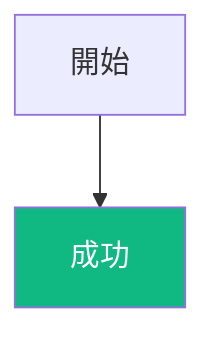

**❌ 錯誤用法**：只指定單一顏色
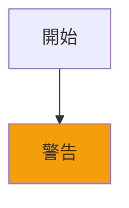

#### 📏 數量限制：絕對不超過 3 個組件

**✅ 正確**：最多 3 個組件使用 style
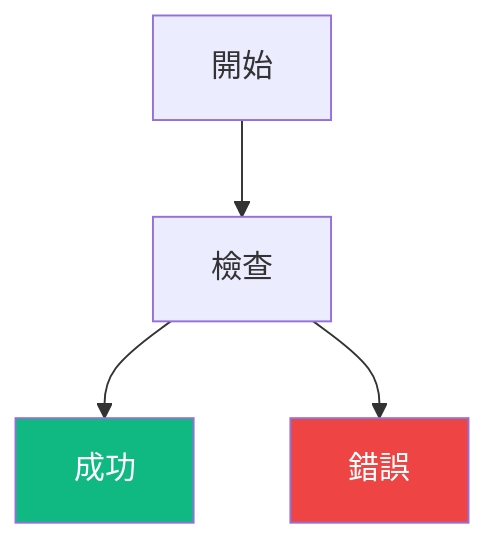

**❌ 錯誤**：超過 3 個組件
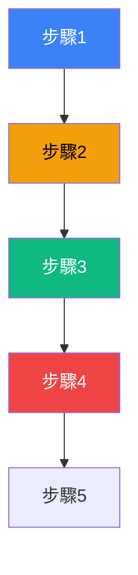

#### 🎯 優先使用 Emoji 替代顏色

**推薦做法**：使用 Emoji 強調，減少顏色使用

⚠️ **重要**：Mermaid 中使用 Emoji 需要用引號包圍節點名稱
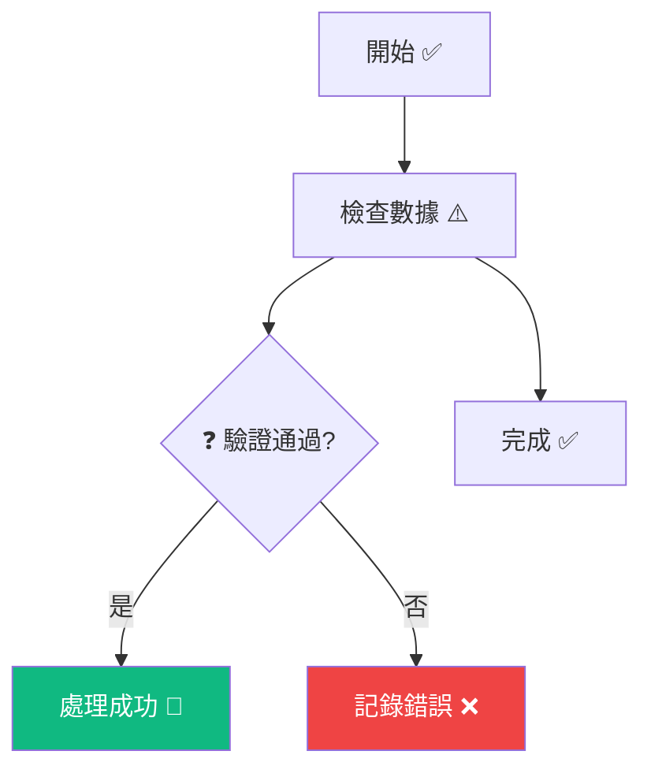

#### 🎭 Emoji 系統性替代方案

**常用 Emoji 對照表**：
| 狀態 | 推薦 Emoji | 顏色搭配 | 使用場景 |
|------|-----------|----------|----------|
| 開始 | ✅, 🚀 | 無需顏色 | 流程起點 |
| 成功 | ✅, 🎉, 🟢 | `#10b981` + `#ffffff` | 成功完成 |
| 失敗 | ❌, 🚫, 🔴 | `#ef4444` + `#ffffff` | 錯誤失敗 |
| 警告 | ⚠️, ⏳, 🟠 | `#f59e0b` + `#000000` | 注意警告 |
| 處理中 | 🔄, ⚙️, 🔵 | `#3b82f6` + `#ffffff` | 進行中 |
| 決策 | ❓, 🤔, 📝 | 無需顏色 | 條件判斷 |

**極簡主義範例**：只用 emoji，零顏色
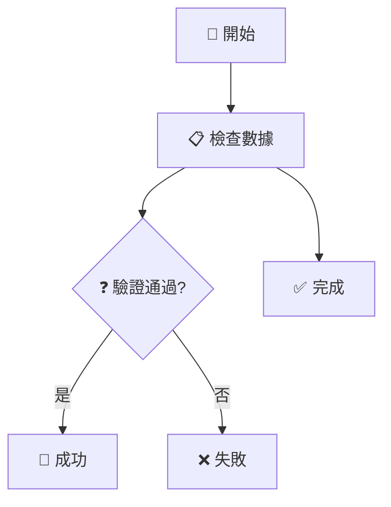

---

## 🎯 使用方法

### 基本語法
```bash
skill: "mermaid" "生成一個系統架構圖"
```

### 實際使用情境

**適用場景**：
- 📝 **文檔編寫**：為技術文檔、專案說明創建流程圖
- 🏗️ **系統設計**：視覺化系統架構、資料流程
- 📊 **業務分析**：展示業務流程、決策路徑
- 🔧 **問題排查**：繪製問題診斷流程圖
- 📚 **教學培訓**：創建概念說明圖表

### 詳細使用範例

#### 1. 創建簡單流程圖
```bash
skill: "mermaid" "生成一個用戶登錄流程圖"
```
> **輸出結果**：
> ```mermaid
> flowchart TD
>     A["🚀 用戶訪問"] --> B["📋 輸入帳密"]
>     B --> C{"❓ 驗證通過?"}
>     C -->|是| D["🎉 登錄成功"]
>     C -->|否| E["❌ 顯示錯誤"]
>     B --> F["📝 記錄日誌"]
> ```

#### 2. 創建系統架構圖
```bash
skill: "mermaid" "生成一個三層式架構圖，包含前端、後端、資料庫"
```

#### 3. 創建類別關係圖
```bash
skill: "mermaid" "生成用戶和訂單的類別關係圖"
```

### 使用原則

1. **零配置原則**：不使用任何 `%%{init: {...}}%%` 配置
2. **專注圖表內容**：圖表資訊傳達比樣式重要
3. **謹慎使用 style**：只在必要時使用，且必須遵守安全配色規範
4. **優先使用 emoji**：用表情符號減少顏色依賴，提高通用性
5. **明確描述需求**：提供清晰的圖表描述，獲得更準確的結果

### 🎨 正確範例

#### 基本流程圖（使用安全配色）
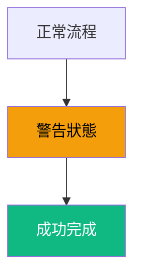

#### 錯誤處理流程
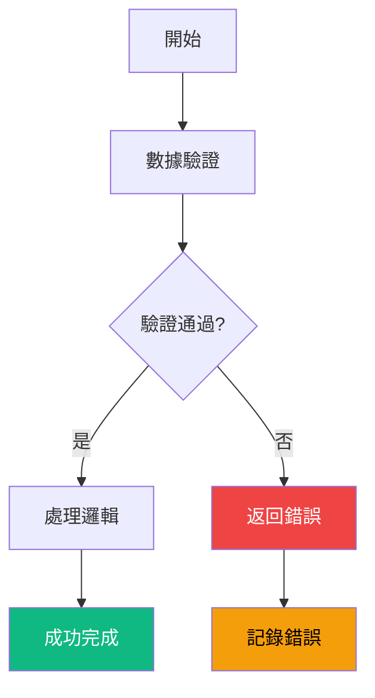

---

## 🎯 範例展示

### 所有圖表都使用預設配置

#### Class Diagram（無需配置）
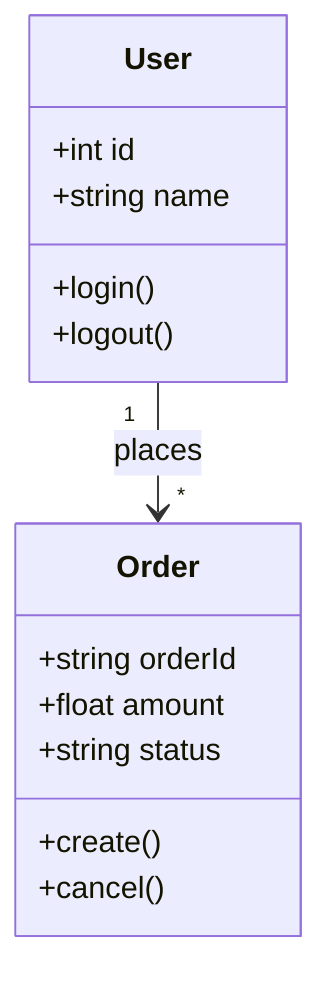

#### XYChart（無需配置）
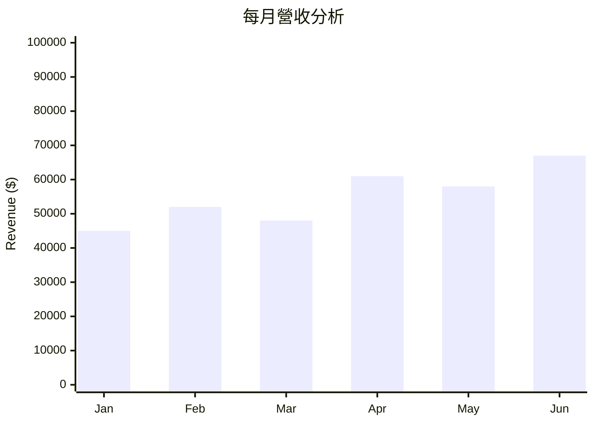

#### Pie Chart（無需配置）
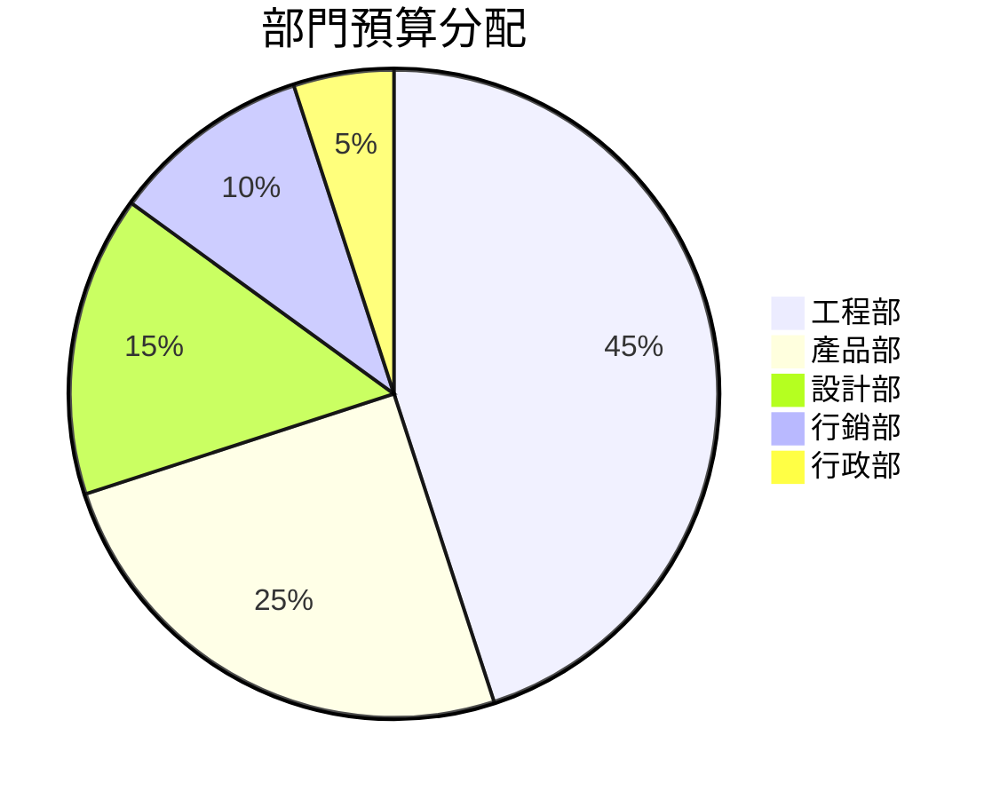

#### Sequence Diagram（無需配置）
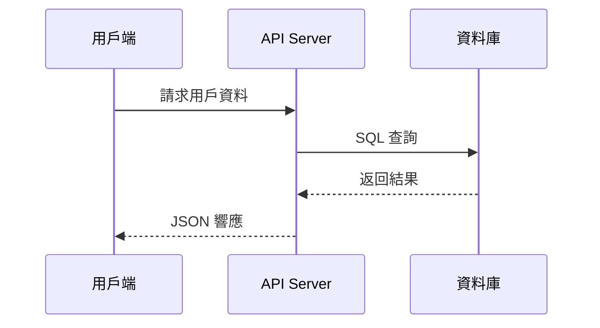

## 🚀 快速模板

### 複製即用模板

**零配置模板**：
```markdown
```mermaid
[你的圖表代碼]
```
```

**含安全 Style 模板**：
```markdown
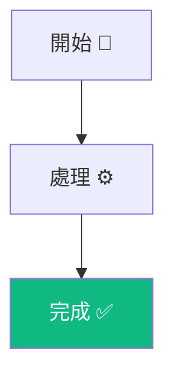

### 問題診斷清單

如果遇到顯示問題：
1. ✅ **檢查是否違反 Style 規範**：底色+文字色是否同時設定？
2. ✅ **檢查是否超過 3 個組件限制**：是否 style 了太多節點？
3. ✅ **檢查是否使用禁用顏色**：是否使用了純黑、純白等禁忌顏色？
4. ✅ **確認 Mermaid 版本**：是否使用 8.8.0+ 版本？
5. ✅ **重啟編輯器**：有時候重新啟動編輯器能解決問題


## 💡 實用建議

### 🎯 最佳實踐

- ✅ **零配置原則** - 直接使用預設主題，無需自定義
- ✅ **專注內容** - 圖表資訊傳達比樣式重要
- ✅ **嚴格 Style 約束** - 底色+文字色同時設定，最多 3 個組件
- ✅ **優先 Emoji** - 使用 emoji 減少顏色依賴
- ✅ **安全配色** - 只使用經過驗證的安全顏色組合
- ✅ **正確註解** - 只使用獨立行的 `%%` 註解，絕對不能與程式碼同行

### 🚨 常見錯誤

- ❌ **使用 %%{init: {...}}%% 配置** - 已證實會造成相容性問題
- ❌ **錯誤註解符號** - 使用 `//`、`#`、`/* */` 而非 `%%`
- ❌ **只設定單一顏色** - 底色或文字色只設其一，對比度無保證
- ❌ **超過 3 個組件限制** - 過度使用 style 語法
- ❌ **使用禁忌顏色** - 純黑、純白、灰色等相容性差的顏色
- ❌ **忽略 Emoji 語法** - 未用引號包圍含 emoji 的節點名稱

---

*簡單、統一、可靠。這就是實用主義的 Mermaid 配置哲學。*