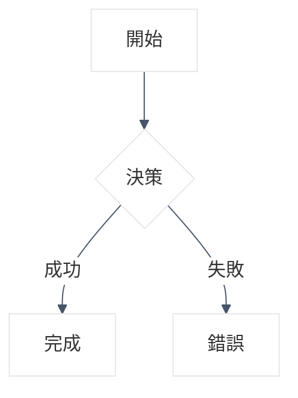
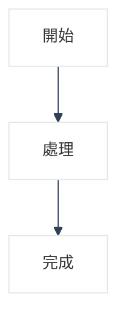
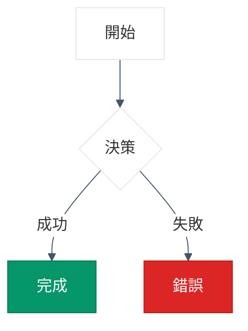
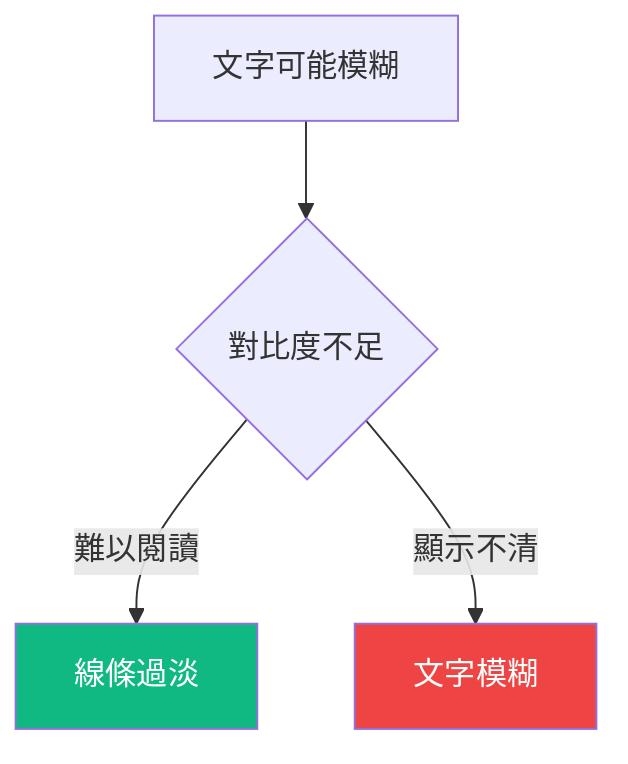
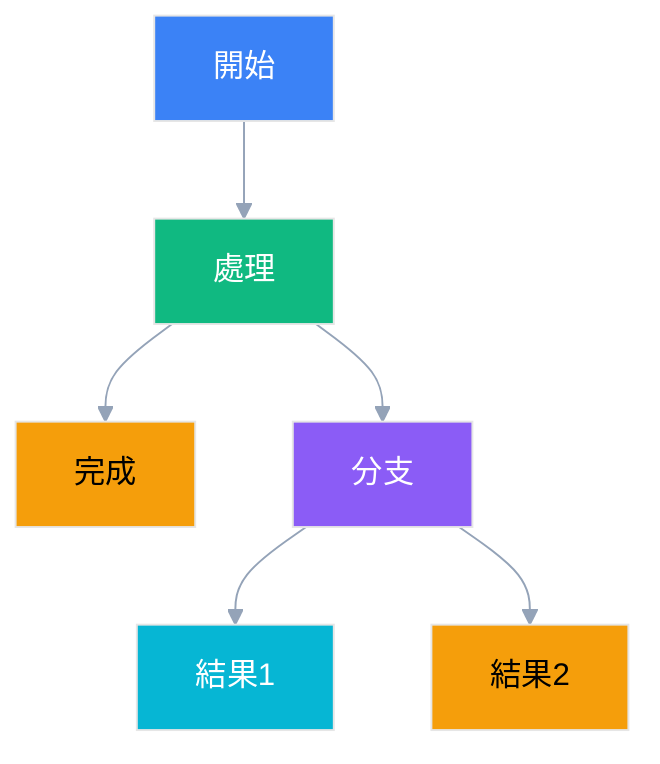
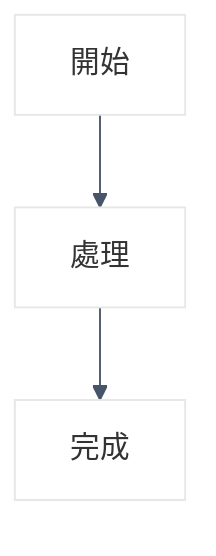
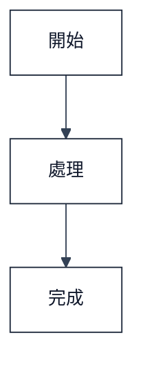

# Mermaid 專業圖表生成 Skill

## 🎯 功能概述

專業的 Mermaid 圖表生成和色彩管理工具，確保 Dark/Light 模式下的完美相容性。特別設計用於技術文檔、系統架構圖、業務流程圖等專業視覺化場景。

## ✨ 核心特色

### 🎨 Dark/Light 模式智能相容
- **透明背景策略**: 適應任何主題環境
- **對比度保證**: 所有色彩搭配確保 ≥4.5:1 對比度
- **最小干預設計**: 僅在關鍵節點使用色彩強調

### 🔧 標準化配置模板
- **統一的初始化配置**: 確保所有圖表風格一致
- **最佳實踐範例**: 提供可直接使用的圖表模板
- **色彩驗證機制**: 自動檢查色彩搭配的可讀性

## 🚀 使用時機

當你需要：
- 生成技術文檔中的架構圖
- 創建業務流程視覺化圖表
- 設計系統組件關係圖
- 製作專案時序圖或甘特圖
- 確保圖表在 Dark/Light 模式下都清晰可見

## 📋 使用方法

### 基本語法
```bash
skill: "mermaid"
```

### 需求描述
明確告訴 AI 你需要什麼類型的圖表：
- "生成一個用戶註冊流程圖"
- "創建微服務架構圖"
- "製作資料庫設計關係圖"

## 🎨 色彩設計原則

### 🎨 高對比度配色方案（已驗證可讀性）
```yaml
# 最佳實踐配色方案（基於實際渲染測試）
universal_colors:
  background: "transparent"  # 適應任何主題環境
  lineColor: "#475569"       # 深藍灰 - 高對比度連接線
  textColor: "#111827"       # 深黑灰 - 最高文字對比度
  primaryTextColor: "#ffffff" # 節點內文字色

# 強調色彩（已測試 Dark/Light 相容性）
emphasis_colors:
  success: "#059669"         # 深綠色 - 成功狀態
  error: "#dc2626"           # 深紅色 - 錯誤狀態
  warning: "#d97706"         # 深橙色 - 警告狀態
  info: "#2563eb"            # 深藍色 - 一般強調

# 輔助色彩
border_colors:
  primary: "#1e293b"         # 深色邊框
  secondary: "#64748b"       # 中性邊框
  accent: "#0ea5e9"          # 強調邊框
```

### 🔍 對比度驗證標準
- **文字對比度**: ≥ 7:1 (WCAG AAA 標準)
- **線條對比度**: ≥ 4.5:1 (WCAG AA 標準)
- **色彩驗證**: 經過 Dark/Light 模式實測驗證

### 核心約束
- **普通節點禁止使用底色**
- **最多3個節點使用 `style` 語法**
- **只在關鍵狀態（成功/錯誤/警告）時使用底色**

## 📐 標準配置模板（已修正可讀性問題）

### 🎯 高可讀性配置（推薦使用）

標準高對比度配置：
```yaml
background: 'transparent'
lineColor: '#475569'
textColor: '#111827'
```

範例圖表：


### 🔧 字體增強配置（文字不清時使用）

當文字模糊時，使用以下配置：
```yaml
fontSize: '14px'
fontFamily: 'system-ui, -apple-system, sans-serif'
lineColor: '#334155'
textColor: '#0f172a'
```

範例圖表：


### ⚠️ 已棄用配置（容易導致文字模糊）

⚠️ 以下配置已被證實容易導致文字和線條顯示不清：
```yaml
# ❌ 問題配置
textColor: "#374151"  # 對比度不足
lineColor: "#94a3b8"   # 線條過淺
```

## 📊 範例對比

### ✅ 高可讀性範例（已修正問題）


### ⚠️ 舊版問題範例（已棄用）


### ❌ 過度使用底色（禁止）


## 🔍 色彩驗證標準（基於實際渲染測試）

### ✅ 高可讀性色彩（已驗證）
```yaml
文字色彩:
  #111827  # 深黑灰 - 最高對比度 ✅
  #0f172a  # 深藍黑 - 極佳可讀性 ✅
  #1e293b  # 深藍灰 - 良好對比度 ✅

線條色彩:
  #475569  # 深藍灰 - 清晰可見 ✅
  #334155  # 藍灰色 - 高對比度 ✅
  #1e293b  # 深藍色 - 極佳線條 ✅
```

### ⚠️ 問題色彩（易導致顯示不清）
```yaml
# ❌ 以下色彩已被證實容易導致顯示問題：
文字色彩:
  #374151  # 對比度不足，文字模糊
  #6b7280  # 過淺，難以閱讀
  #94a3b8  # 線條色不適合文字

線條色彩:
  #94a3b8  # 過淺，線條不清晰
  #cbd5e1  # 幾乎不可見
  #e2e8f0  # 完全消失
```

### 🎯 WCAG 可讀性標準
- **AAA 級別**: 對比度 ≥ 7:1
- **AA 級別**: 對比度 ≥ 4.5:1
- **建議配置**: 使用高對比度色彩組合

## ✅ 品質檢查清單（已更新）

### 📋 生成前檢查
生成圖表前請確保：
- [ ] **使用高可讀性配置**: 推薦使用新的 `#475569` 和 `#111827` 配色
- [ ] **棄用舊版配置**: 避免使用 `#94a3b8` 和 `#374151`
- [ ] **背景設置**: 保持 `transparent` 適應所有主題
- [ ] **節點樣式限制**: 最多3個節點使用底色（僅關鍵狀態）
- [ ] **字體增強**: 文字模糊時使用字體增強配置

### 🔍 渲染後驗證
- [ ] **文字清晰度**: 確保所有文字內容清晰可讀
- [ ] **線條可見性**: 檢查連接線是否清晰可見
- [ ] **色彩對比度**: 文字與背景對比度 ≥ 4.5:1
- [ ] **Dark/Light 測試**: 在兩種模式下都測試過
- [ ] **實際環境驗證**: 在目標 IDE 環境中實際測試

### 🚨 問題診斷指南
如果圖表顯示不清，請檢查：
1. **是否使用了舊版配色**？ → 更新為新的高對比度配置
2. **文字是否模糊**？ → 使用字體增強配置
3. **線條是否過淺**？ → 檢查 `lineColor` 設置
4. **特定 IDE 環境問題**？ → 考慮環境特定的渲染差異

## 🚨 重要約束

### 代碼塊標記要求
- **✅ 必須使用**: ````mermaid` 代碼塊包裝所有圖表
- **🚫 禁止**: 直接在文檔中寫 Mermaid 語法而不包裝

### 樣式定義規範
- **✅ 推薦**: 使用標準 `style` 語法定義節點顏色
- **✅ 範例**: `style A fill:#6366f1,stroke:#4f46e5,color:#ffffff`
- **🚫 禁止**: 使用未定義的 CSS class（如 `class A primaryNode`）

---

## 🎯 快速修正指南

### 發現問題如何修正
如果現有檔案中的 Mermaid 圖表顯示不清，請快速修正：

#### 1. 文字模糊問題
```yaml
# ❌ 問題配置
textColor: '#374151'  # 對比度不足

# ✅ 修正配置
textColor: '#111827'  # 高對比度
```

#### 2. 線條過淺問題
```yaml
# ❌ 問題配置
lineColor: '#94a3b8'  # 線條過淺

# ✅ 修正配置
lineColor: '#475569'  # 清晰可見
```

#### 3. 完整修正範本
直接替換為：


#### 4. 字體增強配置（文字不清時使用）


#### 5. 已棄用配置（容易導致文字模糊）
⚠️ 以下配置已被證實容易導致顯示問題：
```yaml
# ❌ 問題配置
textColor: '#374151'  # 對比度不足
lineColor: '#94a3b8'   # 線條過淺
```

### 一鍵修正腳本
使用以下替換規則快速修正所有檔案：
1. `#374151` → `#111827`
2. `#94a3b8` → `#475569`

---

*這個 Skill 確保所有生成的 Mermaid 圖表都符合 WCAG 可讀性標準，在任何環境下都能提供清晰、高對比度的視覺體驗。*