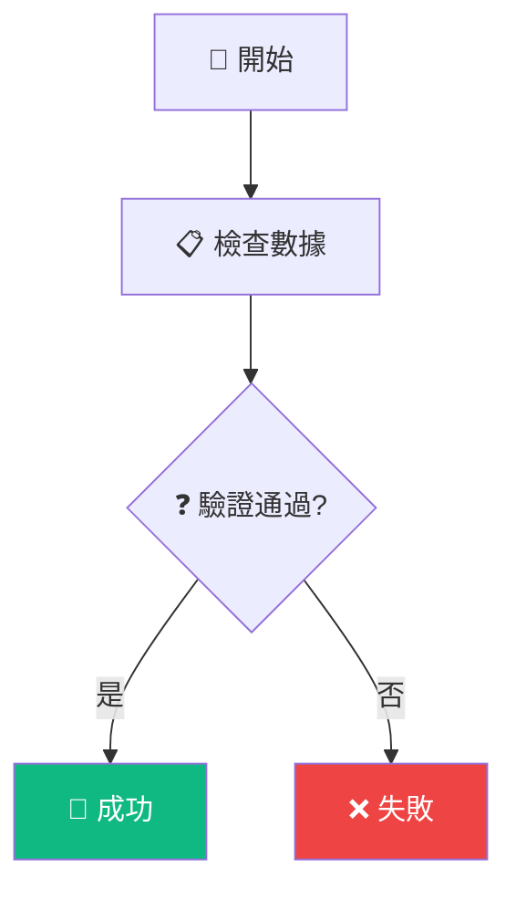

# Mermaid 圖表生成

## 核心原則

**圖的可讀性不依賴渲染環境的主題（Dark/Light）。** 不加任何 `%%{init: {...}}%%` 配置——強制主題只解決單一環境，換環境（dark 終端 → light 網頁）就破；唯一穩健解法是**顯式配色讓節點自帶可讀性**。

## Style 規範

### 硬限制

- `fill` + `color` 必須同時指定（缺一不可）——只設 `fill` 時字色吃到主題字色，Dark 主題下常變成深底深字不可讀（這正是本規範要防的失敗模式）
- 最多 **3 個組件**使用 style——寧可簡單配色，語義靠 emoji 與節點文字承載
- 註解只用 `%%`，必須獨占一行，不與程式碼同行

### 安全配色

| 狀態 | fill | color | 用途 |
|------|------|-------|------|
| 成功 | `#10b981` | `#ffffff` | 完成節點 |
| 失敗 | `#ef4444` | `#ffffff` | 錯誤節點 |
| 警告 | `#f59e0b` | `#000000` | 注意節點 |
| 資訊 | `#3b82f6` | `#ffffff` | 處理中 |

禁止 **fill** 用：`#000000`（Dark 消失）、`#ffffff`（Light 消失）、`#808080`（對比不足）——`color`（字色）配深色 fill 時用 `#ffffff` 是安全配置。另**禁淺 tint**（tailwind-50 級淺底）：dark theme 下產生刺眼白框。

### Emoji 優先

用 Emoji 減少顏色依賴。含 Emoji 的節點名稱必須用引號：`A["🚀 開始"]`。

## 範例

```mermaid
flowchart TD
    A["🚀 開始"] --> B["📋 檢查數據"]
    B --> C{"❓ 驗證通過?"}
    C -->|是| D["🎉 成功"]
    C -->|否| E["❌ 失敗"]

    style D fill:#10b981,color:#ffffff
    style E fill:#ef4444,color:#ffffff
```
