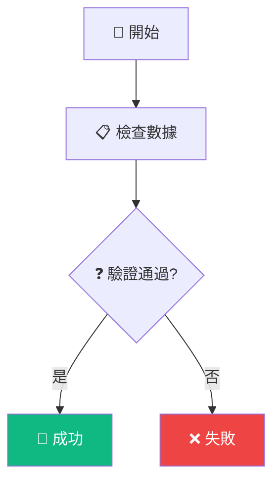

# Mermaid 圖表生成

## 核心原則（MD 語境）

**圖的可讀性不依賴渲染環境的主題（Dark/Light）。** MD 語境（markdown 沉澱/終端預覽）不加任何 `%%{init: {...}}%%` 配置——強制主題只解決單一環境，換環境（dark 終端 → light 網頁）就破；唯一穩健解法是**顯式配色讓節點自帶可讀性**。殼語境（HTML 嵌入）的例外見「殼內嵌」段——節點顯式 fill+color 兩語境都保留。

## Style 規範

### 硬限制

- `fill` + `color` 必須同時指定（缺一不可）——只設 `fill` 時字色吃到主題字色，Dark 主題下常變成深底深字不可讀（這正是本規範要防的失敗模式）
- 最多 **3 個組件**使用 style——寧可簡單配色，語義靠 emoji 與節點文字承載
- 註解只用 `%%`，必須獨占一行，不與程式碼同行

### 安全配色

| 狀態 | fill | color | 用途 |
|------|------|-------|------|
| 成功 | `#10b981` | `#ffffff` | 完成節點 |
| 失敗 | `#ef4444` | `#ffffff` | 錯誤節點 |
| 警告 | `#f59e0b` | `#000000` | 注意節點 |
| 資訊 | `#3b82f6` | `#ffffff` | 處理中 |

禁止 **fill** 用：`#000000`（Dark 消失）、`#ffffff`（Light 消失）、`#808080`（對比不足）——`color`（字色）配深色 fill 時用 `#ffffff` 是安全配置。另**禁淺 tint**（tailwind-50 級淺底）：dark theme 下產生刺眼白框。

### Emoji 優先

用 Emoji 減少顏色依賴。含 Emoji 的節點名稱必須用引號：`A["🚀 開始"]`。

## 殼內嵌（HTML embedding）

> 把 mermaid 圖放進 HTML 報告殼（report shell）時的配方。選哪個載體先看 [diagram-selection](../diagram-selection/SKILL.md)；殼側整合形態（四種嵌法、frame-wrap、源進 git）見 [illustrate-html-mode](../_common/illustrate-html-mode.md)。**無縫一體準則**：圖與殼視覺一體——同主題（殼 dark → 圖 dark chrome）、透明底、同字體、尺寸自適應、無 iframe 痕跡（border/scrollbar/白底不出現）。

### 渲染雙路徑與三嵌法

- **路徑 A：mmdc 預渲染**——`npx -y @mermaid-js/mermaid-cli -i x.mmd -o x.svg -t dark -b transparent`（`-t` 主題四選 default/forest/dark/neutral；`-b transparent` 透明底；`-c <config.json>` 可帶 themeVariables；`-I <svgId>` 自訂 SVG id）。無 runtime 依賴，靜態產物。
- **嵌法 A-1（inline SVG）**：svg 直接進殼 DOM（同 CSS 變數/字體，最一體）——受 id 碰撞約束，見陷阱 5。
- **嵌法 A-2（iframe 嵌 svg 檔）**：`iframe` 帶 `border:0`＋`background:transparent`＋**JS 高度自適應**（同源 iframe 載入後量 `contentDocument svg` 高度設 `frame.height`——實證無捲動條無白底）
- **路徑 B：CDN runtime lazy render**——`startOnLoad:false`＋nav 切換後逐節補渲染：`mermaid.run({querySelector:'<目標節>.show pre.mermaid:not(:has(svg))'})`（v10+ API；`initialize` 是唯一配置通道）。零建置工具，適合無 mmdc 環境。
- 環境缺場互為 fallback（mmdc 下載逾時 → 路徑 B），如實記錄所用路徑。三嵌法（inline／iframe／CDN lazy）無縫一體準則均經截圖＋vision 判讀實證（主題一致、透明底、零 iframe 痕跡、CJK/emoji 正常）。

### init 例外（僅殼語境）

殼語境**允許** `mermaid.initialize({theme:'dark', themeVariables:{...}})`（或 mmdc `-t dark`）驗 chrome 色（線/文字/箭頭）——殼主題已知且追求無縫一體，MD 語境的「跨環境可攜」在此不適用。節點顯式 fill+color 仍然必填（可讀性不押在主題上）。

### 陷阱（實證）

1. **`display:none` 容器 flowchart 崩潰**：nav 切換式殼隱藏章節時，mermaid flowchart 排版需量測文字寬度（getBBox），隱藏容器量測全 0 → 圖面紅色 bomb 顯示 "Syntax error"——**假語法錯誤**（乾淨 parse 實際 OK）；sequenceDiagram 線性佈局免疫
2. **lazy render 單次 guard 陷阱**：`_mmRendered` flag 之類單次 guard 只渲染第一個含圖節，後續節永遠不渲染——`:has(svg)` 排除已渲染者是關鍵（逐節補渲染）
3. **parse error 除錯法**：渲染失敗後 DOM textContent 已被 error SVG 殘骸＋注入 CSS 污染，拿去 `mermaid.parse()` 恆報誤導性的 "No diagram type detected"——**從 html 原始檔正則抽乾淨源碼**，乾淨頁載 mermaid 後 `parse(src)` 反證
4. **特殊字元（★/全形）易誤歸因**：渲染失敗先查容器（陷阱 1）再查字元；保守 label 仍值得（寬度可控）但非首要嫌疑
5. **mmdc `id="my-svg"` 碰撞**：同頁多張 inline SVG 互污染（style 選擇器＋arrowhead marker id 撞名）——解法：**每張 mmdc 渲染帶唯一 `-I <svgId>`**（POC 實證：id、marker id、style selector **全部**隨之改寫，`my-svg` 零殘留）；無 `-I` 的預設產物（舊檔/他人產出）才限 **inline ≤1/頁**，其餘存 `diagram-*.svg` 檔＋iframe/img 隔離
6. **驗收閉環**：截圖 → vision-review 判讀 → 修 → 複驗——`mermaid.parse` OK ≠ 渲染 OK ≠ 佈局可讀，三層各有失敗面，vision 是後兩層唯一防線（契約見 [diagram-selection](../diagram-selection/SKILL.md) 共性段）

### 源與產物

`.mmd` 源隨殼任務家進 git（與 archify JSON IR 對位）；`diagram-*.svg` 渲染產物不進（一命令再生）——git 慣例單一源見 [illustrate-html-mode](../_common/illustrate-html-mode.md)。

## 範例

```mermaid
flowchart TD
    A["🚀 開始"] --> B["📋 檢查數據"]
    B --> C{"❓ 驗證通過?"}
    C -->|是| D["🎉 成功"]
    C -->|否| E["❌ 失敗"]

    style D fill:#10b981,color:#ffffff
    style E fill:#ef4444,color:#ffffff
```
