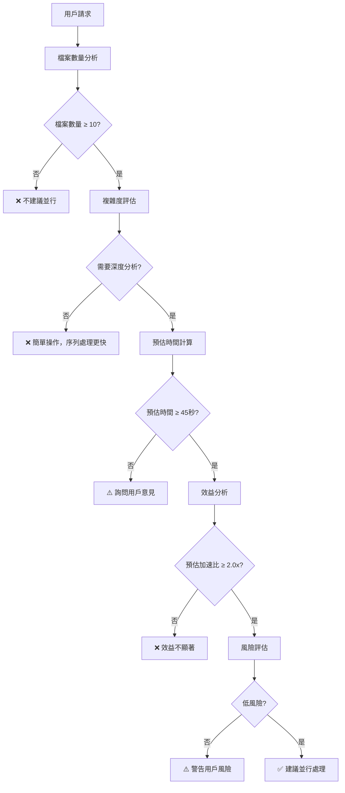
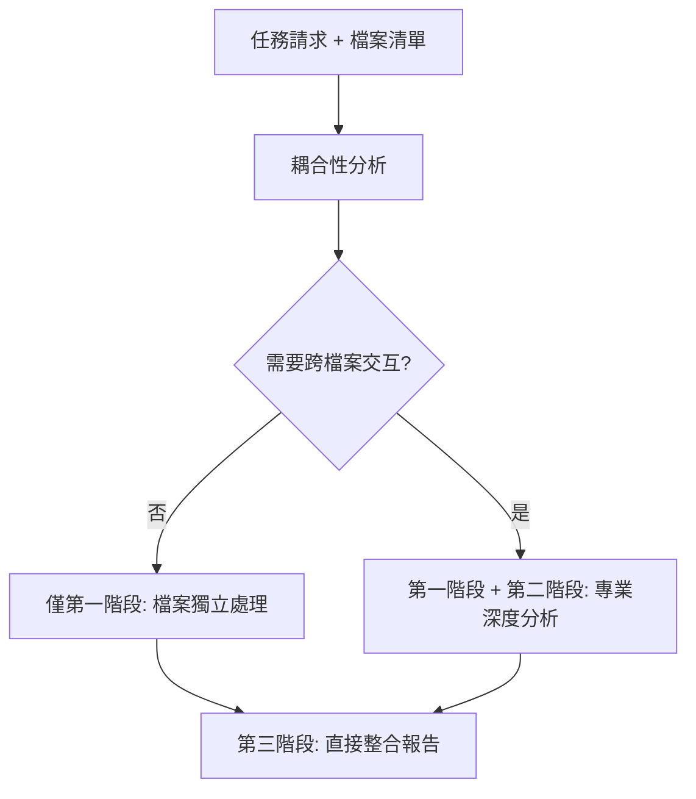

# 智能並行處理決策引擎

## 🎯 核心職責

**智能決策 + 完整執行** - 基於任務耦合性自動選擇最優執行策略，提供從智能決策到完整並行執行的一站式解決方案。

### ✅ 核心職責
- **智能並行決策**：分析任務規模、複雜度、成本效益
- **最優分組策略**：自動將大任務分解為高效的並行任務組
- **真正並行執行**：使用 `&` 和 `wait` 實現真正的並行處理
- **結果智能整合**：收集並整合所有並行任務的執行結果

### 🚫 職責邊界
- 不處理用戶權限、硬體資源控制、系統設定修改

---

## ⚡ 智能觸發決策

### 🌳 決策流程



### 📊 觸發條件矩陣

| 檔案數量 | 複雜度 | 預估時間 | 加速比 | 建議 |
|----------|--------|----------|--------|------|
| < 5 | 簡單 | < 15s | < 1.5x | ❌ 不建議 |
| 5-9 | 簡單 | 15-30s | 1.5-2.0x | ⚠️ 詢問用戶 |
| 5-9 | 複雜 | 30-45s | 2.0-2.5x | ⚠️ 詢問用戶 |
| ≥ 10 | 簡單 | 30-45s | 2.0-2.5x | ⚠️ 詢問用戶 |
| ≥ 10 | 複雜 | ≥ 45s | ≥ 2.5x | ✅ 建議並行 |
| ≥ 20 | 任意 | ≥ 60s | ≥ 3.0x | ✅ 強烈建議 |

### 🔍 任務耦合性分析演算法

#### 耦合性評估標準
**高耦合任務**（需要第二階段）：
- **跨檔案參考**: "比較", "對比", "關聯", "整體", "一致性"
- **依賴分析**: "依賴", "關係", "影響", "結構"
- **全局優化**: "優化", "統一", "標準化", "重構"
- **模式檢測**: "模式", "共識", "重複", "最佳實踐"

**低耦合任務**（第一階段就夠）：
- **獨立分析**: "檢查", "分析", "統計", "驗證"
- **基本資訊**: "讀取", "概述", "基本", "快速"
- **品質檢查**: "語法", "格式", "規範", "錯誤"

#### 增強的耦合性分數計算
```python
def calculate_coupling_score(user_task, file_count):
    """計算任務耦合性分數，包含語義分析和信心度"""

    # 基礎關鍵詞匹配（權重：0.6）
    coupling_keywords = {
        'cross_reference': ['比較', '對比', '關聯', '整體', '一致性', '全局'],
        'dependency_analysis': ['依賴', '關係', '影響', '結構', '架構'],
        'global_optimization': ['優化', '統一', '標準化', '重構', '規範化'],
        'pattern_detection': ['模式', '共識', '重複', '最佳實踐', '改進']
    }

    # 語義分析（權重：0.4）
    semantic_indicators = {
        'high_coupling': ['各個', '全部', '整體', '對比', '差異'],
        'low_coupling': ['分別', '各自', '獨立', '單獨']
    }

    task_text = user_task.lower()
    coupling_score = 0
    confidence = 0.8  # 基礎信心度

    # 關鍵詞匹配
    for pattern, keywords in coupling_keywords.items():
        matches = sum(1 for keyword in keywords if keyword in task_text)
        coupling_score += matches * 2

    # 語義分析
    high_coupling_matches = sum(
        1 for indicator in semantic_indicators['high_coupling']
        if indicator in task_text
    )
    low_coupling_matches = sum(
        1 for indicator in semantic_indicators['low_coupling']
        if indicator in task_text
    )

    # 調整分數和信心度
    coupling_score += high_coupling_matches * 1.5 - low_coupling_matches * 1.0

    # 檔案數量影響
    if file_count > 15:
        coupling_score += 1
    elif file_count > 8:
        coupling_score += 0.5

    # 信心度調整
    if high_coupling_matches > 0 and low_coupling_matches > 0:
        confidence = 0.6  # 衝突指示詞降低信心度
    elif coupling_score > 0:
        confidence = 0.9

    return {
        'coupling_score': max(0, coupling_score),
        'confidence': confidence,
        'requires_phase2': coupling_score >= 2 and confidence >= 0.7,
        'recommendation': determine_recommendation(coupling_score, confidence)
    }

def determine_recommendation(score, confidence):
    """基於分數和信心度決定建議"""
    if confidence < 0.7:
        return 'ask_user'  # 詢問用戶
    elif score >= 3:
        return 'required'  # 強烈建議
    elif score >= 2:
        return 'recommended'  # 建議
    else:
        return 'optional'  # 可選
```

---

## 💰 成本效益分析

### 並行效益計算
```
總效益 = 預估節省時間 - 並行啟動成本
預估節省時間 = 序列執行時間 × (1 - 1/加速比)
並行啟動成本 = 任務分配成本 + 結果整合成本
```

### 啟動成本評估
```python
def calculate_parallel_overhead(file_count):
    """並行處理啟動成本"""
    task_distribution_cost = min(file_count // 4, 8) * 2.5
    result_integration_cost = 8
    coordination_cost = 4
    return task_distribution_cost + result_integration_cost + coordination_cost
```

### 效益閾值標準
- **最小節省時間**：≥ 30 秒
- **加速比要求**：≥ 2.0x
- **淨效益**：預估節省時間 > 啟動成本 × 1.5

---

## 🛠️ 適用場景

### ✅ 高度適合並行處理
- **多檔案獨立分析**：程式碼品質檢查、文檔一致性驗證
- **批次格式轉換**：圖片處理、文檔轉換、格式優化
- **大型數據處理**：日誌分析、資料清理、統計處理

### ❌ 不適合並行處理
- **簡單快速操作**：單檔案操作、小規模處理
- **強依賴性任務**：有序工作流程、編譯部署流程
- **需要全局狀態**：統一版本更新、總體報告生成

---

## 🔄 耦合性驅動的動態執行模式

### 動態並行執行策略



### 📋 動態並行執行策略

#### **低耦合任務**（第一階段就夠）
```bash
# 範例："分析所有 commands 的基本資訊"
Task 1: "content-analyzer 分析 /commands/explain.md" &
Task 2: "content-analyzer 分析 /commands/doc-hierarchy.md" &
Task 3: "content-analyzer 分析 /commands/error-diagnose.md" &
...
Task N: "content-analyzer 分析 /commands/CLAUDE.md" &
wait

# 直接跳到第三階段整合
Task "report-coordinator 整合所有基礎分析結果" &
```

#### **高耦合任務**（需要第二階段）
```bash
# 範例："比較所有 commands 的設計一致性"

# 第一階段：基礎處理
Task 1: "content-analyzer 分析 command1.md" &
Task 2: "content-analyzer 分析 command2.md" &
...
Task N: "content-analyzer 分析 commandN.md" &
wait

# 第二階段：專業深度分析
Task 1: "structure-analyzer 分析整體架構一致性" &
Task 2: "content-processor 分析格式標準化需求" &
Task 3: "verification-expert 檢查交叉引用" &
wait
```

### 🔧 智能任務分組演算法

```python
def analyze_file_types(files):
    """分析檔案類型，為耦合性分析和分組提供上下文資訊"""

    file_types = {}
    type_distribution = {'code': [], 'documentation': [], 'config': [], 'markup': [], 'other': []}

    for file_path in files:
        ext = file_path.split('.')[-1].lower() if '.' in file_path else 'unknown'

        # 簡單分類，不使用複雜權重
        if ext in [
            '.py', '.js', '.ts', '.jsx', '.tsx', '.java', '.cpp', '.c',
            '.go', '.rs', '.php', '.rb', '.swift', '.kt'
        ]:
            category = 'code'
        elif ext in ['.md', '.rst', '.txt', 'adoc']:
            category = 'documentation'
        elif ext in ['.json', '.yml', '.yaml', '.toml', '.ini', '.conf']:
            category = 'config'
        elif ext in ['.html', '.css', '.scss', '.less', '.xml']:
            category = 'markup'
        else:
            category = 'other'

        file_types[file_path] = category
        type_distribution[category].append(file_path)

    return {
        'file_types': file_types,
        'type_distribution': type_distribution,
        'summary': {
            'total_files': len(files),
            'code_files': len(type_distribution['code']),
            'doc_files': len(type_distribution['documentation']),
            'config_files': len(type_distribution['config']),
            'markup_files': len(type_distribution['markup']),
            'other_files': len(type_distribution['other'])
        }
    }

def adaptive_task_grouping(files, coupling_analysis):
    """基於耦合性分析的動態分組策略 - 保持耦合性驅動的純粹性"""

    # 分析檔案類型（提供上下文資訊）
    file_type_analysis = analyze_file_types(files)

    # 核心原則：耦合性決定執行策略，檔案類型僅優化分組
    if coupling_analysis['requires_phase2']:
        # 高耦合：按類型分組，有助於專業化處理
        return group_by_file_type(file_type_analysis['type_distribution'], target_size=5)
    else:
        # 低耦合：簡單均勻分組，不考慮複雜度權重
        return simple_balanced_grouping(files, target_size=6)

def group_by_file_type(type_distribution, target_size=5):
    """按檔案類型分組 - 適合高耦合任務的專業化處理"""
    groups = []

    for file_type, file_list in type_distribution.items():
        if not file_list:  # 跳過空類型
            continue

        # 如果該類型檔案超過目標大小，拆分成小組
        if len(file_list) <= target_size:
            groups.append({
                'group_type': file_type,
                'files': file_list,
                'specialist_agent': get_specialist_agent(file_type)
            })
        else:
            # 拆分成較小的組
            for i in range(0, len(file_list), target_size):
                subgroup = file_list[i:i + target_size]
                groups.append({
                    'group_type': file_type,
                    'files': subgroup,
                    'specialist_agent': get_specialist_agent(file_type)
                })

    return groups

def simple_balanced_grouping(files, target_size=6):
    """簡單均勻分組 - 適合低耦合任務的獨立處理"""
    groups = []

    for i in range(0, len(files), target_size):
        subgroup = files[i:i + target_size]
        groups.append({
            'group_type': 'mixed',
            'files': subgroup,
            'specialist_agent': 'content-analyzer'  # 低耦合使用通用分析器
        })

    return groups

def get_specialist_agent(file_type):
    """根據檔案類型推薦專業處理器"""
    agent_mapping = {
        'code': 'structure-analyzer',
        'documentation': 'content-processor',
        'config': 'verification-expert',
        'markup': 'content-analyzer',
        'other': 'content-analyzer'
    }
    return agent_mapping.get(file_type, 'content-analyzer')
```

---

## 📊 完整執行範例

### 場景 1: 低耦合任務（僅第一階段）

**用戶請求**: "檢查所有 commands 檔案的語法錯誤"

**耦合性分析**: 低耦合 (score: 0, confidence: 0.9, requires_phase2: False)

**執行策略**: 直接跳過第二階段，使用簡單均勻分組

### 場景 2: 高耦合任務（完整三階段）

**用戶請求**: "比較所有 commands 的設計一致性，找出重複模式和改進機會"

**耦合性分析**: 高耦合 (score: 8, confidence: 0.85, requires_phase2: True)

**執行策略**:
```bash
# 第一階段：基礎檔案分析
Task 1: "content-analyzer 分析 commands/explain.md 的基本結構" &
Task 2: "content-analyzer 分析 commands/doc-hierarchy.md 的基本結構" &
...
Task 8: "content-analyzer 分析 commands/worktree.md 的基本結構" &
wait

# 第二階段：專業深度分析
Task 1: "structure-analyzer 分析所有 commands 的整體架構一致性" &
Task 2: "content-processor 分析所有 commands 的內容重複模式" &
Task 3: "verification-expert 檢查所有 commands 間的交叉引用" &
wait

# 第三階段：高級整合與報告
Task 1: "report-coordinator 生成完整的設計一致性分析報告" &
Task 2: "visualization-specialist 創建設計模式對比圖表" &
wait
```

---

## 💡 使用方法

### 🎯 保守觸發（推薦）
```bash
# 明確指定並行處理，避免誤觸發
"請使用並行處理分析整個專案的程式碼架構"
"同時檢查所有配置檔案的一致性"
"啟用多執行緒批次處理這些圖片檔案"
```

### ⚡ 手動指定（進階）
```bash
# 直接調用 skill
skill: "parallel-processing" "並行分析以下檔案：file1.py, file2.py, file3.py"
skill: "parallel-processing" "使用 4 個並行任務處理 src/ 目錄"
```

### 📁 檔案類型分析與分組

系統會分析檔案類型並根據耦合性決定分組策略：

```bash
# 範例：混合檔案類型的專案分析
"並行分析整個專案，包含 .py, .js, .md, .json 等多種檔案"

# 系統分析結果：
# 檔案類型：code(3), documentation(2), config(3), markup(1)
# 耦合性決定：高耦合 → 按類型專業化分組
# 低耦合 → 簡單均勻分組
```

### 🎯 專業化處理器映射

```bash
# 檔案類型與專業處理器對應
code → structure-analyzer          # 程式碼架構分析
documentation → content-processor # 文檔內容處理
config → verification-expert      # 配置驗證
markup → content-analyzer         # 標記語言分析
other → content-analyzer         # 通用分析器
```

### 🛡️ 安全使用原則
1. **耦合性優先**：執行策略由耦合性分析決定，檔案類型僅優化分組
2. **規模確認**：確保確實有大規模處理需求
3. **效益評估**：確認並行處理確實能帶來效益
4. **明確意圖**：使用明確的並行處理關鍵詞
5. **測試先行**：重要任務先用小規模測試

---

## ⚠️ 重要技術限制

### ✅ Claude Code 真正並行處理
- 使用 `&` 符號可以實現真正的並行處理
- `Task 1: "..." & Task 2: "..." & wait` 確保同時執行
- 理論提升：2-4x 速度提升，實際取決於任務特性

### 💡 實際應用建議
1. **智能分組**：Skill 核心價值在於智能判斷並行可行性和最優分組
2. **真正並行**：使用 `&` 和 `wait` 確保真正的並行執行
3. **成本效益**：只有在效益顯著時才建議並行處理

---

*讓每一次 Claude Code 操作都能自動受益於現代並行處理的強大能力。這就是通用並行處理加速器的設計理念。*