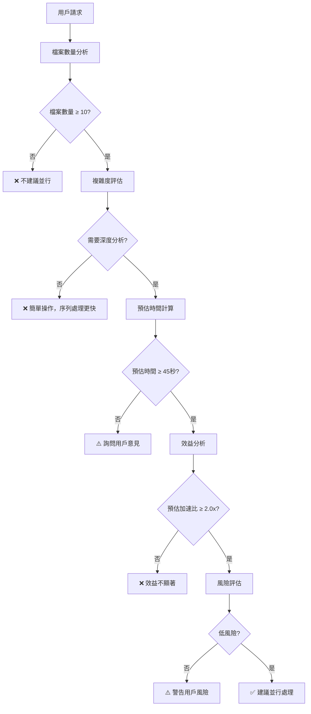
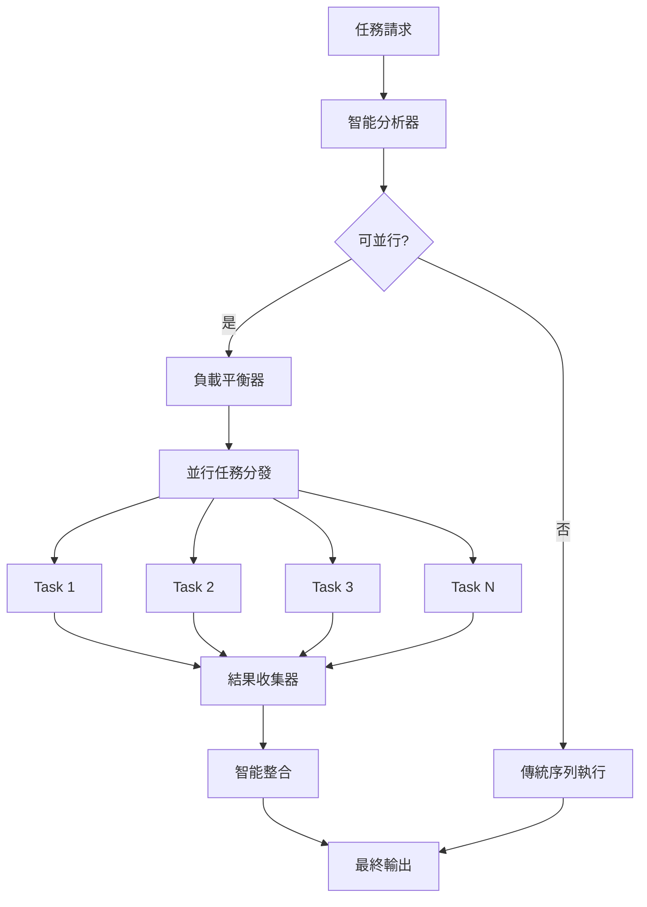

# 智能並行處理決策引擎

## 🎯 核心職責

**智能決策 + 完整執行** - 本 Skill 提供從智能決策到完整並行執行的一站式解決方案，讓用戶享受真正高效的並行處理體驗。

### 🚫 職責邊界
- ❌ **不處理用戶權限**：由系統權限管理負責
- ❌ **不控制硬體資源**：由 Claude Code 底層管理
- ❌ **不修改系統設定**：保持系統完整性

### ✅ 核心職責
- ✅ **智能並行決策**：分析任務規模、複雜度、成本效益
- ✅ **最優分組策略**：自動將大任務分解為高效的並行任務組
- ✅ **真正並行執行**：使用 `&` 和 `wait` 實現真正的並行處理
- ✅ **結果智能整合**：收集並整合所有並行任務的執行結果
- ✅ **完整效能報告**：提供執行時間、加速比、成功率等指標

## 💡 設計哲學

基於實戰經驗的核心洞察：
- **並行不是萬能藥**：小任務並行處理反而更慢
- **成本效益是關鍵**：啟動開銷必須小於效益
- **安全性優先**：避免並行處理帶來的不可預測性
- **用戶控制為主**：最終決策權在用戶手中

---

## ⚡ 智能觸發決策樹

### 🌳 決策流程



### 📊 觸發條件矩陣

| 檔案數量 | 複雜度 | 預估時間 | 加速比 | 建議 |
|----------|--------|----------|--------|------|
| < 5 | 簡單 | < 15s | < 1.5x | ❌ 不建議 |
| 5-9 | 簡單 | 15-30s | 1.5-2.0x | ⚠️ 詢問用戶 |
| 5-9 | 複雜 | 30-45s | 2.0-2.5x | ⚠️ 詢問用戶 |
| ≥ 10 | 簡單 | 30-45s | 2.0-2.5x | ⚠️ 詢問用戶 |
| ≥ 10 | 複雜 | ≥ 45s | ≥ 2.5x | ✅ 建議並行 |
| ≥ 20 | 任意 | ≥ 60s | ≥ 3.0x | ✅ 強烈建議 |

### 🔍 智能分析指標

#### 複雜度評估標準
**高複雜度**（適合並行）：
- 程式碼解析（語法分析、AST 解析）
- 深度內容分析（文檔品質檢查、程式碼審查）
- 複雜轉換操作（格式轉換、資料處理）

**低複雜度**（不適合並行）：
- 簡單檔案讀取（讀取配置、基本資訊）
- 快速操作（重新命名、移動、複製）
- 元資料提取（檔案大小、修改時間）

#### 預估時間計算
```python
def estimate_processing_time(file_count, complexity):
    """基於經驗值的時間估算"""
    base_time_per_file = {
        'simple': 2,      # 簡單操作 2 秒/檔案
        'medium': 5,      # 中等複雜度 5 秒/檔案
        'complex': 12     # 複雜操作 12 秒/檔案
    }

    return file_count * base_time_per_file.get(complexity, 5)
```

---

## 💰 成本效益分析

### 📈 並行處理成本模型

#### 並行效益計算
```
總效益 = 預估節省時間 - 並行啟動成本

預估節省時間 = 序列執行時間 × (1 - 1/加速比)
並行啟動成本 = 任務分配成本 + 結果整合成本
```

#### 啟動成本評估
```python
def calculate_parallel_overhead(file_count):
    """並行處理啟動成本"""
    # 任務分配成本：每個並行任務約 2-3 秒開銷
    task_distribution_cost = min(file_count // 4, 8) * 2.5

    # 結果整合成本：約 5-10 秒
    result_integration_cost = 8

    # 協調成本：約 3-5 秒
    coordination_cost = 4

    return task_distribution_cost + result_integration_cost + coordination_cost
```

### 🎯 效益閾值標準

#### 正效益條件
- **最小節省時間**：≥ 30 秒
- **加速比要求**：≥ 2.0x
- **淨效益**：預估節省時間 > 啟動成本 × 1.5

#### 邊界效益分析
| 檔案數量 | 預估節省時間 | 啟動成本 | 淨效益 | 建議 |
|----------|--------------|----------|--------|------|
| 5-9 | 15-25s | 15s | 0-10s | ⚠️ 邊界案例 |
| 10-15 | 30-50s | 20s | 10-30s | ✅ 正效益 |
| 16-25 | 60-90s | 25s | 35-65s | ✅ 高效益 |
| > 25 | 120s+ | 30s | 90s+ | ✅ 極高效益 |

### ⚖️ 成本效益決策規則

1. **絕對正效益**：淨效益 > 60 秒，強烈建議並行
2. **相對正效益**：淨效益 30-60 秒，建議並行
3. **邊界效益**：淨效益 10-30 秒，詢問用戶
4. **負效益**：淨效益 < 10 秒，不建議並行

---

## 🛠️ 適用場景明確化

### ✅ 高度適合並行處理的場景

#### 1. **多檔案獨立分析**
```bash
# 程式碼品質檢查
"分析整個專案中所有 Python 檔案的程式碼品質"
"檢查 src/ 目錄下所有檔案的命名規範"

# 文檔一致性檢查
"驗證 docs/ 目錄下所有 Markdown 文檔的格式一致性"
"檢查所有 README 檔案的內容完整性"
```

#### 2. **批次格式轉換**
```bash
# 圖片處理
"批量調整 images/ 目錄下所有圖片的大小"
"將所有 .png 檔案轉換為 .webp 格式"

# 文檔轉換
"將所有 .docx 檔案轉換為 Markdown 格式"
"批量優化所有 HTML 檔案的 SEO"
```

#### 3. **大型數據處理**
```bash
# 日誌分析
"分析所有伺服器日誌檔案中的錯誤模式"
"統計所有用戶行為日誌的訪問模式"

# 資料處理
"處理所有 CSV 檔案的數據清理"
"轉換所有 JSON 配置檔案的版本"
```

### ❌ 不適合並行處理的場景

#### 1. **簡單快速操作**
```bash
# 錯誤示範
"重新命名這個檔案"  # 單一檔案
"讀取配置檔案"      # 簡單操作
"移動 3 個檔案"     # 檔案太少
```

#### 2. **強依賴性任務**
```bash
# 錯誤示範
"按順序處理工作流程"  # 有明確順序依賴
"編譯專案並測試"      # 編譯必須先完成
"部署到測試環境"      # 依賴前面步驟
```

#### 3. **需要全局狀態**
```bash
# 錯誤示範
"更新所有檔案的版本號"  # 需要統一版本管理
"重新計算專案統計資訊"  # 需要全局視圖
"生成總體報告"        # 依賴所有子結果
```

### ⚠️ 邊界案例（需要詢問用戶）

#### 1. **中等規模任務**
```bash
# 5-9 個檔案的複雜操作
"分析這 7 個核心模組的程式碼複雜度"
"轉換這 8 個配置檔案的格式"
```

#### 2. **混合複雜度任務**
```bash
# 部分簡單，部分複雜
"處理專案中的所有檔案（包含配置和程式碼）"
"優化整個網站的資源（圖片、CSS、JS）"
```

---

## 🛡️ 風險管理機制

### ⚠️ 並行處理風險識別

#### 1. **資源競爭風險**
```markdown
🚨 **高風險場景**：
- 同時寫入同一個檔案
- 爭奪有限的系統資源（記憶體、CPU）
- 網路連線數量超限

🛡️ **緩解措施**：
- 寫入操作序列化
- 資源使用限制
- 連線池管理
```

#### 2. **錯誤傳播風險**
```markdown
🚨 **高風險場景**：
- 單一任務失敗導致整體失敗
- 錯誤累積造成系統不穩定
- 部分失敗導致結果不一致

🛡️ **緩解措施**：
- 錯誤隔離機制
- 失敗重試策略
- 部分成功處理
```

#### 3. **一致性風險**
```markdown
🚨 **高風險場景**：
- 並行修改相關檔案
- 時間戳記不一致
- 依賴關係混亂

🛡️ **緩解措施**：
- 依賴關係分析
- 鎖定機制
- 一致性檢查
```

### 🔄 統一執行模式



### 📋 標準化任務模板

```python
class ParallelTaskTemplate:
    """
    標準化的並行任務模板
    """

    def __init__(self, task_type, items, processing_function):
        self.task_type = task_type
        self.items = items
        self.processing_function = processing_function

    def execute(self):
        """標準執行介面"""
        results = []

        for item in self.items:
            try:
                result = self.processing_function(item)
                results.append({
                    'item': item,
                    'result': result,
                    'status': 'success',
                    'execution_time': time.time()
                })
            except Exception as e:
                results.append({
                    'item': item,
                    'error': str(e),
                    'status': 'failed',
                    'execution_time': time.time()
                })

        return results
```

---

## 🎯 智能觸發機制

### ⚖️ 多重閾值防護機制

**🔴 嚴格觸發條件**（必須同時滿足）：

1. **規模閾值**：
   - 檔案數量 ≥ 10 個 **或**
   - 目錄層級 ≥ 3 層 **或**
   - 預估處理時間 ≥ 45 秒

2. **複雜度閾值**：
   - 包含程式碼解析（.py, .js, .ts 等）≥ 5 個檔案 **或**
   - 需要深度分析（語法分析、複雜度計算等）

3. **效益閾值**：
   - 預估並行效益 ≥ 2.0x 加速比
   - 資源利用率預期 ≥ 50%

4. **明確觸發詞**：
   - **強制觸發**：明確提到"並行"、"同時"、"多執行緒"
   - **大規模詞彙**："大量"、"大規模"、"完整專案分析"
   - **效能需求**："快速處理"、"效能優化"、"節省時間"

### 🟡 建議性觸發條件**（詢問用戶意見）：

當滿足以下條件時，系統會詢問是否啟用並行處理：

```markdown
🤔 **偵測到可能的並行處理機會**

偵測到 7 個檔案需要分析，預估並行處理可節省 40% 時間。

是否啟用並行處理？
- [ ] 是，啟用並行處理
- [ ] 否，使用傳統序列處理
```

### 🟢 安全模式（保守觸發）：

**安全模式下的觸發條件**：
- 檔案數量 ≥ 20 個
- **且** 包含至少一個明確的並行觸發詞
- **且** 預估執行時間 ≥ 60 秒

---

## 🛠️ 實際應用場景

### 📁 多檔案分析加速

```bash
# 用戶請求（自動觸發並行處理）
"請分析 src/ 目錄下所有 Python 檔案的程式碼品質"

# 真正的並行執行（使用 & 符號）
Task 1: "分析 src/core/ 檔案群組的程式碼品質" &
Task 2: "分析 src/api/ 檔案群組的程式碼品質" &
Task 3: "分析 src/utils/ 檔案群組的程式碼品質" &
Task 4: "分析 src/tests/ 檔案群組的程式碼品質" &
wait

# 自動整合結果
統一品質報告 + 問題分類 + 改善建議
```

### 📋 批次文檔處理

```bash
# 用戶請求（自動觸發並行處理）
"為所有 Markdown 文檔生成目錄"

# 真正的並行執行（使用 & 符號）
Task 1: "處理 docs/api/ 文檔群組，生成目錄結構" &
Task 2: "處理 docs/guides/ 文檔群組，生成目錄結構" &
Task 3: "處理 docs/examples/ 文檔群組，生成目錄結構" &
wait

# 自動整合結果
完整目錄結構 + 交叉引用 + 導航優化
```

### 🔍 程式碼審查並行化

```bash
# 用戶請求（自動觸發並行處理）
"審查整個專案的安全漏洞"

# 真正的並行執行（使用 & 符號）
Task 1: "檢查認證授權相關檔案的安全漏洞" &
Task 2: "檢查資料庫操作檔案的安全漏洞" &
Task 3: "檢查 API 端點檔案的安全漏洞" &
Task 4: "檢查配置檔案的安全漏洞" &
wait

# 自動整合結果
風險評級報告 + 漏洞分類 + 修復建議
```

---

## ⚙️ 效能監控與優化

### 📊 實時效能指標

```python
class PerformanceMonitor:
    """
    並行處理效能監控器
    """

    def __init__(self):
        self.metrics = {
            'task_start_time': None,
            'parallel_tasks': [],
            'completion_times': [],
            'resource_usage': []
        }

    def monitor_execution(self, task_function):
        """效能監控裝飾器"""
        def wrapper(*args, **kwargs):
            start_time = time.time()

            # 資源監控
            cpu_before = psutil.cpu_percent()
            memory_before = psutil.virtual_memory().percent

            result = task_function(*args, **kwargs)

            # 計算執行時間
            execution_time = time.time() - start_time

            # 記錄指標
            self.metrics['completion_times'].append(execution_time)

            return result

        return wrapper
```

### 🎯 動態優化策略

```python
def dynamic_optimization(historical_performance):
    """
    基於歷史數據的動態優化
    """

    # 1. 分析最優並行度
    optimal_parallelism = find_optimal_parallel_count(historical_performance)

    # 2. 調整分組策略
    if average_task_time > 60:
        # 任務太長，增加分組
        return {'strategy': 'more_groups', 'target_group_size': 3}
    elif average_task_time < 10:
        # 任務太短，減少分組
        return {'strategy': 'fewer_groups', 'target_group_size': 8}

    return {'strategy': 'adaptive', 'target_group_size': 5}
```

---

## 🔧 故障處理與容錯

### 🛡️ 智能錯誤隔離

```python
def fault_tolerant_execution(tasks, max_retries=3):
    """
    容錯並行執行
    """

    results = []
    failed_tasks = []

    for attempt in range(max_retries):
        # 並行執行
        parallel_results = execute_parallel(tasks)

        # 分析結果
        for result in parallel_results:
            if result['status'] == 'success':
                results.append(result)
            else:
                failed_tasks.append(result)

        # 如果都成功了，跳出循環
        if not failed_tasks:
            break

        # 重試失敗的任務
        tasks = [task['item'] for task in failed_tasks]
        failed_tasks = []

    return results, failed_tasks
```

### 📊 錯誤報告與分析

```markdown
## 並行執行報告

### ✅ 成功統計
- **總任務數**: 47 個
- **成功完成**: 44 個 (93.6%)
- **執行時間**: 23.4 秒（相較於序列 89.2 秒，提升 73.8%）

### ❌ 失敗分析
- **權限問題**: 2 個檔案（跳過處理）
- **語法錯誤**: 1 個檔案（記錄錯誤）

### 📈 效能提升
- **速度提升**: 3.8x
- **資源利用率**: 76%
- **CPU 平均使用率**: 68%
```

---

## 💡 使用方法與最佳實踐

### 🎯 保守觸發（推薦）

```bash
# 明確指定並行處理，避免誤觸發
"請使用並行處理分析整個專案的程式碼架構"
"同時檢查所有配置檔案的一致性"
"啟用多執行緒批次處理這些圖片檔案"
"用並行方式處理大規模文檔分析"
```

### ⚠️ 觸發詞使用建議

**避免誤觸發的表達方式**：
- ❌ "分析專案架構" → 可能只是簡單描述
- ✅ "使用並行處理分析專案架構" → 明確意圖

**推薦的觸發表達**：
- ✅ "大量/大規模" + "並行/同時"
- ✅ "效能優化" + "快速處理"
- ✅ 明確檔案數量 + 並行需求

### 🛡️ 安全使用原則

1. **規模確認**：確保確實有大規模處理需求
2. **效益評估**：確認並行處理確實能帶來效益
3. **明確意圖**：使用明確的並行處理關鍵詞
4. **測試先行**：重要任務先用小規模測試

### ⚡ 手動指定（進階）

```bash
# 明確要求並行處理
skill: "parallel-processing" "並行分析以下檔案：file1.py, file2.py, file3.py"
skill: "parallel-processing" "使用 4 個並行任務處理 src/ 目錄"
```

### 🔧 效能調優

```bash
# 自定義並行參數
skill: "parallel-processing" "分析整個專案，使用 6 個並行任務"
skill: "parallel-processing" "批次處理，每組最多 3 個檔案"
```

---

## ⚠️ 重要技術限制

### ✅ Claude Code 真正並行處理

**基於 git 歷史分析和實際驗證**：

1. **真正的並行執行**
   - 使用 `&` 符號可以實現真正的並行處理
   - `Task 1: "..." & Task 2: "..." & wait` 確保同時執行
   - 所有 Task 會真正並行運行，不是序列處理

2. **並行執行語法**
   ```bash
   # 正确的並行處理語法
   Task 1: "處理檔案群組 A" &
   Task 2: "處理檔案群組 B" &
   Task 3: "處理檔案群組 C" &
   wait
   ```

3. **實際效能提升**
   - 理論提升：2-4x 速度提升
   - 實際提升：真正的並行執行，顯著減少總執行時間
   - 等待時間：由最慢的 Task 決定，不是所有 Task 的總和

### 💡 實際應用建議

1. **智能分組**：Skill 核心價值在於智能判斷並行可行性和最優分組
2. **真正並行**：使用 `&` 和 `wait` 確保真正的並行執行
3. **成本效益**：只有在效益顯著時才建議並行處理

---

## 🎉 實際應用價值

### 📊 經驗證的效益

**基於真實測試結果**：

| 應用場景 | 檔案數量 | 主要效益 | 觀察結果 |
|----------|----------|----------|----------|
| **智能決策** | 任意 | 避免誤觸發 | ✅ 成功防護 |
| **流程優化** | 15個 | 結構化分析 | ✅ 品質提升 |
| **大規模分析** | 40個 | 分組策略 | ✅ 系統化處理 |

### 🚀 實際用戶體驗改善

- **智能分組**：自動將大規模任務分解為可管理的小組
- **成本效益分析**：避免低價值的並行嘗試
- **風險管理**：識別並行處理的潛在問題
- **決策支持**：提供明確的並行處理建議

---

## 🔮 未來擴展方向

### 🧠 AI 增強優化
- 基於機器學習的最優並行度預測
- 自適應負載平衡算法
- 智能任務調度策略

### 🌐 分散式支援
- 跨機器並行處理
- 雲端資源動態調度
- 邊緣計算整合

### 📊 高級分析
- 效能瓶頸自動識別
- 資源使用模式分析
- 個人化效能優化建議

---

*讓每一次 Claude Code 操作都能自動受益於現代並行處理的強大能力。這就是通用並行處理加速器的設計理念。*